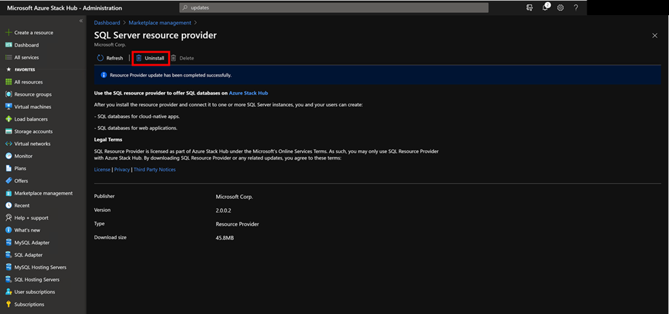
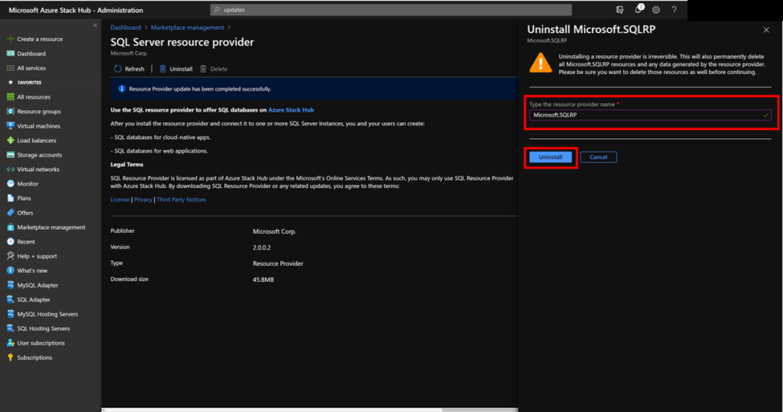
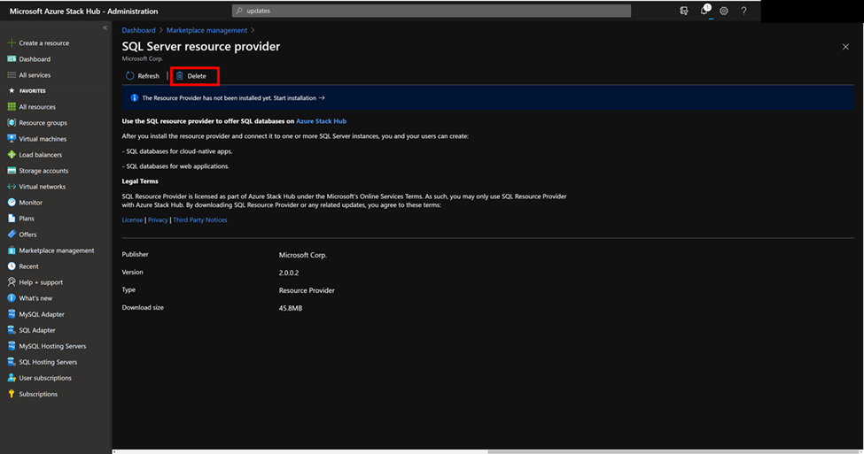

# Remove the SQL resource provider

[!INCLUDE [preview-banner](../includes/sql-mysql-rp-limit-access.md)]

Removing the SQL resource provider will delete:

- The SQL resource provider.
- The associated plans and quotas managed by operator.
- The metadata in Azure Stack Hub for the hosting server, database, and logins. 

Removing the SQL resource provider will not delete:

- The tenant databases on the hosting servers.
- The packages used to install SQL RP.

## To remove the SQL resource provider V1

1. Verify that you've removed all the existing SQL resource provider dependencies.

   > [!NOTE]
   > Uninstalling the SQL resource provider will proceed even if dependent resources are currently using the resource provider.
  
2. Get a copy of the SQL resource provider installation package and then run the self-extractor to extract the contents to a temporary directory. You can find the download links for the resource provider installers in [Deploy the resource provider prerequisites](./azure-stack-sql-resource-provider-deploy.md#prerequisites).

3. Open a new elevated PowerShell console window and change to the directory where you extracted the SQL resource provider installation files.

> [!IMPORTANT]
> We strongly recommend using **Clear-AzureRmContext -Scope CurrentUser** and **Clear-AzureRmContext -Scope Process** to clear the cache before running the script.

4. Run the DeploySqlProvider.ps1 script using the following parameters:

    * **Uninstall**: Removes the resource provider and all associated resources.
    * **PrivilegedEndpoint**: The IP address or DNS name of the privileged endpoint.
    * **AzureEnvironment**: The Azure environment used for deploying Azure Stack Hub. Required only for Microsoft Entra deployments.
    * **CloudAdminCredential**: The credential for the cloud admin, necessary to access the privileged endpoint.
    * **AzCredential**: The credential for the Azure Stack Hub service admin account. Use the same credentials that you used for deploying Azure Stack Hub. The script will fail if the account you use with AzCredential requires multi-factor authentication (MFA).

## To remove the SQL resource provider V2
1. Sign in to the Azure Stack Hub administrator portal.

2. Select Marketplace Management on the left, then select Resource providers.

3. Select SQL resource provider from the list of resource providers. You may want to filter the list by Entering “SQL Server resource provider” or “MySQL Server resource provider” in the search text box provided.

4. Select Uninstall from the options provided across the top the page.

5. Enter the name of the resource provider, then select Uninstall. This action confirms your desire to uninstall:
-	The SQL Server resource provider.
-	All admin/user created SKU/Quota/HostingServer/Database/Login metadata.

6. (Optional) If you want to delete the installation package, after uninstalling the SQL resource provider, select Delete from the SQL resource provider page.

## Next steps

[Offer App Services as PaaS](azure-stack-app-service-overview.md)
