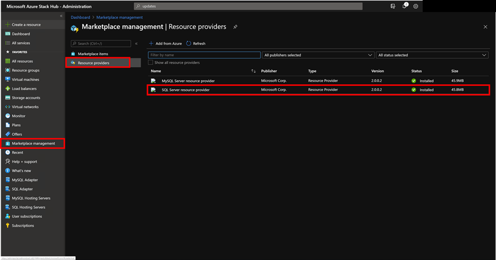
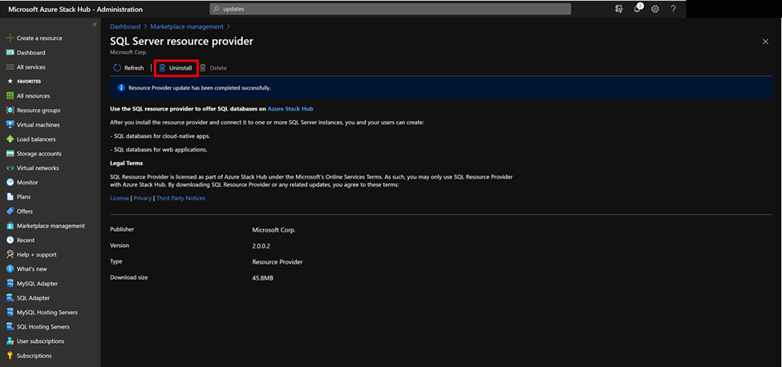
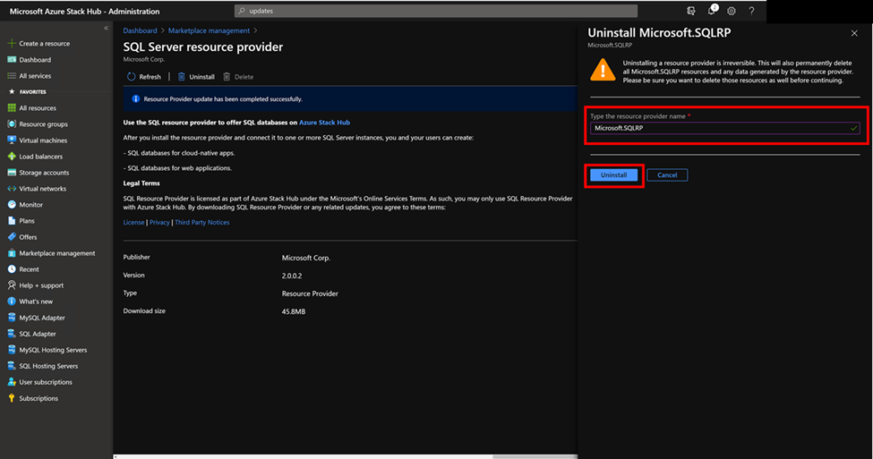
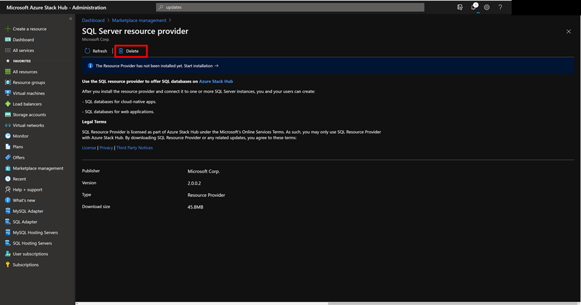

# Remove the SQL resource provider

[!INCLUDE [preview-banner](../includes/sql-mysql-rp-limit-access.md)]

When you remove the SQL resource provider, you delete:

- The SQL resource provider.
- The associated plans and quotas that the operator manages.
- The metadata in Azure Stack Hub for the hosting server, database, and logins. 

When you remove the SQL resource provider, you don't delete:

- The tenant databases on the hosting servers.
- The packages used to install SQL RP.

## To remove the SQL resource provider V1

1. Verify that you removed all the existing SQL resource provider dependencies.

   > [!NOTE]
   > The uninstallation process continues even if dependent resources currently use the resource provider.
  
1. Get a copy of the SQL resource provider installation package, and then run the self-extractor to extract the contents to a temporary directory. To find the download links for the resource provider installers, see [Deploy the resource provider prerequisites](./azure-stack-sql-resource-provider-deploy.md#prerequisites).

1. Open a new elevated PowerShell console window and change to the directory where you extracted the SQL resource provider installation files.

   > [!IMPORTANT]
   > Use **Clear-AzureRmContext -Scope CurrentUser** and **Clear-AzureRmContext -Scope Process** to clear the cache before running the script.

1. Run the `DeploySqlProvider.ps1` script by using the following parameters:

    * **Uninstall**: Removes the resource provider and all associated resources.
    * **PrivilegedEndpoint**: The IP address or DNS name of the privileged endpoint.
    * **AzureEnvironment**: The Azure environment used for deploying Azure Stack Hub. Required only for Microsoft Entra deployments.
    * **CloudAdminCredential**: The credential for the cloud admin, necessary to access the privileged endpoint.
    * **AzCredential**: The credential for the Azure Stack Hub service admin account. Use the same credentials that you used for deploying Azure Stack Hub. The script fails if the account you use with `AzCredential` requires multifactor authentication (MFA).

## To remove the SQL resource provider V2
1. Sign in to the Azure Stack Hub administrator portal.

1. Select **Marketplace Management** on the left, and then select **Resource providers**.

1. Select SQL resource provider from the list of resource providers. To find the SQL resource provider, filter the list by entering **SQL Server resource provider** or **MySQL Server resource provider** in the search text box.

   

1. Select **Uninstall** from the options at the top of the page.

   

1. Enter the name of the resource provider, and then select **Uninstall**. This action confirms your desire to uninstall:

   - The SQL Server resource provider.
   - All admin/user created SKU/Quota/HostingServer/Database/Login metadata.

   

1. (Optional) If you want to delete the installation package, after uninstalling the SQL resource provider, select **Delete** from the SQL resource provider page.

   

## Next steps

[Offer App Services as PaaS](azure-stack-app-service-overview.md)
