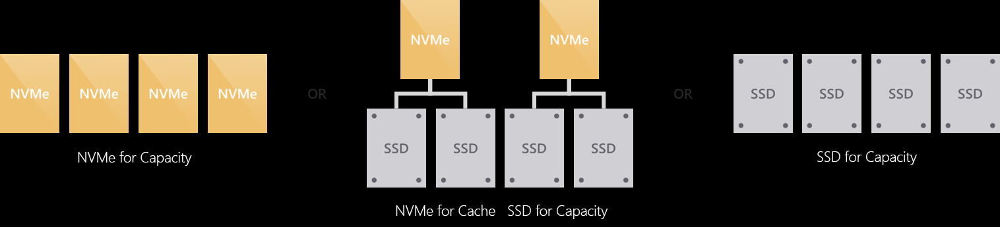
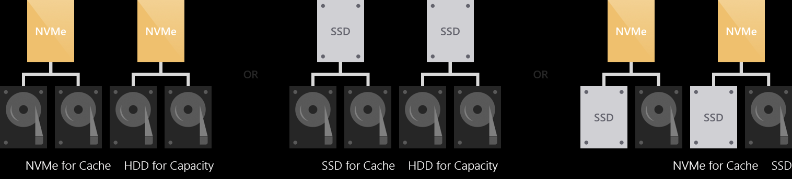
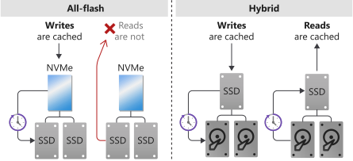

# Azure Stack Hub storage infrastructure overview

This article provides Azure Stack Hub storage infrastructure concepts. It covers information about drives and volumes and how they are used in Azure Stack Hub.

## Drives

### Drive types

Azure Stack Hub integrated system partners offer many solution variations, including a wide range of storage flexibility. You can select up to **two** drive types from the three supported drive types:

1. NVMe (non-volatile memory express)
1. SATA/SAS SSD (solid-state drive)
1. HDD (hard disk drive).

### Performance vs capacity

Azure Stack Hub uses Storage Spaces Direct (S2D) with Windows Server Failover Clustering. This combination provides a performant, scalable, and resilient storage service.

Azure Stack deployments can maximize storage performance, or balance performance and capacity.

Storage Spaces Direct uses a cache to maximize storage performance.

### How drive types are used

When an Azure Stack Hub appliance has one drive type, all drives are used for capacity.

If there are two drive types, Storage Spaces Direct automatically uses all drives of the "fastest" (NVMe &gt; SSD &gt; HDD) type for caching. The remaining drives are used for capacity.

### All-flash or hybrid

The drives could be grouped into either an "all-flash" or "hybrid" deployment.

All-flash deployments aim to maximize storage performance and don't include rotational HDDs.

Hybrid deployments aim to balance performance and capacity or to maximize capacity and do include rotational HDDs.

### Caching behavior

The behavior of the cache is determined automatically based on the type(s) of drives. When caching for SSDs (such as NVMe caching for SSDs), only writes are cached. This reduces wear on the capacity drives, reducing the cumulative traffic to the capacity drives and extending their lifetime.

Reads aren't cached. They aren't cached because reads don't significantly affect the lifespan of flash and because SSDs universally offer low read latency.

When caching for HDDs (such as SSDs caching for HDDs), both reads and writes are cached, to provide flash-like latency (often /~10x better) for both.

For the available configuration of storage, you can check Azure Stack Hub OEM partner (https://azure.microsoft.com/overview/azure-stack/partners/) for detailed specification.

> [!NOTE]
> The Azure Stack Hub appliance can be delivered in a hybrid deployment, with both HDD and SSD (or NVMe) drives. But the drives of faster type would be used as cache drives, and all remaining drives would be used as capacity drives as a pool. The tenant data (blobs, tables, queues, and disks) would be placed on capacity drives. Provisioning premium disks or selecting a premium storage account type doesn't guarantee the objects will be allocated on SSD or NVMe drives.

## Volumes

The *storage service* partitions the available storage into separate volumes that are allocated to hold system and tenant data. Volumes combine the drives in the storage pool to provide the fault tolerance, scalability, and performance benefits of Storage Spaces Direct.

### Volume types

There are three types of volumes created on Azure Stack Hub storage pool:

1. **Infrastructure** volumes host files used by Azure Stack Hub infrastructure VMs and core services.
1. **VM Temp** volumes host the temporary disks attached to tenant VMs and that data is stored in these disks.
1. **Object Store** volumes host tenant data servicing blobs, tables, queues, and VM disks.

### Volumes in a multi-node deployment

In a multi-node deployment, there are three Infrastructure volumes.

The number of VM Temp volumes and Object Store volumes is equal to the number of the nodes in the Azure Stack Hub deployment:

- On a four-node deployment, there are four equal VM Temp volumes and four equal Object Store volumes.

- If you add a new node to the cluster, there would be a new volume for both types created.

- The number of volumes remains the same even if a node malfunctioning or is removed.

> [!NOTE]
> If you use the [Azure Stack Development Kit (ASDK)](../asdk/index.yml), there's a single volume with multiple [shares](azure-stack-manage-storage-shares.md).

### Fault tolerance and mirroring

Volumes in Storage Spaces Direct provide resiliency to protect against hardware problems, such as drive or server failures. They enable continuous availability throughout server maintenance, like software updates.

Mirroring provides fault tolerance by keeping multiple copies of all data. How that data is striped and placed is non-trivial, but any data stored using mirroring is written in its entirety multiple times. Each copy is written to different physical hardware (different drives in different servers) that are assumed to fail independently. 

Azure Stack Hub deployment uses three-way mirroring to ensure data resilience. Three-way mirroring can safely tolerate at least two hardware problems (drive or server) at a time. For example, if you're rebooting one server when suddenly another drive or server fails, all data remains safe and continuously accessible.

Three copies of tenant data are written to different servers, where they land in cache:

## Next step

[Manage storage capacity](azure-stack-manage-storage-shares.md) 
