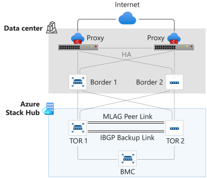

# Transparent proxy for Azure Stack Hub

A transparent proxy (also known as an intercepting, inline, or forced proxy) intercepts normal communication at the network layer without requiring special client configuration. Clients don't need to be aware of the existence of the proxy.

If your datacenter requires all traffic to use a proxy, you configure a transparent proxy to process all traffic according to policy by separating traffic between the zones on your network.

## Traffic types

Outbound traffic from Azure Stack Hub is categorized as either tenant traffic or infrastructure traffic.

Tenant traffic is generated by tenants by way of virtual machines, load balancers, VPN gateways, app services, etc.

Infrastructure traffic is generated from the first `/27` range of the public virtual IP pool assigned to infrastructure services such as identity, patch and update, usage metrics, Marketplace syndication, registration, log collection, Windows Defender, etc. The traffic from these services is routed to [Azure endpoints](azure-stack-integrate-endpoints.md#ports-and-urls-outbound). Azure does not accept traffic modified by a proxy or TLS/SSL intercepted traffic. This reason is why Azure Stack Hub does not support a native proxy configuration.

When configuring a transparent proxy, you can choose to send all outbound traffic or only infrastructure traffic through the proxy.

## Partner integration

Microsoft has partnered with Citrix ADC, Cisco WSA, Check Point Security Gateway, and Sophos XG Firewall to validate Azure Stack Hub’s use case scenarios with a transparent proxy configuration. The following diagram is an example Azure Stack Hub network configuration.



External proxy devices must be placed before the border devices. Additionally, the border devices must be configured to route traffic to Azure Stack Hub one of the following ways:
- Route all traffic to Azure Stack Hub
- Route traffic from the first `/27` range of the Azure Stack Hub virtual IP pool to the proxy devices via a policy-based routing rule or a default route.  

For a sample border configuration, see [Example border configuration](#example-border-configuration) section in this article.

The Sophos and Check Point devices provide a dual-mode feature that allows specific ranges of traffic through transparent mode, while other ranges can be configured to be through an explicit mode. Using this feature, only infrastructure traffic is sent through the transparent proxy, while all tenant traffic is sent through the explicit mode.

For more information on how to configure a transparent proxy with Azure Stack Hub, see the following articles: 

- [Configure a Check Point Security Gateway transparent proxy](https://supportcenter.checkpoint.com/supportcenter/portal?eventSubmit_doGoviewsolutiondetails=&solutionid=sk171559)
- [Configure a Sophos XG firewall transparent proxy](https://community.sophos.com/xg-firewall/f/recommended-reads/124106/xg-firewall-integration-with-azure-stack-hub)

> [!IMPORTANT]
> SSL traffic interception is not supported and can lead to service failures when accessing endpoints. The maximum supported timeout to communicate with endpoints required for identity is 60s with 3 retry attempts. For more information, see [Azure Stack Hub firewall integration](azure-stack-firewall.md#ssl-interception).

## Example border configuration

In the following example, specific infrastructure network traffic for ports 80 and 443 are routed from the border devices to the transparent proxy deployment. The transparent squid proxy does URL filtering, and *none allowed* traffic is dropped.

In this scenario, the source infrastructure networks that require access to the internet are as follows:

- Public VIP - First /27
- Infrastructure network – Last /27
- BMC Network – Last /27

The solution is based on policy based routing (PBR) which uses an administrator defined set of criteria implemented by an access control list (ACL). The ACL categorizes the traffic which is directed to the next-hop IP of the proxy devices implemented in a route-map, rather than normal routing which is based only on destination IP address.

The following subnets receive Policy Based Routing (PBR) treatment in this scenario:

| Network | IP Range | Subnet receiving PBR treatment
|---------|----------|-------------------------------
| Public Virtual IP pool | First /27 of 172.21.107.0/27 | 172.21.107.0/27 = 172.21.107.1 to 172.21.107.30
| Infrastructure network | Last /27 of 172.21.7.0/24 | 172.21.7.224/27 = 172.21.7.225 to 172.21.7.254
| BMC network | Last /27 of 10.60.32.128/26 | 10.60.32.160/27 = 10.60.32.161 to 10.60.32.190

### Configure border device

Enable PBR by entering the `feature pbr` command. The following is an example border device configuration.

```
****************************************************************************
PBR Configuration Notes for Cisco Nexus 9508 Chassis
PBR Enivronment configured to use VRF08
The test rack has is a 4-node Azure Stack stamp with 2x TOR switches and 1x BMC switch. Each TOR switch 
has a single uplink to the Nexus 9508 chassis using BGP for routing. In this example the test rack 
is in it's own VRF (VRF08)
****************************************************************************
!
feature pbr
!

<Create VLANs that the proxy devices will use for inside and outside connectivity>

!
VLAN 801
name PBR_Proxy_VRF08_Inside
VLAN 802
name PBR_Proxy_VRF08_Outside
!
interface vlan 801
description PBR_Proxy_VRF08_Inside
no shutdown
mtu 9216
vrf member VRF08
no ip redirects
ip address 10.60.3.1/29
!
interface vlan 802
description PBR_Proxy_VRF08_Outside
no shutdown
mtu 9216
vrf member VRF08
no ip redirects
ip address 10.60.3.33/28
!
!
ip access-list PERMITTED_TO_PROXY_ENV1
100 permit tcp 172.21.107.0/27 any eq www
110 permit tcp 172.21.107.0/27 any eq 443
120 permit tcp 172.21.7.224/27 any eq www
130 permit tcp 172.21.7.224/27 any eq 443
140 permit tcp 10.60.32.160/27 any eq www
150 permit tcp 10.60.32.160/27 any eq 443
!
!
route-map TRAFFIC_TO_PROXY_ENV1 pbr-statistics
route-map TRAFFIC_TO_PROXY_ENV1 permit 10
  match ip address PERMITTED_TO_PROXY_ENV1
  set ip next-hop 10.60.3.34 10.60.3.35
!
!
interface Ethernet1/1
  description DownLink to TOR-1:TeGig1/0/47
  mtu 9100
  logging event port link-status
  vrf member VRF08
  ip address 192.168.32.193/30
  ip policy route-map TRAFFIC_TO_PROXY_ENV1
  no shutdown
!
interface Ethernet2/1
  description DownLink to TOR-2:TeGig1/0/48
  mtu 9100
  logging event port link-status
  vrf member VRF08
  ip address 192.168.32.205/30
  ip policy route-map TRAFFIC_TO_PROXY_ENV1
  no shutdown
!

<Interface configuration for inside/outside connections to proxy devices. In this example there are 2 firewalls>

!
interface Ethernet1/41
  description management interface for Firewall-1
  switchport
  switchport access vlan 801
  no shutdown
!
interface Ethernet1/42
  description Proxy interface for Firewall-1
  switchport
  switchport access vlan 802
  no shutdown
!
interface Ethernet2/41
  description management interface for Firewall-2
  switchport
  switchport access vlan 801
  no shutdown
!
interface Ethernet2/42
  description Proxy interface for Firewall-2
  switchport
  switchport access vlan 802
  no shutdown
!

<BGP network statements for VLAN 801-802 subnets and neighbor statements for R023171A-TOR-1/R023171A-TOR-2> 

!
router bgp 65000
!
vrf VRF08
address-family ipv4 unicast
network 10.60.3.0/29
network 10.60.3.32/28
!
neighbor 192.168.32.194
  remote-as 65001
  description LinkTo 65001:R023171A-TOR-1:TeGig1/0/47
  address-family ipv4 unicast
    maximum-prefix 12000 warning-only
neighbor 192.168.32.206
  remote-as 65001
  description LinkTo 65001:R023171A-TOR-2:TeGig1/0/48
  address-family ipv4 unicast
    maximum-prefix 12000 warning-only
!
!
```

Create the new ACL (access list) that will be used to identify traffic that will get PBR treatment. That traffic is web traffic (HTTP port 80 and HTTPS port 443) from the hosts/subnets in the test rack that gets proxy service as detailed in this example. For example, the ACL name is **PERMITTED_TO_PROXY_ENV1**.

```
ip access-list PERMITTED_TO_PROXY_ENV1
100 permit tcp 172.21.107.0/27 any eq www <<HTTP traffic from CL04 Public Admin VIPs leaving test rack>>
110 permit tcp 172.21.107.0/27 any eq 443 <<HTTPS traffic from CL04 Public Admin VIPs leaving test rack>>
120 permit tcp 172.21.7.224/27 any eq www <<HTTP traffic from CL04 INF-pub-adm leaving test rack>>
130 permit tcp 172.21.7.224/27 any eq 443 <<HTTPS traffic from CL04 INF-pub-adm leaving test rack>>
140 permit tcp 10.60.32.160/27 any eq www <<HTTP traffic from DVM and HLH leaving test rack>>
150 permit tcp 10.60.32.160/27 any eq 443 <<HTTPS traffic from DVM and HLH leaving test rack>>
```

The core of the PBR functionality is implemented by the **TRAFFIC_TO_PROXY_ENV1** route-map. The **pbr-statistics** option is added to enable viewing the policy match statistics to verify the number packets that do and do not get PBR forwarding. Route-map sequence 10 permits PBR treatment to traffic meeting ACL **PERMITTED_TO_PROXY_ENV1** criteria. That traffic is forwarded to the next-hop IP addresses of `10.60.3.34` and `10.60.3.35` which are the VIPs for the primary/secondary proxy devices in our example configuration

```
!
route-map TRAFFIC_TO_PROXY_ENV1 pbr-statistics
route-map TRAFFIC_TO_PROXY_ENV1 permit 10
  match ip address PERMITTED_TO_PROXY_ENV1
  set ip next-hop 10.60.3.34 10.60.3.35
```

ACLs are used as the match criteria for the **TRAFFIC_TO_PROXY_ENV1** route-map. When traffic matches the **PERMITTED_TO_PROXY_ENV1** ACL, PBR overrides the normal routing table, and instead forwards the traffic to the listed IP next-hops.
 
The **TRAFFIC_TO_PROXY_ENV1** PBR policy is applied to traffic that enters the border device from CL04 hosts and public VIPs and from the HLH and DVM in the test rack.

## Next steps

Learn more about firewall integration, see [Azure Stack Hub firewall integration](azure-stack-firewall.md)