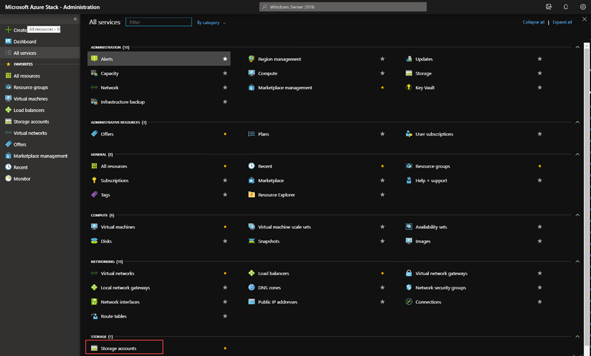
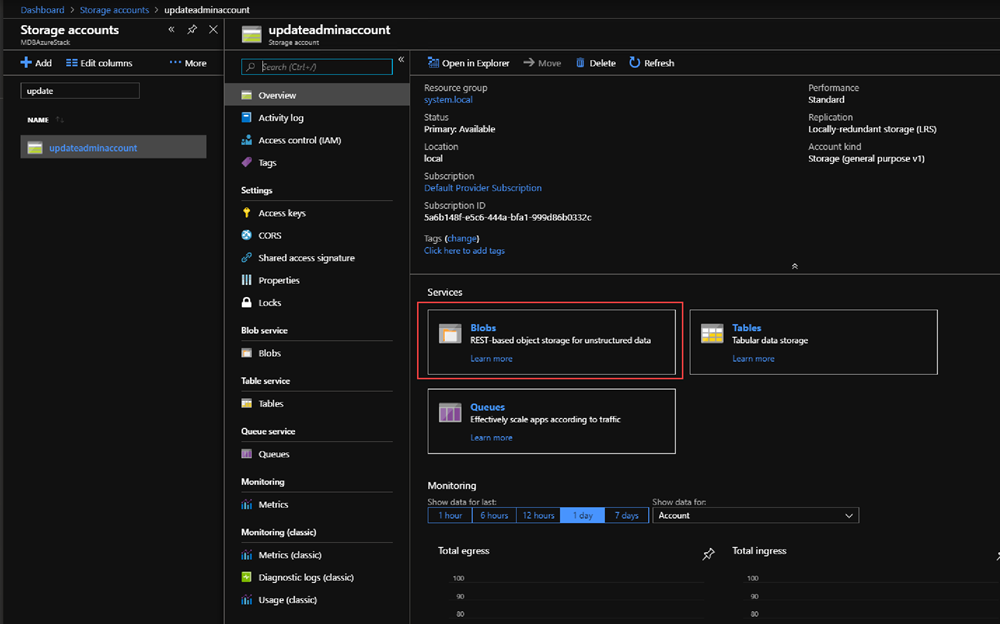
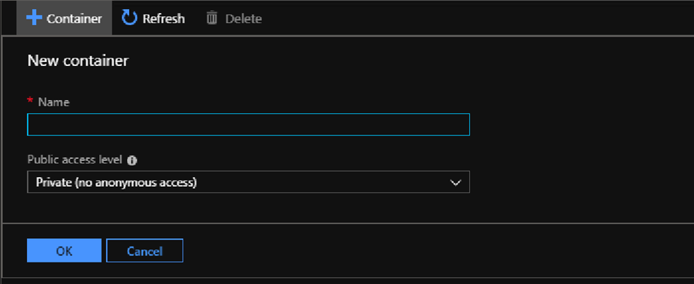
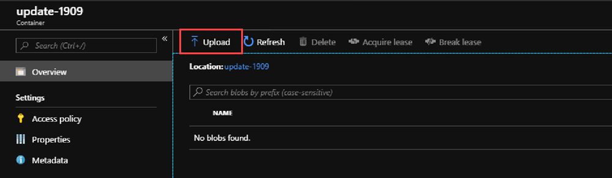
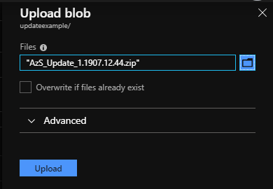

# Prepare an Azure Stack update package

*Applies to: Azure Stack integrated systems*

This article provides an overview of preparing Azure Stack update packages so that they can be used to update your Azure Stack environment. This process is done automatically for Azure Stack software updates and hotfixes on internet-connected systems. For all OEM package updates and Azure Stack software updates and hotfixes on internet-disconnected systems and systems with weak or intermittent internet-connectivty, update packages are prepared by downloading the Azure Stack update package or OEM update package and importing the package to storage so that it can be accessed by the Azure Stack update provider. The table displays when the steps in this article should be performed:

| Update Type | Internet Connection | Action |
| --- | --- | --- |
| Azure Stack Software Updates | Connected | Update is automatically downloaded and prepared when the update is applied. |
| Azure Stack Hotfixes | Connected | Update is automatically downloaded and prepared when the update is applied. |
| OEM Package Updates | Connected | The update package must be prepared. Follow the steps in this article. |
| Azure Stack Software Updates | Disconnected or Weak Connection | The update package must be prepared. Follow the steps in this article. |
| Azure Stack Hotfixes | Disconnected or Weak Connection | The update package must be prepared. Follow the steps in this article. |
| OEM Package Updates | Disconnected or Weak Connection | The update package must be prepared. Follow the steps in this article. |

## Download the update package
The update package for Azure Stack updates and hotfixes is available through the update blade for connected systems. You will need to download the package and move the package to a location that is accessible to your Azure Stack instance if you are updating an OEM package, or if you are supporting a disconnected system. You may also need to download and then upload the package to an accessible location if your are running a system with an intermittent connection.

Review the package contents. An update package typically consists of the following files:

-   **A self-extracting \<PackageName>.zip file**. This file contains the payload for the update.
- **A Metadata.xml file**. This file contains essential information about the update, for example, the publisher, name, prerequisite, size, and support path URL.

## Azure Stack Software updates

Azure Stack software updates are hosted at a secure Azure endpoint. Azure Stack operators with connected instances will see the Azure Stack updates automatically appear in the Administration portal with the message **Update available**. Azure Stack updates are automatically downloaded on internet-connected systems when the update is applied. For internet disconnected systems or systems with weak internet connectivity, update packages can be downloaded using the [Azure Stack Updates downloader tool](https://aka.ms/azurestackupdatedownload). Azure Stack software update packages may contain updates to Azure Stack services as well as updates to the operating system of your Azure Stack’s scale units.

### Azure Stack hotfixes 

Hotfix update packages are hosted in the same secure Azure endpoint. Azure Stack operators with connected instances will see the hotfixes automatically appear in the Administration portal with the message **Update available**. Azure Stack hotfixes are automatically downloaded on internet-connected systems when the update is applied. You can download them using the embedded links in each of the respective hotfix KB articles; for example, [Azure Stack hotfix 1.1906.11.52](https://support.microsoft.com/help/4515650). You can find hotfixes in the release notes corresponding to your Azure Stack version.OEM hardware vendor-provided updates

Your OEM vendor will also release updates, such as driver and firmware updates. While these updates are delivered as separate packages by vendor, some are imported, installed, and managed the same way as update packages from Microsoft. You can find a list of vendor contact links at [Apply Azure Stack original equipment manufacturer (OEM) updates](https://docs.microsoft.com/azure-stack/operator/azure-stack-update-oem#oem-contact-information).

## Import and install updates

The following procedure shows how to import and install update packages in the administration portal.

> [!Important]  
> Notify users of any maintenance operations, and that you schedule normal maintenance windows during non-business hours as much as possible. Maintenance operations may affect both user workloads and portal operations.

1.  In the administration portal, select **All services**. Then, under the **DATA + STORAGE** category, select **Storage accounts**. (Or, in the filter box, start typing **storage accounts**, and select it.)

     

1.  In the filter box, type **update**, and select the **updateadminaccount** storage account.

2.  In the storage account details, under **Services**, select **Blobs**.

    

1.  Under **Blob service**, select **+ Container** to create a container. Enter a name (for example *update-1811*) and then select **OK**.

    

1.  After the container is created, click the container name, and then click **Upload** to upload the package files to the container.

    

1.  Under **Upload blob**, click the folder icon, browse to the update package's .zip file and then click **Open** in the file explorer window.

2.  Under **Upload blob**, click **Upload**.

    

1.  Repeat steps 6 and 7 for the Metadata.xml file and any additional .zip files in the update package. Do not import the Supplemental Notice.txt file if included.

2.  When done, you can review the notifications (bell icon in the top-right corner of the portal). The notifications should indicate that the upload has completed.

3.  Navigate back to the Update blade on the dashboard. The blade should indicate that an update is available. This indicates that the update has been prepared successfully. Click the blade to review the newly added update package.

4.  To install the update, select the package that's marked as **Ready** and either right-click the package and select **Update now**, or click the **Update now** action near the top.

5.  When you click the installing update package, you can view the status in the **Update run details** area. From here, you can also click **Download summary** to download the log files. Logs from update runs are available for 6 months after the attempt ended.

6.  When the update completes, the Update blade shows the updated Azure Stack version.

You can manually delete updates from the storage account after they have been installed on Azure Stack. Azure Stack periodically checks for older update packages and removes them from storage. It may take Azure Stack two weeks to remove the old packages.

## Next steps

[Apply the update](azure-stack-apply-updates.md)
