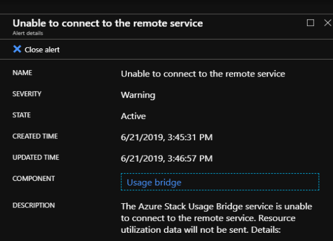
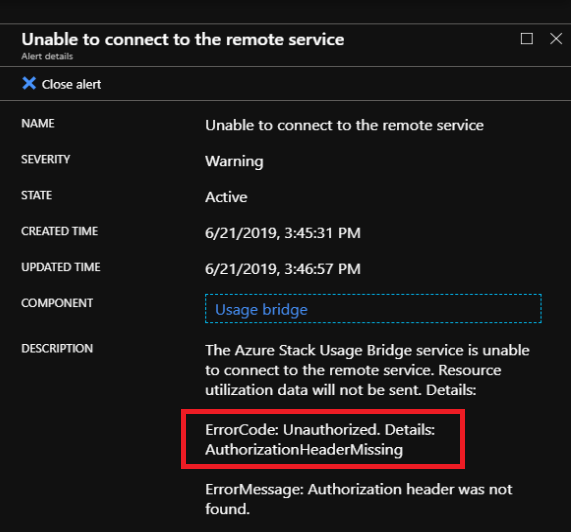
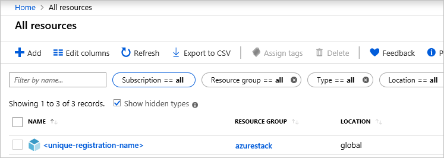

# Usage connectivity errors

Azure Stack Hub usage data is sent to Azure by the [*Azure Bridge*](azure-stack-usage-reporting.md) component in Azure Stack Hub. If the bridge within Azure Stack Hub is unable to connect to the Azure usage service, the following error appears:

The window may provide more information about the error and resolution:

## Resolve connectivity issues

To mitigate the issue, try the following steps:

- Verify that network configuration allows the Azure Bridge to connect to the remote service.

- Go to the [**Region Management** > **Properties**](azure-stack-registration.md#verify-azure-stack-hub-registration) blade to find the Azure subscription ID used for the registration, resource group, and name of the registration resource. Verify that the registration resource exists under the correct Azure subscription ID in Azure portal. To do so, go to **All resources** created under the Azure subscription ID, and check the **Show hidden types** box. If you can't find the registration resource, follow the steps in [Renew or change registration](azure-stack-registration.md#renew-or-change-registration) to re-register your Azure Stack Hub.

  

## Error codes

This section describes the usage error codes.

| Error code                 | Issue                                                                                                                                             | Remediation                                                                                                                                                                                                                                                                                        |
|----------------------------|---------------------------------------------------------------------------------------------------------------------------------------------------|----------------------------------------------------------------------------------------------------------------------------------------------------------------------------------------------------------------------------------------------------------------------------------------------------|
| NetworkError               | Azure Stack Hub bridge is unable to send request to usage service endpoint in Azure.                                                            | Check if a proxy is blocking or intercepting access to the usage service endpoint.                                                                                                                                                                                                             |
| RequestTimedOut            | Request was sent from the Azure Bridge but the usage service in Azure failed to respond within the timeout period.                             | Check if a proxy is blocking or intercepting access to the usage service endpoint.                                                                                                                                                                                                                        |
| LoginError                 | Unable to authenticate with Microsoft Azure Active Directory.                                                                                                             | Ensure the Azure AD login endpoint is accessible from all XRP VMs in Azure Stack Hub.                                                                                                                                                                                                                     |
| CertificateValidationError | The Azure bridge is unable to send the request because it is unable to authenticate with the Azure service.                                    | Check if there is a proxy intercepting HTTPS traffic between the Azure Stack Hub XRP machine and the usage gateway endpoint.                                                                                                                                                                                      |
| Unauthorized               | The Azure bridge is unable to push data to the usage service in Azure, because the Azure service is unable to authenticate the Azure Stack Hub bridge. | Check if the registration resource has been modified, and if so, re-register Azure Stack Hub.    Sometimes, a time sync issue between Azure Stack Hub and Azure AD can cause this failure. In this case, ensure the times on the XRP VMs on Azure Stack Hub are in sync with Azure AD. |
|                            |                                                                                                                                                   |                                                                                                                                                                                                                                                                                                    |

Additionally, you may be required to provide the log files for the Azure Bridge, WAS, and WASPublic components by following [these steps](azure-stack-configure-on-demand-diagnostic-log-collection.md#use-the-privileged-endpoint-pep-to-collect-diagnostic-logs).

## Next steps

- Learn more about [reporting Azure Stack Hub usage data to Azure](azure-stack-usage-reporting.md).
- To review error messages if they are triggered in your registration process, see [Tenant registration error messages](azure-stack-registration-errors.md).
- Learn more about the [Usage reporting infrastructure for Cloud Solution Providers](azure-stack-csp-ref-infrastructure.md).
