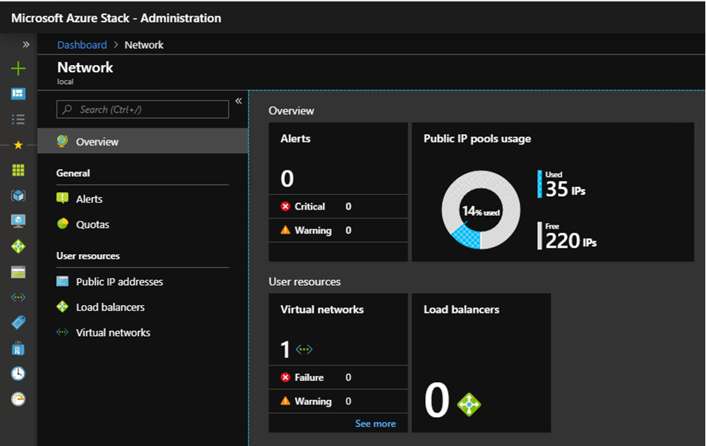
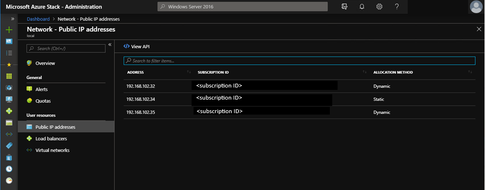

# Manage network resources in Azure Stack Hub

## MAC address pool

Azure Stack Hub uses a static MAC address pool to automatically generate and assign MAC address to virtual machines (VMs). This MAC address pool is automatically generated during deployment and uses the following range:

- StartMacAddress: 00-1D-D8-B7-00-00
- EndMacAddress: 00-1D-D8-F4-FF-FF

> [!Note]  
> This MAC address pool is the same across each Azure Stack Hub system and is not configurable.

Depending on how the virtual networks connect with existing corporate networks, you may expect duplicated MAC addresses of VMs.

More information can be found about MAC address pool utilization using the cmdlet [Get-AzsMacAddressPool](https://docs.microsoft.com/powershell/module/azs.fabric.admin/get-azsmacaddresspool) in the Azure Stack Hub administrator PowerShell module.

## View public IP address consumption in Azure Stack Hub

As a cloud administrator, you can view:
 - The number of public IP addresses that have been allocated to tenants.
 - The number of public IP addresses that are still available for allocation.
 - The percentage of public IP addresses that have been allocated in that location.

The **Public IP pools usage** tile shows the number of public IP addresses consumed across public IP address pools. For each IP address, the tile shows usage for tenant IaaS VM instances, fabric infrastructure services, and public IP address resources that were explicitly created by tenants.

The purpose of the tile is to give Azure Stack Hub operators a sense of the number of public IP addresses used in this location. The number helps administrators determine whether they're running low on this resource.

The **Public IP addresses** menu item under **Tenant Resources** lists only those public IP addresses that have been *explicitly created by tenants*. You can find the menu item on the **Resource providers** -> **Network** pane. The number of **Used** public IP addresses on the **Public IP pools usage** tile is always different from (larger than) the number on the **Public IP Addresses** tile
under **Tenant Resources**.

### View the public IP address usage information

To view the total number of public IP addresses that have been consumed
in the region:

1. In the Azure Stack Hub administrator portal, select **All services**. Then, under the **ADMINISTRATION** category, select **Network**.
1. The **Network** pane displays the **Public IP pools usage** tile in the **Overview** section.

    

The **Used** number represents the number of assigned public IP addresses from public IP address pools. The **Free** number represents the number of public IP addresses from public IP address pools that haven't been assigned and are still available. The **% Used** number represents the number of used or assigned addresses as a percentage of the total number of public IP addresses in public IP address pools in that location.

### View the public IP addresses that were created by tenant subscriptions

Select **Public IP addresses** under **Tenant Resources**. Review the list of public IP addresses explicitly created by tenant subscriptions in a specific region.

You might notice that some public IP addresses that have been dynamically allocated appear in the list. However, an address hasn't been associated with them yet. The address resource has been created in the Network Resource Provider, but not yet in the Network Controller.

The Network Controller doesn't assign an address to the resource until it
binds to an interface, a network interface card
(NIC), a load balancer, or a virtual network gateway. When the public IP
address binds to an interface, the Network Controller allocates an IP
address. The address appears in the **Address** field.

### View the public IP address information summary table

In different cases, public IP addresses are
assigned that determine whether the address appears in one
list or another.

| **Public IP address assignment case** | **Appears in usage summary** | **Appears in tenant public IP addresses list** |
| --- | --- | --- |
| Dynamic public IP address not yet assigned to an NIC or load balancer (temporary). |No |Yes |
| Dynamic public IP address assigned to an NIC or load balancer. |Yes |Yes |
| Static public IP address assigned to a tenant NIC or load balancer. |Yes |Yes |
| Static public IP address assigned to a fabric infrastructure service endpoint. |Yes |No |
| Public IP address implicitly created for IaaS VM instances and used for outbound NAT on the virtual network. These are created behind the scenes whenever a tenant creates a VM instance so that VMs can send information out to the Internet. |Yes |No |

## Next steps

[Manage Storage Accounts in Azure Stack Hub](azure-stack-manage-storage-accounts.md)
