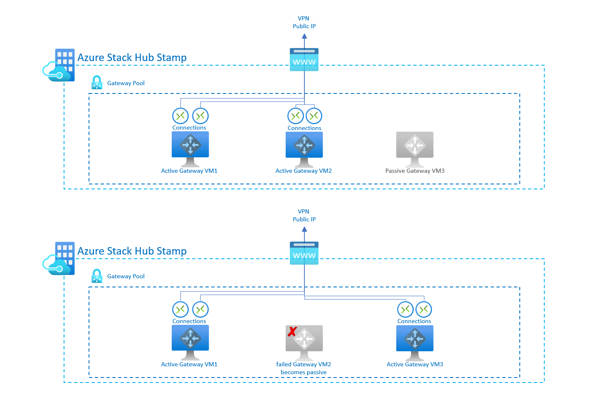
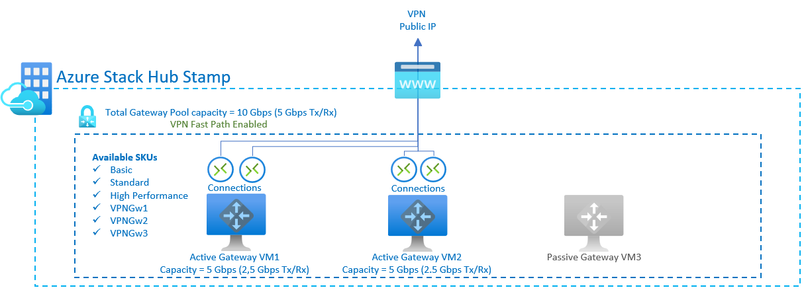

# Azure Stack Hub VPN Fast Path public preview for operators

## What is the Azure Stack Hub VPN Fast Path feature?

Azure Stack Hub is introducing new SKUs as part of the VPN Fast Path public preview. Previously, S2S tunnels were limited to a maximum bandwidth of 200 Mbps Tx/Rx using the High Performance SKU.

The new SKUs will enable many customer scenarios where higher network throughput is necessary. The throughput values for each SKU are unidirectional values, meaning it supports the said throughput on either of send or receive traffic.

In this article you will find documentation about the following topics:

- New VPN Fast Path virtual network gateway SKUs
- Important considerations before enabling Azure Stack Hub VPN Fast Path
- How to enable Azure Stack Hub VPN Fast Path
- Azure Stack Hub Gateway Pool architecture
- New Gateway Pool total capacity
- Monitoring Gateway Pool usage from the Azure Stack Hub admin portal
- Managing and troubleshooting VPN Connections from Azure Stack Hub admin portal
- Managing and troubleshooting VPN Connections using PowerShell

## New VPN Fast Path virtual network gateway SKUs

With the introduction of the VPN Fast Path feature in Azure Stack Hub, tenant users will have the option to create VPN connections using 3 new SKUs:

- Basic
- Standard
- High Performance
- VpnGw1 (new)
- VpnGw2 (new)
- VpnGw3 (new)

## Important considerations before enabling Azure Stack Hub VPN Fast Path

To make any update process go as smoothly as possible so that there's minimal impact on your users, it's important to prepare your Azure Stack Hub stamp.

As the Azure Stack Hub operator enabling VPN Fast Path, we recommend that you coordinate with tenant users to schedule a maintenance window during which the changeover can happen. Notify your users of any possible VPN connection service outages, and then follow the steps below to prepare your stamp for the update.

### VPN Fast Path requires NAT-T on remote VPN devices

Azure Stack Hub VPN Fast Path relies on the new SDN Gateway service, and it comes with a new requirement when planning.

### Plan with tenant users before enabling VPN Fast Path

- List of existing virtual network gateway resources settings.
- List of existing connections resources settings.
- List of IPSec policies and settings used on their existing connections.
   - This ensures your users have policies configured that work with their device, including custom IPSec policies.
- List local network gateway settings. Tenant users are able to re-use local network gateway resources and configurations. However, we also recommend that you save the existing configuration just in case they need to be re-created.
- Once VPN Fast Path is enabled, tenants must re-create their virtual network gateways and connections as appropriate if they want to use the new SKUs.

## How to enable Azure Stack Hub VPN Fast Path

For the VPN Fast Path public preview, operators can enable the new feature using the following PowerShell commands. Once the feature reaches general availability, the operators will also have the option to enable the feature using the Azure Stack Hub admin portal.

Existing setups can be adjusted by re-creating the virtual network gateway and its connections with one of the new SKUs.

### Enable Azure Stack Hub VPN Fast Path using PowerShell

From the Azure Stack Hub privileged endpoint you can run the following PowerShell command to enable the VPN Fast Path feature. 

For more information about the Azure Stack Hub PEP you can read this page [Access privileged endpoint](/azure-stack/operator/azure-stack-privileged-endpoint.md)

```powershell
Set-AzSVPNFastPath -Enable
```


### Validate Azure Stack Hub VPN Fast Path is enabled using PowerShell

Once the VPN Fast Path feature is enabled, you can validate the current state of the Gateway VMs and the used capacity using the following PowerShell command.

```powershell
Get-AzSVPNFastPath
```


## Azure Stack Hub Gateway Pool architecture

There are three multi-tenant gateway infrastructure VMs in Azure Stack Hub. Two of these VMs are in active mode, and the third is in redundant mode. Active VMs enable the creation of VPN connections on them, and the redundant VM only accepts VPN connections if a failover happens. If an active gateway VM becomes unavailable, the VPN connection fails over to the redundant VM after a short period (a few seconds) of connection loss.

Gateway connection failovers are expected during an OEM or an Azure Stack Hub update, as the VMs are patched and live migrated. This can result in a temporary disconnect of the tunnels.



## New Gateway Pool total capacity

The overall Gateway Pool capacity of an Azure Stack Hub stamp is 4 Gbps. This capacity is divided between the two Active Gateway VMs, with each Gateway VM supporting up to 2 Gbps of throughput. When a connection resource is created, twice its SKU is reserved on the Gateway VM. This ensures that the maximum throughput of the SKU (measured in one direction) can be reached with either Tx or Rx traffic, depending on the requirements of the user workload.

For example, a **HighPerformance** SKU will reserve 400 Mbps on a Gateway VM (200 for Tx, 200 for Rx). This means that on the existing engine, a **HighPerformance** connection reserves one tenth of the overall Gateway Pool capacity.

The following table shows the gateway types and the estimated aggregate throughput for each tunnel/connection by gateway SKU when VPN Fast Path is disabled:

| SKU | Max VPN Connection throughput (1) | Max # of VPN Connections per active GW VM | Max # of VPN Connections per stamp (2) |
|-------|-------|-------|-------|
|**Basic** **(3)** |  100 Mbps Tx/Rx  | 10 | 20 |
|**Standard** | 100 Mbps Tx/Rx  | 10 | 20 |
|**High Performance** |  200 Mbps Tx/Rx  | 5 | 10 |

### Table notes

**(1)** - Tunnel throughput is not a guaranteed throughput for cross-premises connections across the internet. It is the maximum possible throughput measurement. The total aggregate in one direction is 2 Gbps.  
**(2)** - Max tunnels is the total per Azure Stack Hub deployment for all subscriptions.  
**(3)** - BGP routing is not supported for the Basic SKU.


### Estimated aggregate tunnel throughput by SKU with VPN Fast Path Enabled

Once the operator enables VPN Fast Path on the Azure Stack Hub stamp, the overall Gateway Pool capacity will be increased to 10 Gbps. Since the capacity is divided between the two active Gateway VMs, each Gateway VM has a capacity of 5 Gbps. The amount of capacity reserved for each connection is the same as outlined above. Therefore, a VpnGw3 SKU (1250 Mbps) will reserve 2500 Mbps of capacity on a Gateway VM:

| SKU | Max VPN Connection throughput (1) |Max # of VPN Connections per active GW VM | Max # of VPN Connections per stamp (2) |
|-------|-------|-------|-------|
|**Basic** **(3)** | 100 Mbps Tx/Rx  | 25 | 50 |
|**Standard** | 100 Mbps Tx/Rx  | 25 | 50 |
|**High Performance** |  200 Mbps Tx/Rx  | 12 | 24 |
|**VPNGw1**|  650 Mbps Tx/Rx |3 |6|
|**VPNGw2**|  1000 Mbps Tx/Rx  |2 |4|
|**VPNGw3**|  1250 Mbps Tx/Rx  |2 |4|

#### Table notes

**(1)** - Tunnel throughput is not a guaranteed throughput for cross-premises connections across the internet. It is the maximum possible throughput measurement. The total aggregate in one direction is 5 Gbps.  
**(2)** - Max tunnels is the total per Azure Stack Hub deployment for all subscriptions.  
**(3)** - BGP routing is not supported for the Basic SKU.



<!-- ## Monitoring Gateway Pool usage from the Azure Stack Hub admin portal

>Placeholder section to include the new admin UX experience to monitor Gateway Pool usage

## Manage and troubleshoot VPN connections from the Azure Stack Hub admin portal

Placeholder section to include information about the new blades in the admin UX portal listing the virtual network gateways, the connections and current state of the connections for each subscription 

## Manage and troubleshoot VPN Connections using PowerShell

Placeholder section to include information about how to leverage the new Admin API via PowerShell to manage and troubleshoot tenant users VPN connections and overall Gateway Pool usage. -->

## Next steps

- [VPN gateway configuration settings for Azure Stack Hub](../user/azure-stack-vpn-gateway-settings.md)
