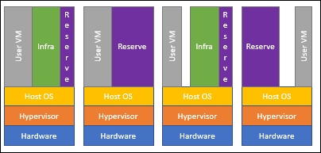
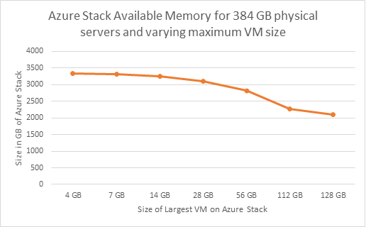
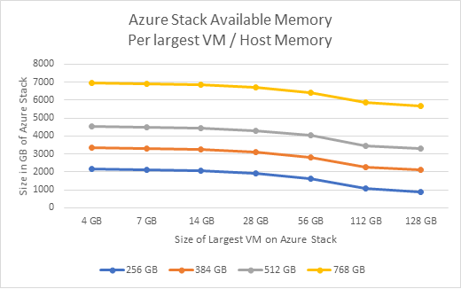

# Azure Stack capacity planning
When evaluating an Azure Stack Solution, there are hardware configuration choices that have a direct impact on the overall capacity of the Azure Stack Cloud. These are the classic choices of CPU, memory density, storage configuration, and overall solution scale or number of servers. Unlike a traditional virtualization solution, the simple arithmetic of these components to determine usable capacity does not apply. The first reason for this is that Azure Stack is architected to host the infrastructure or management components within the solution itself. The second reason is that some of the solution's capacity is reserved in support of resiliency, the updating of the solution's software in a way to minimize disruption of tenant workloads. <!--- is the reserve only for fault tolerance in the case of server failure or also for updating? compute planing topic says only fault tolerance. >

> [!IMPORTANT]
> This capacity planning information and the [Azure Stack Capacity Planner](https://aka.ms/azstackcapacityplanner) are a starting point for Azure Stack planning and configuration decisions. They are not intended to replace your own investigation and analysis. <!--- what do they need to analyze? Are there monitoring indicators or events or similar?>

An Azure Stack Solution is built as a hyper-converged cluster of compute and storage. The convergence allows for the sharing of the hardware capacity in the cluster, referred to as a *scale unit*. In Azure Stack, a scale unit provides the availability and scalability of resources. A scale unit consists of a set of Azure Stack servers, referred to as *hosts*. The infrastructure software is hosted within a set of VMs and shares the same physical servers as the tenant VMs. All Azure Stack VMs are then managed by the scale unit’s Windows Server clustering technologies and individual Hyper-V instances. The scale unit simplifies the acquisition and management Azure Stack. The scale unit also allows for the movement and scalability of all services (tenant and infrastructure) across Azure Stack. 

You can review a pie chart in the Administration portal that shows the free and used memory in Azure Stack. The following diagram shows the physical memory capacity on an Azure Stack scale unit in the Azure Stack: 


Used memory is made up of several components. The following components consume the memory in the use section of the pie chart.  

1. Host OS usage or reserve – This is the memory used by the operating system (OS) on the host, virtual memory page tables, processes that are running on the host OS, and the Spaces Direct memory cache.  
2. Infrastructure services – These are the infrastructure VMs that make up Azure Stack. As of the 1902 release version of Azure Stack, this entails 31 VMs that take up 242GB of memory and 146 cores. This internal service structure allows for the future introduction of new infrastructure services as they are developed.<!--- Theebs to review, should it say 1902 or 1904>
3. Resiliency reserve – Azure Stack reserves a portion of the memory to allow for tenant availability during a single host failure as well as during patch and update to allow for successful live migration of VMs. 
4. Tenant VMs – These are the tenant VMs created by Azure Stack users. In addition to running VMs, memory is consumed by any VMs that have landed on the fabric. This means that VMs in **Creating** or **Failed** state, or VMs shut down from within the guest, will consume memory. However, VMs that have been deallocated using the stop deallocated option will not consume memory from Azure Stack. 

   

## VM placement

In Azure Stack, tenant VM placement is done automatically by the placement engine across available hosts. 
The only two considerations when placing VMs are whether there is enough memory on the host for that VM type, and if the VMs are a part of an [availability set](https://docs.microsoft.com/azure/virtual-machines/windows/manage-availability) or are [virtual machine scale sets](https://docs.microsoft.com/azure/virtual-machine-scale-sets/overview).  

To achieve high availability of a multi-VM production system in Azure Stack, VMs are placed in an availability set that spreads them across multiple fault domains. 
A fault domain in an availability set is defined as a single node in the scale unit. 
Azure Stack supports having an availability set with a maximum of three fault domains to be consistent with Azure. 
VMs placed in an availability set will be physically isolated from each other by spreading them as evenly as possible over multiple fault domains, that is, Azure Stack hosts. 
If there is a hardware failure, VMs from the failed fault domain will be restarted in other fault domains, but, if possible, kept in separate fault domains from the other VMs in the same availability set. 
When the host comes back online, VMs will be rebalanced to maintain high availability.  

Virtual machine scale sets use availability sets on the back end and make sure each virtual machine scale set instance is placed in a different fault domain. 
This means they use separate Azure Stack infrastructure nodes. 
For example, in a 4 node Azure Stack system, there may be a situation where a virtual machine scale set of 3 instances will fail at creation due to the lack of the 4-node capacity to place 3 virtual machine scale set instances on 3 separate Azure Stack nodes. 
In addition, Azure Stack nodes can be filled up at varying levels prior to trying placement. 

Azure Stack doesn't over-commit memory. However, an over-commit of the number of physical cores is allowed. 
Since placement algorithms don't look at the existing virtual to physical core over-provisioning ratio as a factor, each host could have a different ratio. 

## Azure Stack memory 

Azure Stack is designed to keep VMs running that have been successfully provisioned. 
For example, if a host is offline because of a hardware failure, Azure Stack will attempt to restart that VM on another host. 
The second example is patch and update of the Azure Stack software. 
If there is a need to reboot a physical host, an attempt is made to move the VMs executing on that host to another available host in the solution.   

This VM management or movement can only be achieved if there is reserved memory capacity to allow for the restart or migration to occur. 
A portion of the total host memory is reserved and unavailable for tenant VM placement. 

The following calculation results in the total, available memory that can be used for tenant VM placement. 
This memory capacity is for the entirety of the Azure Stack scale unit. 


  Available Memory for VM placement = Total Host Memory - Resiliency Reserve - Memory used by running tenant VMs - Azure Stack Infrastructure Overhead <sup>1</sup>

  Resiliency reserve = H + R * ((N-1) * H) + V * (N-2)

> Where:
> -	H = Size of single server memory
> - N = Size of Scale Unit (number of servers)
> -	R = The operating system reserve for OS overhead, which is .15 in this formula<sup>2</sup>
> -	V = Largest VM in the scale unit

  <sup>1</sup> Azure Stack Infrastructure Overhead = 242 GB (4 x # of nodes). Approximately 31 VMs are used to host Azure Stack's infrastructure and, in total, consume about 242 GB of memory and 146 virtual cores. The rationale for this number of VMs is to satisfy the needed service separation to meet security, scalability, servicing and patching requirements. This internal service structure allows for the future introduction of new infrastructure services as they are developed. <!--- need to confirm 4 x # of nodes>

  <sup>2</sup> Operating system reserve for overhead = 15% (.15) of node memory. The operating system reserve value is an estimate and will vary based on the physical memory capacity of the server and general operating system overhead.


The value V, largest VM in the scale unit, is dynamically based on the largest tenant VM memory size. 
For example, the largest VM value could be 7 GB or 112 GB or any other supported VM memory size in the Azure Stack solution. 
Changing the largest VM on the Azure Stack fabric will result in an increase in the resiliency reserve in addition to the increase in the memory of the VM itself. 

This is a graph of a 12 node Azure Stack with 384 GB memory per node and how the amount of available memory varies depending on the size of the largest VM on the Azure Stack. 
The largest VM in these examples is the only VM that has been placed on the Azure Stack. 


  
The resiliency reserve is also a function of the size of the host. 
The following graph shows available memory on different node memory size Azure Stacks given the possible largest VM memory sizes. 




This calculation is an estimate and subject to change. The ability to deploy tenant VMs and services is based on specific factors of the deployed solution. This example calculation is a guide, but not an absolute answer to whether a VM can be deployed to a server.

> [!NOTE]
> The capacity planning requirements for networking are minimal as only the size of the Public VIP is configurable. For information about how to add more Public IP Addresses to Azure Stack, see [Add Public IP Addresses](azure-stack-add-ips.md).

## Azure Stack storage 
The following sections provide Azure Stack storage capacity planning information to assist in planning for the solutions's storage needs.

### Uses and Organization of Storage Capacity
The hyper-converged configuration of Azure Stack allows for the sharing of physical storage devices. The three main divisions of the available storage are between the infrastructure, temporary storage of the tenant virtual machines, and the storage backing the blobs, tables, and queues of the Azure Consistent Storage (ACS) services.

### Spaces Direct Cache and Capacity Tiers
There is storage capacity used for the operating system, local logging, dumps, and other temporary infrastructure storage needs. This local storage capacity is separate (devices and capacity) from the storage devices brought under management of the Storage Spaces Direct configuration. The remainder of the storage devices is placed in a single pool of storage capacity regardless of the number of servers in the Scale Unit. These devices are of two types: Cache and Capacity.  The Cache devices are just that - Cache. Spaces Direct will consume these devices for write-back and read caching. The capacities of these Cache devices, while used, are not committed to formatted, "visible" capacity of the formatted virtual-disks. The Capacity devices are used for this purpose and provide the "home location" of the data managed by Storage Spaces.

All storage capacity is allocated and managed directly by the Azure Stack infrastructure. The operator does need to make choices about configuration, allocation, or deal with choices when it comes to capacity expansion. These design decisions have been made to align with the solution requirements and are automated during either initial installation/deployment or during capacity expansion. Details about resiliency, reserved capacity for rebuilds, and other details have been considered as part of the design. 

Operators can choose between either an all flash or a hybrid storage configuration:


In the all flash configuration, the configuration can either be a two-tier or single-tier configuration.  If the configuration is single-tier, all capacity devices will be of the same type (e.g. NVMe or SATA SSD or SAS SSD) and cache devices are not used. In a two-tier all flash configuration, the typical configuration is NVMe as the cache devices and then either SATA or SAS SSDs as the capacity devices.

In the hybrid, two-tier configuration, the cache is a choice between NVMe, SATA or SAS SSD and the capacity is HDD. 

A brief summary of the Storage Spaces Direct and Azure Stack storage configuration is as follows:
- One Storage Spaces Pool per Scale Unit (all storage devices are configured within a single pool)
- Virtual-disks are created as a three copy mirror for best performance and resiliency
- Each virtual-disk is formatted as an ReFS file system
- Virtual-disk capacity is calculated and allocated in a way as to leave one Capacity device's amount of data capacity unallocated in the pool. This is the equivalent of one Capacity drive per server.
- Each ReFS file system will have BitLocker enabled for data-at-rest encryption. 

The virtual-disks created automatically and their capacities are as follows:

|Name|Capacity calculation|Description|
|-----|-----|-----|
|Local/boot device|Minimum of 340 GB<sup>1</sup>|Individual server storage for operating system images and "local" Infrastructure VMs|
|Infrastructure|3.5 TB|All Azure Stack infrastructure usage|
|VmTemp|See below<sup>2</sup>|Tenant virtual machines have a temporary disk attached and that data is stored in these virtual disks|
|ACS|See below <sup>3</sup>|Azure Consistent Storage capacity for servicing blobs, tables, and queues|

<sup>1</sup> Minimum storage capacity required of the Azure Stack solution partner.

<sup>2</sup> The virtual-disk size used for Tenant Virtual Machine temporary disks is calculated as a ratio of the physical memory of the server. As noted in the tables below for the Azure IaaS VM sizes, the temporary disk is a ratio of the physical memory assigned to the virtual machine. The allocation done for "temp disk" storage in Azure Stack will be done in a way as to capture most use cases but may not be able to satisfy all temp disk storage needs. The ratio chosen is a trade-off between making temporary storage available while not consuming a majority of the storage capacity of the solution for temp disk capacity only. One temporary storage disk is created per server in the Scale Unit. The capacity of the temporary storage will not grow beyond 10% of the overall available storage capacity in the storage pool of the Scale Unit. The calculation is something like the following example:

```
  DesiredTempStoragePerServer = PhysicalMemory * 0.65 * 8
  TempStoragePerSolution = DesiredTempStoragePerServer * NumberOfServers
  PercentOfTotalCapacity = TempStoragePerSolution / TotalAvailableCapacity
  If (PercentOfTotalCapacity <= 0.1)
      TempVirtualDiskSize = DesiredTempStoragePerServer
  Else
      TempVirtualDiskSize = (TotalAvailableCapacity * 0.1) / NumberOfServers
```

<sup>3</sup> The virtual-disks created for use by ACS are a simple division of the remaining capacity. As noted, all virtual-disks are a three-way mirror and one Capacity drive's worth of capacity for each server is unallocated. The various virtual-disks enumerated above are allocated first and the remaining capacity is then used for the ACS virtual-disks.

## Azure Stack Capacity Planner
The Azure Stack Capacity Planner is a spreadsheet that shows how different allocations of computing resources would fit across a selection of hardware offerings. 

### Worksheet descriptions
The following table has a decsription for each worksheet in the Azure Stack Capacity Planner, which can be downloaded from [https://aka.ms/azstackcapacityplanner](https://aka.ms/azstackcapacityplanner). 

|Tab Name|Description|
|-----|-----|
|Version-Disclaimer|Purpose of the calculator, version number, and release date.|
|Instructions|Step-by-step instructions to model capacity planning for a collection of virtual machines (VMs).|
|DefinedSolutionSKUs|Table with up to five hardware definitions. The entries are examples. Change the details to match system configurations under consideration.|
|DefineByVMFootprint|Find the appropriate hardware SKU by comparing configurations with different sizes and quantities of VMs.|
|DefineByWorkloadFootprint|Find the appropriate hardware SKU by creating a collection of Azure Stack workloads.|
|  |  |

### DefinedSolutionSKUs instructions
This worksheet contains up to five hardware definition examples. Change details to match the system configurations under consideration.

#### Hardware selections provided by Authorized Hardware Partners
Azure Stack is delivered as an integrated system with software installed by solution partners. Solution partners provide their own authoritative versions of Azure Stack capacity planning tools. Use those tools for final discussions of solution capacity.

#### Multiple ways to model computing resources
Resource modeling within the Azure Stack planner depends upon the various sizes of Azure Stack VMs. VMs range in size from the smallest Basic 0 up to the largest Standard_Fsv2. You can model computing resource allocations in two different ways:

1. Select a specific hardware offering and see which combinations of various resources fit. 

2. Create a specific combination of VM allocations and let the Azure Resource Calculator show which available hardware SKUs are capable of supporting this VM configuration.

This tool provides two methods for allocating VM resources: either as one single collection of VM resource allocations or as a collection of up to six differing Workload configurations. Each Workload configuration can contain a different allocation of available VM resources. The next sections have step-by-step instructions to create and use each of these allocation models. Only values contained in non-background shaded cells, or within SKU pull-down lists on this worksheet should be modified. Changes made within shaded cells may break resource calculations.


### DefineByVMFootprint instructions
To create a model using a single collection of various sizes and quantities of VMs, select the "DefineByVMFootprint" Tab and follow these steps:

1. In the upper right corner of this worksheet, use the provided pull-down list box controls to select an initial number of servers (between 4 and 16) you want installed in each hardware system (SKU). This number of servers may be modified at any time during the modeling process to see how this affects overall available resources for your resource allocation model.
2. If you want to model various VM resource allocations against one specific hardware configuration, find the blue pull-down list box directly below the "Current SKU" label in the upper right-hand corner of the page. Pull down this list box and select your desired hardware SKU.
3. You are now ready to begin adding various sized VMs to your model. To include a particular VM type, enter a quantity value into the blue outlined box to the left of that VM entry.

   > [!NOTE]
   > Total VM Storage refers to the total capacity of the data disk of the VM (number of supported disks * the maximum capacity of a single disk (1 TB)). Based on the configuration indicators we have populated the Available Storage Configurations table, so that you may choose your desired level of storage resource for each Azure Stack VM. However, it is important to note that you may add or change the Available Storage Configurations table as necessary.<br><br>Each VM starts with an initially assigned local temp storage. To reflect the thin provisioning of temp storage the local-temp number can be changed to anything in the drop down menu including the maximum allowable temp storage amount.

4. As you add VMs, you will see the charts that show available SKU resources changing. This allows you to see the effects of adding various sizes and quantities of VMs during the modeling process. Another way to view the effect of changes is to watch the Consumed and Still Available numbers listed directly below the list of available VMs. These numbers reflect estimated values based on the currently selected hardware SKU.
5. Once you have created your set of VMs, you can find the suggested hardware SKU by clicking the "Suggested SKU" button found in the upper right corner of the page, directly below the "Current SKU" label. Using this button, you can then modify your VM configurations and see which hardware supports each configuration.


### DefineByWorkloadFootprint instructions
To create a model using a collection of Azure Stack Workloads, select the "DefineByWorkloadFootprint" Tab and follow this sequence of steps. Azure Stack Workloads are created using available VM resources.   

> [!TIP]
> To change the provided storage size for an Azure Stack VM, see the note from step three in the preceding section.

1. In the upper right corner of this page, use the provided pull-down list box controls to select an initial number of servers (between 4 and 16) you want installed in each hardware system (SKU).
2. If you want to model various VM resource allocations against one specific hardware configuration, find the blue pull-down list box directly below the "Current SKU" label in the upper right-hand corner of the page. Pull down this list box and select your desired hardware SKU.
3. Select the appropriate storage size for each of your desired Azure Stack VMs on the DefineByVMFootprint page as described above in step three of DefineByVMFootprint instructions. The storage size per VM is defined in the DefineByVMFootprint sheet.
4. Starting on the upper left of the DefineByWorkloadFootprint page, create configurations for up to six different Workload types by entering the quantity of each VM type contained within that Workload. This is done by placing numeric values into the column directly below that Workload's name. Workload names may be modified to reflect the type of workloads that will be supported by this particular configuration.
5. You may include a particular quantity of each Workload type by entering a value at the bottom of that column directly below the "Quantity" label.
6. Once Workload types and quantities have been created, clicking the "Suggested SKU" button found in the upper right corner of the page, directly below the "Current SKU" label, will cause the smallest SKU with sufficient resources to support this overall configuration of Workloads to be displayed.
7. Further modeling may be accomplished by modifying the number of servers selected for a hardware SKU, or changing the VM allocations or quantities within your Workload configurations. The associated graphs will display immediate feedback showing how your changes affect the overall resource consumption.
8. Once you are satisfied with your changes, clicking the "Suggested SKU" button again will display the SKU suggested for your new configuration.


## Next steps
Learn about the [datacenter integration considerations for Azure Stack](azure-stack-datacenter-integration.md)
