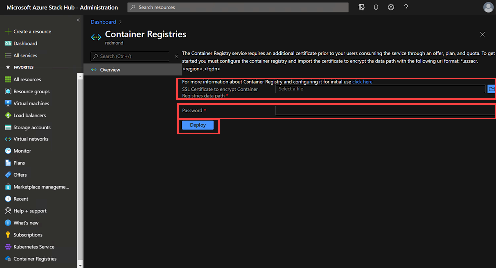
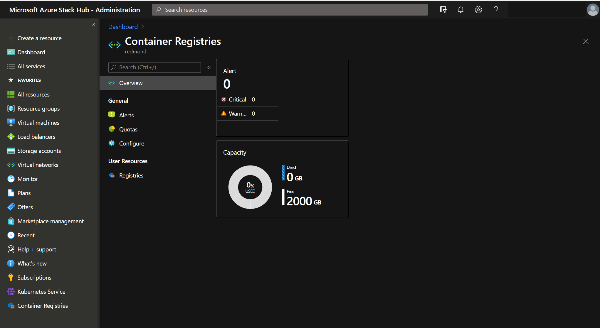

# Install Azure Container Registry on Azure Stack Hub

You can install the Azure Container Registry (ACR) on Azure Stack Hub and make it available to your users so that they can host containers in your environment. To install the ACR, you will need to generate and validate a certificate and install the ACR. You can install through the Azure Stack Hub administrative portal.


>[!IMPORTANT] 
>Once installed, Azure Container Registry on Azure Stack Hub is considered a foundational RP and cannot be uninstalled. Operators can still restrict user access to the ACR service through offers, plans, and quotas.

## Prerequisites

* **Azure Stack Hub version**  
    You can only enable the Microsoft Azure Container in an Azure Stack Hub integrated system running the 2108 update and later releases. Install the Azure Stack Hub update before you complete the steps in this article. The Azure Container Registry (ACR) service is not supported on the Azure Stack Developer Kit (ASDK) deployments.
* **Certificate requirements**  
    The configuration of the ACR on your Azure Stack Hub system adds a new data path that requires a certificate. The certificate must meet the same requirements as the other certificates required to install and operate Azure Stack Hub. You can find more information in the article, "[Azure Stack Hub public key infrastructure (PKI) certificate requirements](/azure-stack-pki-certs.md)."

    The URI for this new certificate should have the following format:

    `*.azsacr.<region>.<fqdn>`

    For example:

    `*.azsacr.azurestack.contoso.com`
## Generate your certificate

You can use the following steps to generate an ACR certificate using The Azure Stack Hub Readiness Checker tool. You must specific the version of the **Microsoft.AzureStack.ReadinessChecker** module for the steps to work.

1. Open PowerShell with an elevated prompt.

2. Run the following cmdlets:

    ```powershell  
    Install-Module -Name Microsoft.AzureStack.ReadinessChecker 
    New-Item -ItemType Directory "$ENV:USERPROFILE\Documents\AzsCertRequests"
                $certificateRequestParams = @{
                    'regionName' = 'azurestack'
                    'externalFQDN' = 'contoso.com'
                    'subject' = "C=US,ST=Washington,L=Redmond,O=Microsoft,OU=Azure Stack"
                    'OutputRequestPath' = "$ENV:USERPROFILE\Documents\AzsCertRequests" }
    New-AzsHubAzureContainerRegistryCertificateSigningRequest @certificateRequestParams
    ```

3. When the **ReadinessChecker** module creates the.req** file, sub the file to your Certificate Authority (CA) 
(either internal or public). The output directory of **New-AzsCertificateSigningRequest** 
contains the CSR(s) necessary to submit to a CA. For your reference, the directory also 
contains a child directory containing the INF file(s) used during certificate request generation.

## Validate the ACR certificate

Validate the ACR certificate adheres to Azure Stack Hub requirements.

1. Copy resulting certificate file (.cer) signed by the CA (supported extensions .cer, .cert, .srt, .pfx) to `\$ENV:USERPROFILE\Documents\AzureStack`.

2. Run the following PowerShell cmdlets from an elevated prompt:

    ```powershell
    Install-Module -Name Microsoft.AzureStack.ReadinessChecker 
    $Path = "\$ENV:USERPROFILE\Documents\AzureStack"
    $pfxPassword = Read-Host -AsSecureString -Prompt "PFX Password"
    ConvertTo-AzsPFX -Path \$Path -pfxPassword \$pfxPassword -ExportPath \$Path
    ```
## Installation steps

You can use these steps to install the ACR service in Azure Stack Hub.

### Portal

You can use the Azure Stack Hub administration portal to import the certificate and install the service.

1.  Sign into the Azure Stack Hub administration portal.
2. Navigate to **All Services** > **Container Registries**.
    
3. Enter the full path to the SSL certificate.
3. Enter the password for the certificate.
4. Select **Deploy**.  
    Installation of the ACR service may take up to one hour.

    

5. Once the install completes in the Azure Stack Hub administration portal, close and reopen the **Container Registries** blade.


Once the installation is complete, you can review or update your capacity in quota in the Azure Stack Hub administrative portal.

## Next steps

[Azure Container Registries on Azure Stack Hub overview](container-registries-overview.md)
