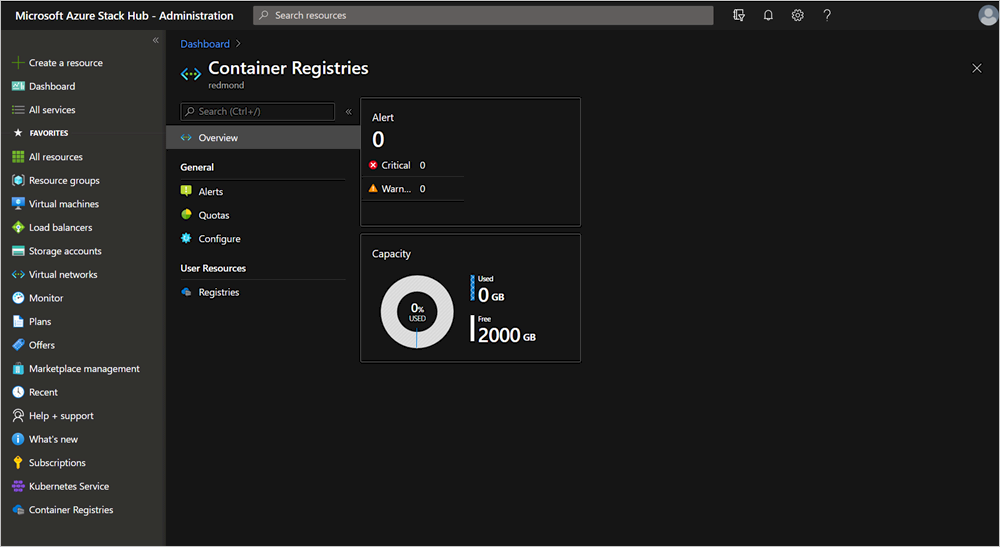

# Manage capacity and quotas for Azure Container Registry on Azure Stack Hub

Unlike Azure, Azure Stack Hub resources have physical constraints for memory and storage based on the configuration and number of available physical nodes. You have several options for limiting the amount of storage consumed by your user's containers and OCI artifacts.

## Set storage capacity

You can manage your container registry in the Azure Stack Hub administrative portal. 

1. Sign in to the Azure Stack Hub administrator portal.
2. Type `Container Registry` in the search.
3. Select **Configure**.
    
4. You can increase or decrease the capacity from the default of 2000 GB. Add your number, and then select **Configure**.

## View storage use

You can view the current storage usage by container registries in the Azure Stack Hub 
administrative portal. In the same view, you can compare utilized capacity to the maximum 
allocated capacity for the ACR in your Azure Stack Hub.

1. Sign in to the Azure Stack Hub administrator portal.
2. Type `Container Registry` in the search.
    
3. Select **Overview**.
## Quota settings

Besides restricting overall storage capacity used by container registries, you can
limit the use of the container registry service with the following quotas:

-   **Storage capacity per registry (GB)**  
    The maximum amount of storage that can be used by any registry. Registries by default 
    are limited to a maximum of 100 GB of storage, but you can offer more limited 
    quotas based on user deployments and user requirements.

-   **Maximum number of registries**  
    You can limit the number of registries that can be created per subscription.

You can find more guidance on offers, plans, and quotas in the article, [Azure Stack Hub services, plans, offers, subscriptions overview](service-plan-offer-subscription-overview.md)

## Next steps

[Azure Container Registries on Azure Stack Hub overview](container-registries-overview.md)
