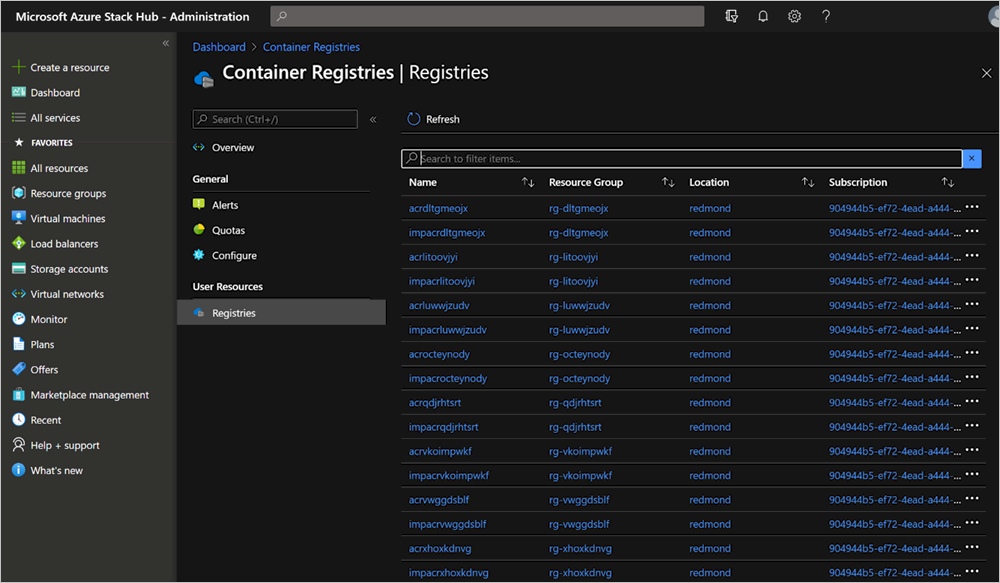
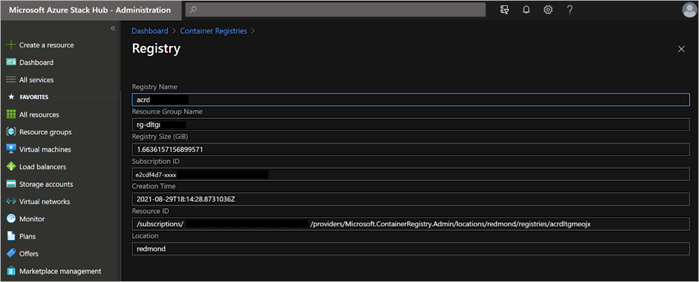

# Troubleshoot Azure Container Registry on Azure Stack Hub for cloud operators

As an Azure Stack Hub cloud operator you may need to troubleshoot or raise support issues with Microsoft during installation of Azure Container Registry (ACR), or due to issues hit by users of ACR on Azure Stack Hub. This document provides guidance on how to collect specific logs for ACR and collect other details required when raising support requests.

## Find the Resource ID for a registry

Users of ACR on Azure Stack Hub have troubleshooting guidance available for self-help. If they are unable to resolve an issue with their registry, they may need the operator's help in creating a support request. When creating a support request for a user registry issue the Resource ID will be required during case creation. Users have guidance to find this, but Operators can also find this using the following steps.

1.  Open the Azure Stack Hub administration portal, and then open **Container Registries**.
2.  Select **Registries** under **User Resources**.
3.  Search for the name of the registry in the list view  
    [  ](./media/container-registries-troubleshoot/search-for-container-registry.png#lightbox)
4.  Select the registry to view the detail  
    [  ](./media/container-registries-troubleshoot/details-for-container-registry.png#lightbox)
5.  Copy the **Resource ID** field.

## Collect logs for support

ACR logs are collected when collecting logs from the Azure Stack Hub administration portal or during a full run of **Send-AzureStackDiagnosticLog**. There may be circumstances where you just want to collect logs specific to ACR, for example, if you are collecting for more than a four-hour period.

### Collecting logs for ACR install issues

To collect ACR logs for ACR issues including installation issues, run **Send-AzureStackDiagnosticLog** with the following parameters:

```powershell  
Send-AzureStackDiagnosticLog -FilterByResourceProvider ACR -FilterByRole FabricRingServices,ECE,CLM
```

### Collecting logs for all other ACR issues

To collect ACR logs for ACR issues, excluding installation issues, run **Send-AzureStackDiagnosticLog** with the following parameters:

```powershell
Send-AzureStackDiagnosticLog -FilterByResourceProvider ACR -FilterByRole FabricRingServices
```

## Next steps

[Azure Container Registries on Azure Stack Hub overview](container-registries-overview.md)
