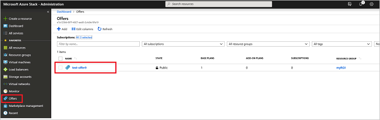
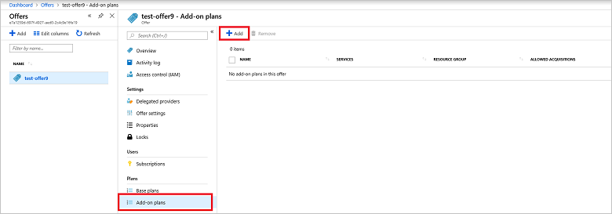
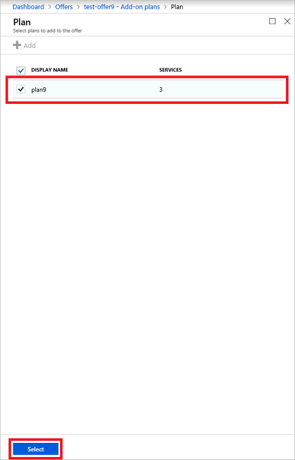
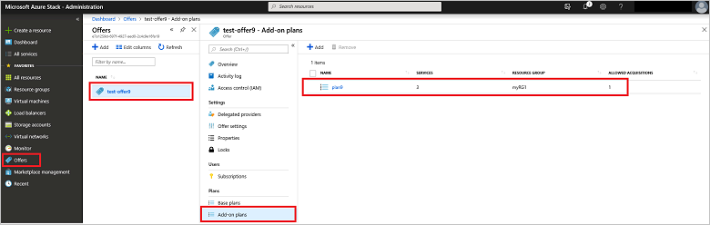

# Create add-on plans in Azure Stack Hub

As an Azure Stack Hub operator, you create add-on plans to modify a [base plan](azure-stack-create-plan.md) when you want to offer additional services or extend *computer*, *storage*, or *network* quotas beyond the base plan initial offer. Add-on plans modify the base plan and are optional extensions that users can choose to enable in their subscription.

There are times when combining everything in a single plan is optimal. Other times you might want to have a base plan and then offer the additional services by using add-on plans. For instance, you could decide to offer IaaS services as part of a base plan with all PaaS services treated as add-on plans.

Another reason to use add-on plans is to help monitor resource usage. To do so, you could start with a base plan that includes relatively small quotas (depending on the services required). Then, as users reach capacity, they would be alerted that they've consumed the allocation of resources based on their assigned plan. From there, the users can select an add-on plan that provides the additional resources.

> [!NOTE]
> When you don't want to use an add-on plan to extend a quota, you can also choose to [edit the original configuration of the quota](azure-stack-quota-types.md#edit-a-quota).

Add-on plans are [created the same way](azure-stack-create-plan.md) as a base plan. The difference between the two is determined when the plan is added to an offer. It's designated as either a base plan or add-on plan. When you add an add-on plan to an existing offer, the additional resources can take up to an hour to appear in the subscription.

::: moniker range=">=azs-1902"
## Create an add-on plan (1902 and later)

1. Sign in to the Azure Stack Hub administrator portal as a cloud administrator.
2. Follow the same steps used to [create a new base plan](azure-stack-create-plan.md) to create a new plan offering services that weren't previously offered.
3. In the administrator portal, select **Offers** and then select the offer to be updated with an add-on plan.

   

4. At the bottom of the offer properties, select **Add-on plans**. Select **Add**.

    

5. Select the plan to add. In this example, the plan is called **20-storageaccounts**. After selecting the plan, click **Select** to add the plan to the offer. You should receive a notification that the plan was added to the offer successfully.

    

6. Review the list of add-on plans included with the offer to verify that the new add-on plan is listed.

    ](media/create-add-on-plan/add-on4lg.png#lightbox)
::: moniker-end

::: moniker range="<=azs-1901"

## Create an add-on plan (1901 and earlier)

1. Sign in to the Azure Stack Hub administrator portal as a cloud administrator.
2. Follow the same steps used to [create a new base plan](azure-stack-create-plan.md) to create a new plan offering services that weren't previously offered. In this example, Key Vault (**Microsoft.KeyVault**) services will be included in the new plan.
3. In the administrator portal, select **Offers** and then select the offer to be updated with an add-on plan.

   

4. Scroll to the bottom of the offer properties and select **Add-on plans**. Select **Add**.

    

5. Select the plan to add. In this example, the plan is called **Key vault plan**. After selecting the plan, click **Select** to add the plan to the offer. You should receive a notification that the plan was added to the offer successfully.

    

6. Review the list of add-on plans included with the offer to verify that the new add-on plan is listed.

    

::: moniker-end

## Next steps

* [Create an offer](azure-stack-create-offer.md)
