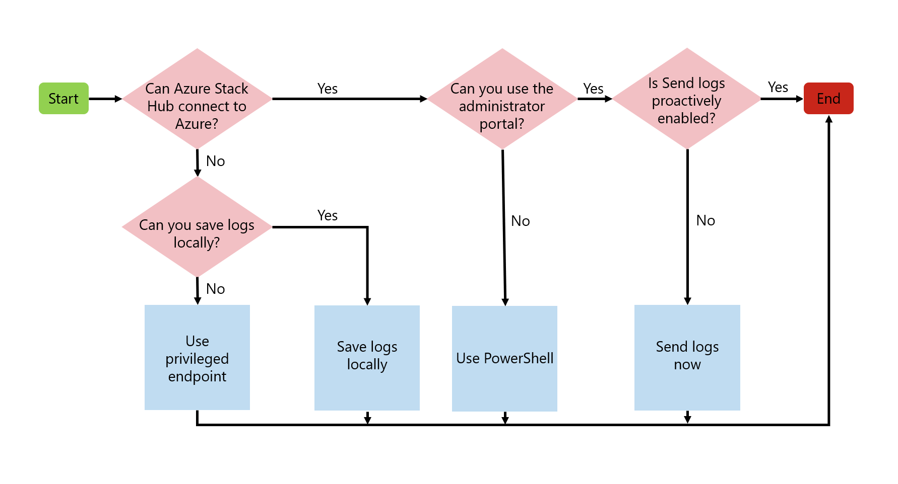
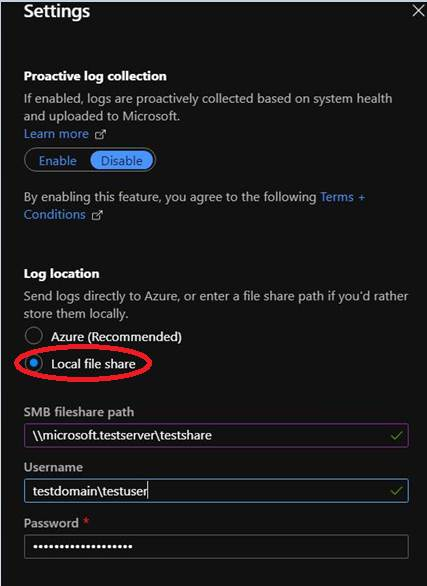

# Diagnostic log collection

You can share diagnostic logs created by Azure Stack Hub. These logs are created by the Windows components and on-premises Azure services. Microsoft Support can use the logs to fix or identify issues with your Azure Stack Hub instance.

To get started with Azure Stack Hub diagnostic log collection, you have to register your instance. If you haven't registered Azure Stack Hub, use [the privileged endpoint (PEP)](azure-stack-get-azurestacklog.md) to share logs. 

::: moniker range=">= azs-2005"

You have multiple ways to send diagnostic logs to Microsoft Support. Depending on your connectivity to Azure, your options include:
* [Send logs proactively (recommended)](#send-logs-proactively)
* [Send logs now](#send-logs-now)
* [Save logs locally](#save-logs-locally)

The flowchart shows which option to use for sending diagnostic logs. If Azure Stack Hub connects to Azure, enable **Proactive log collection**. Proactive log collection automatically uploads diagnostic logs to a Microsoft-controlled storage blob in Azure when a critical alert gets raised. You can also collect logs on-demand by using **Send logs now**. For an Azure Stack Hub that runs in a disconnected environment, or if you're having connectivity issues, choose to **Save logs locally**.



::: moniker-end

## Send logs proactively

Proactive log collection automatically collects and sends diagnostic logs from Azure Stack Hub to Microsoft before you open a support case. These logs are only collected when a system health alert is raised and are only accessed by Microsoft Support in the context of a support case.

::: moniker range=">= azs-2008"

Beginning with Azure Stack Hub version 2008, proactive log collection uses an improved algorithm that captures logs even during error conditions that aren't visible to an operator. This makes sure that the right diagnostic info is collected at the right time without needing any operator interaction. Microsoft support can begin troubleshooting and resolve problems sooner in some cases. Initial algorithm improvements focus on patch and update operations. Logs will be collected by path and update events that trigger alerts in the portal such as `Urp.UpdateFailure` and `Urp.UpdateWarning`. Enabling proactive log collections is recommended as more operations are optimized and the benefits increase.

::: moniker-end

Proactive log collection can be disabled and re-enabled anytime. Follow these steps to set up proactive log collection.

1. Sign in to the Azure Stack Hub administrator portal.
1. Open **Help + support Overview**.
1. If the banner appears, select **Enable proactive log collection**. Or you can select **Settings** and set **Proactive log collection** to **Enable**, then select **Save**.

> [!NOTE]
> If log location settings are configured for a local file share, make sure lifecycle management policies will prevent share storage from reaching its size quota. Azure Stack Hub does not monitor local file share or enforce any retention policies.   

### How the data is handled

You agree to periodic automatic log collections by Microsoft based only on Azure Stack Hub system health alerts. You also acknowledge and consent to the upload and retention of those logs in an Azure storage account managed and controlled by Microsoft.

The data will be used only troubleshooting system health alerts and won't be used for marketing, advertising, or any other commercial purposes without your consent. The data can be retained for up to 90 days and any data Microsoft collects will be handled following our [standard privacy practices](https://privacy.microsoft.com/).

Any data previously collected with your consent won't be affected by the revocation of your permission.

Logs collected using **Proactive log collection** are uploaded to an Azure storage account managed and controlled by Microsoft. These logs may be accessed by Microsoft in the context of a support case and to improve the health of Azure Stack Hub.
k## Send logs now

## Send logs now

> [!TIP]
> Save time by using [Send logs proactively](#send-logs-proactively) instead of Send logs now.

Send logs now is an option where you manually collect and uploads your diagnostic logs from Azure Stack Hub, usually before opening a support case.

There are two ways you can manually send diagnostic logs to Microsoft Support:
* [Administrator portal (recommended)](#send-logs-now-with-the-administrator-portal)
* [PowerShell](#send-logs-now-with-powershell)

If Azure Stack Hub is connected to Azure, we recommend using the administrator portal because it's the simplest way to send the logs directly to Microsoft. If the portal is unavailable, you should send logs using PowerShell.

### Send logs now with the administrator portal

To send logs now using the administrator portal:

1. Open **Help + support > Log Collection > Send logs now**. 
1. Specify the start time and end time for log collection. 
1. Choose the local time zone.
1. Select **Collect and Upload**.

If you're disconnected from the internet or want to only save logs locally, use the [Get-AzureStackLog](azure-stack-get-azurestacklog.md) method to send logs.

### Send logs now with PowerShell

If you're using the **Send logs now** method and want to use PowerShell instead of the administrator portal, you can use the `Send-AzureStackDiagnosticLog` cmdlet to collect and send specific logs.

* The **FromDate** and **ToDate** parameters can be used to collect logs for a particular time period. If these parameters aren't specified, logs are collected for the past four hours by default.

* Use the **FilterByNode** parameter to filter logs by computer name. For example:

  ```powershell
  Send-AzureStackDiagnosticLog -FilterByNode azs-xrp01
  ```

* Use the **FilterByLogType** parameter to filter logs by type. You can choose to filter by File, Share, or WindowsEvent. For example:

  ```powershell
  Send-AzureStackDiagnosticLog -FilterByLogType File
  ```

* Use the **FilterByResourceProvider** parameter to send diagnostic logs for value-add Resource Providers (RPs). The general syntax is:
 
  ```powershell
  Send-AzureStackDiagnosticLog -FilterByResourceProvider <<value-add RP name>>
  ```

  ::: moniker range=">= azs-2008"

  To send diagnostic logs for SQL RP: 

  ```powershell
  Send-AzureStackDiagnosticLog -FilterByResourceProvider SQLAdapter
  ```
  To send diagnostic logs for MySQL RP: 

  ```powershell
  Send-AzureStackDiagnosticLog -FilterByResourceProvider MySQLAdapter
  ```
  
  ::: moniker-end

  To send diagnostic logs for IoT Hub: 

  ```powershell
  Send-AzureStackDiagnosticLog -FilterByResourceProvider IotHub
  ```
 
  To send diagnostic logs for Event Hubs:

  ```powershell
  Send-AzureStackDiagnosticLog -FilterByResourceProvider eventhub
  ```
 
  To send diagnostic logs for Azure Stack Edge:

  ```powershell
  Send-AzureStackDiagnosticLog -FilterByResourceProvide databoxedge
  ```

* Use the **FilterByRole** parameter to send diagnostic logs from VirtualMachines and BareMetal roles:

  ```powershell
  Send-AzureStackDiagnosticLog -FilterByRole VirtualMachines,BareMetal
  ```

* To send diagnostic logs from VirtualMachines and BareMetal roles, with date filtering for log files for the past 8 hours:

  ```powershell
  Send-AzureStackDiagnosticLog -FilterByRole VirtualMachines,BareMetal -FromDate (Get-Date).AddHours(-8)
  ```

* To send diagnostic logs from VirtualMachines and BareMetal roles, with date filtering for log files for the time period between 8 hours ago and 2 hours ago:

  ```powershell
  Send-AzureStackDiagnosticLog -FilterByRole VirtualMachines,BareMetal -FromDate (Get-Date).AddHours(-8) -ToDate (Get-Date).AddHours(-2)
  ```

> [!NOTE]
> If you're disconnected from the internet or want to only save logs locally, use [Get-AzureStackLog](azure-stack-get-azurestacklog.md) method to send logs. 

### How the data is handled

By initiating diagnostic log collection from Azure Stack Hub, you acknowledge and consent to uploading those logs and retaining them in an Azure storage account managed and controlled by Microsoft. Microsoft Support can access these logs right away with the support case without having to engage with the customer for log collection.

::: moniker range=">= azs-2005"

## Save logs locally

You can save logs to a local Server Message Block (SMB) share when Azure Stack Hub is disconnected from Azure. You may, for example, run a disconnected environment. If you're normally connected but are experiencing connectivity issues, you can save logs locally to help with troubleshooting.

 In the **Settings** blade, enter the path and a username and password with permission to write to the share. During a support case, Microsoft Support will provide detailed steps on how to get these local logs transferred. If the Administrator portal is unavailable, you can use [Get-AzureStackLog](azure-stack-get-azurestacklog.md) to save logs locally.



::: moniker-end

## Bandwidth considerations

The average size of diagnostic log collection varies based on whether it runs proactively or manually. The average size for **Proactive log collection** is around 2 GB. The collection size for **Send logs now** depends on how many hours are being collected.

The following table lists considerations for environments with limited or metered connections to Azure.

| Network connection | Impact |
|----|---|
| Low-bandwidth/high-latency connection | Log upload will take an extended amount of time to complete. |
| Shared connection | The upload may also impact other apps/users sharing the network connection. |
| Metered connection | There may be another charge from your ISP for the extra network usage. |

## View log collection

The history of logs collected from Azure Stack Hub appears on the **Log collection** page in **Help + support**, with the following dates and times:

- **Time Collected**: When the log collection operation began.
- **Status**: Either in progress or complete.
- **Logs start**: Start of the time period for which you want to collect.
- **Logs end**: End of the time period.
- **Type**: If it's a manual or proactive log collection.


## See also

[Azure Stack Hub log and customer data handling](./azure-stack-data-collection.md)
