# How to install Event Hubs on Azure Stack Hub

This article shows you how to download and install the Event Hubs resource provider, making it available to offer to customers for subscription.

## Download packages

Before you can install Event Hubs on Azure Stack Hub, you must download the resource provider and its dependent packages. You have two options, depending on your situation or requirements:

- Download Event Hubs under a connected scenario.
- Download Event Hubs under a disconnected or partially connected scenario.

If you're not familiar with the **Marketplace Management** feature of the Azure Stack Hub administrator portal, spend time reviewing [Download marketplace items from Azure and publish to Azure Stack Hub](azure-stack-download-azure-marketplace-item.md). This article will walk you through the process of downloading items from Azure to the Azure Stack Hub marketplace. It covers both connected and disconnected scenarios. 

### Download Event Hubs - connected scenario

> [!NOTE]
> The download process can take 30 minutes to 2 hours, depending on the network latency and existing packages on your Azure Stack Hub instance. 

Follow these instructions if your Azure Stack Hub has Internet connectivity:

1. Sign in to the Azure Stack Hub administrator portal.
2. Select **Marketplace Management** on the left.
3. Select **Resource providers**.
4. Select **+ Add from Azure**.
5. Search for "Event Hubs" using the search bar.
6. Select the "Event Hubs" row on the search results. 
7. On the "Event Hubs" download page, select the Event Hubs version you wish to install, then select **Download** at the bottom of the page. 
   [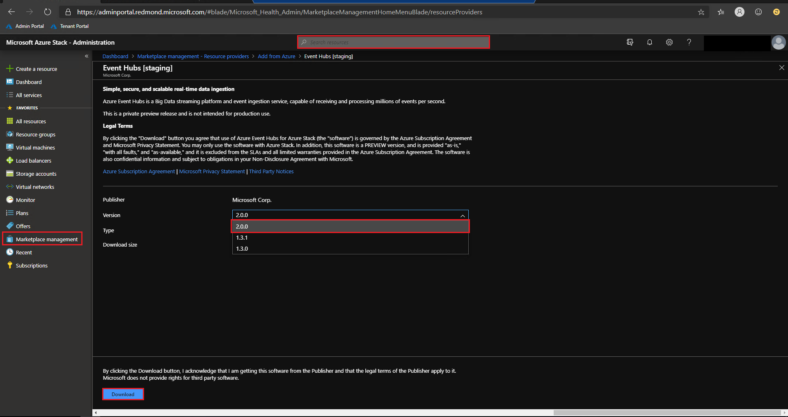](media/event-hubs-rp-install/1-marketplace-management-download.png#lightbox)

Notice that additional software packages are downloaded along with Event Hubs, including:

- Microsoft Azure Stack Hub Add-On RP Windows Server INTERNAL ONLY
- PowerShell Desired State Configuration

Once the download process is complete, skip to the [Install Prerequisites section](#install-prerequisites).

### Download Event Hubs - disconnected or partially connected scenario

First you download the packages to your local machine, then you import them into your Azure Stack Hub instance.

1. If you haven't already, follow the instructions in [Download Marketplace items - Disconnected or partially connected scenarios](azure-stack-download-azure-marketplace-item.md#disconnected-or-a-partially-connected-scenario). Here you download and run the Marketplace Syndication tool, which allows you to download the Event Hubs packages.
2. After the syndication tool's "Azure Marketplace Items" window opens, find and select "Event Hubs" to download the required packages to your local machine.
3. Once the download finishes, you import the packages to your Azure Stack Hub instance and publish to Marketplace. 

## Installation 

1. If you haven't already, sign in to the Azure Stack Hub administrator portal.
2. Select **Marketplace Management** on the left, then select **Resource providers**.
3. Once Event Hubs and other required software have been downloaded, **Marketplace Management** should show the "Event Hubs" packages with a status of "Not Installed". There may be other packages that show a status of "Downloaded". Select the "Event Hubs" row you wish to install.
   [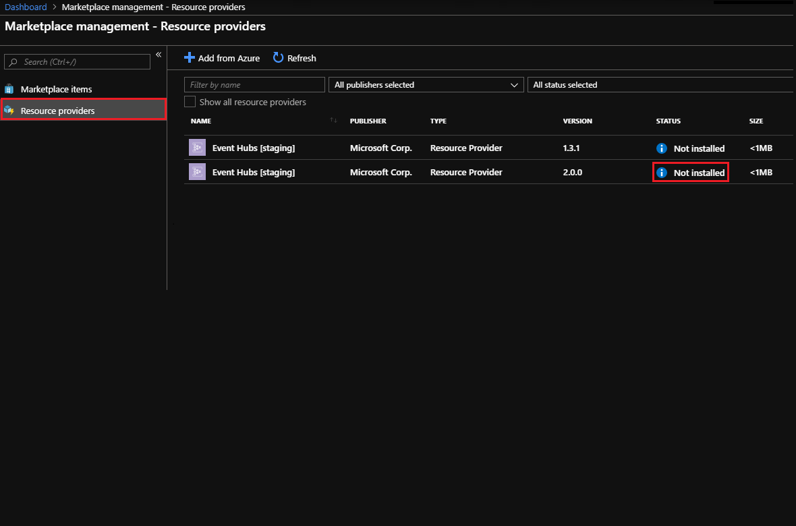](media/event-hubs-rp-install/2-marketplace-management-downloaded.png#lightbox)
 
4. The Event Hubs install package page should show a blue banner across the top. Select the banner to start the installation of Event Hubs.
   [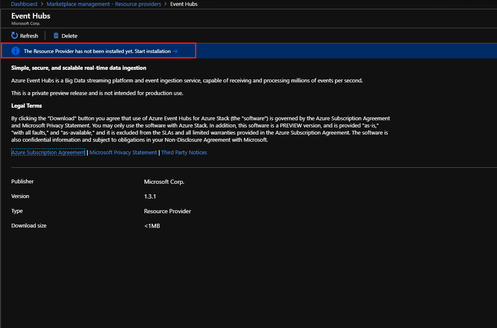](media/event-hubs-rp-install/3-marketplace-management-install-ready.png#lightbox)

### Install prerequisites

1. Next you're transferred to the install page. Select **Install Prerequisites** to begin the installation process.
   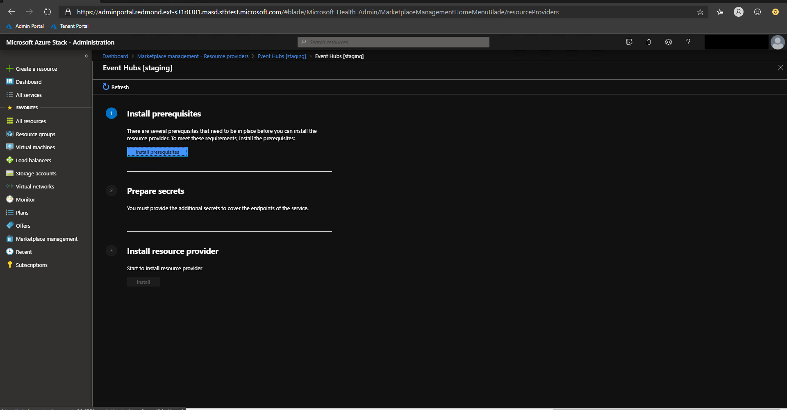
 
2. Wait until the installation of prerequisites succeeds. You should see a green checkmark next to **Install prerequisites** before proceeding to the next step.

   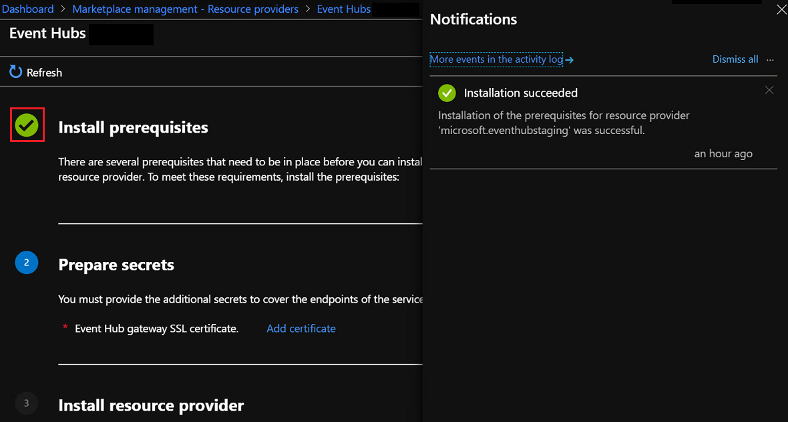

### Prepare secrets 

1. Under the **2. Prepare secrets** step, select **Add certificate**, and the **Add a certificate** panel will appear.
   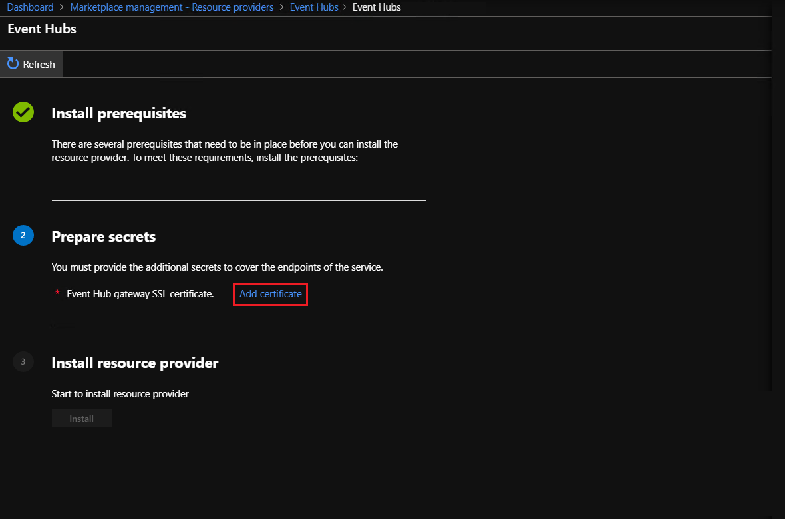

2. Select the browse button on **Add a certificate**, just to the right of the certificate filename field.
3. Select the .pfx certificate file you procured when completing the prerequisites. For more information, see [the installation Prerequisites](event-hubs-rp-prerequisites.md). 

4. Enter the password you provided to create a secure string for Event Hubs SSL Certificate. Then select **Add**.
   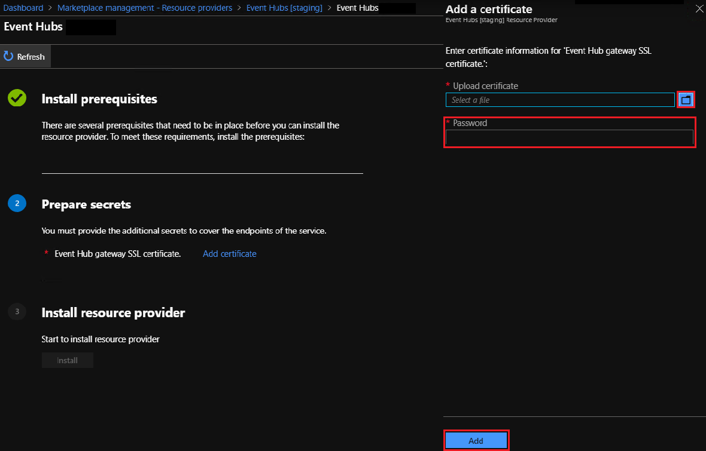

### Install resource provider

1. When the installation of the certificate succeeds, you should see a green checkmark next to **Prepare secrets** before proceeding to the next step. Now select the **Install** button next to **3 Install resource provider**.
   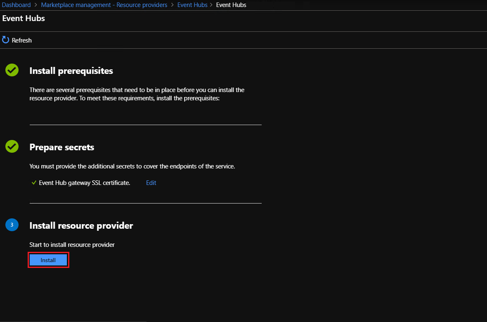
 
2. Next you'll see the following page, which indicates that Event Hubs resource provider is being installed.
   [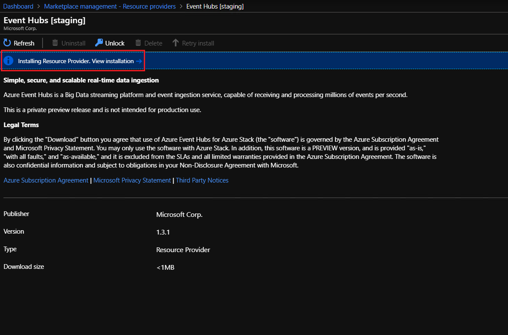](media/event-hubs-rp-install/9-marketplace-management-install-inprogress.png#lightbox)
 
3. Wait for the installation complete notification. This process usually takes one or more hours, depending on your Azure Stack Hub type. 
   [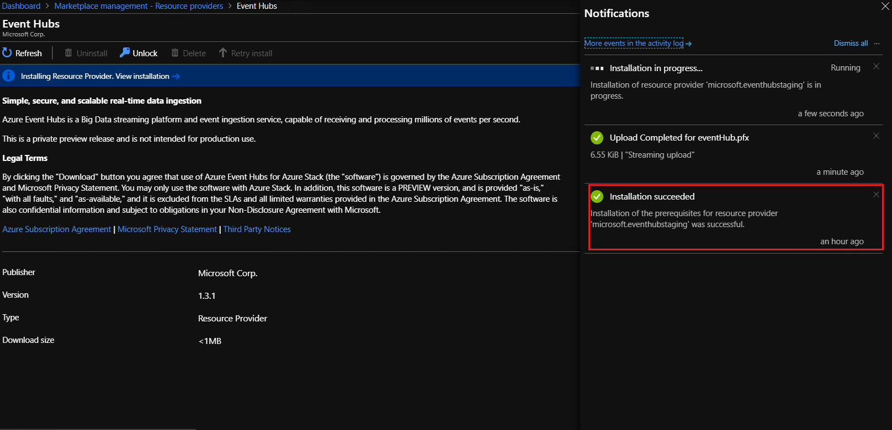](media/event-hubs-rp-install/10-marketplace-management-install-complete.png#lightbox)

4. Verify that the installation of Event Hubs has succeeded, by returning to the **Marketplace Management**, **Resource Providers** page. The status of Event Hubs should show "Installed".
   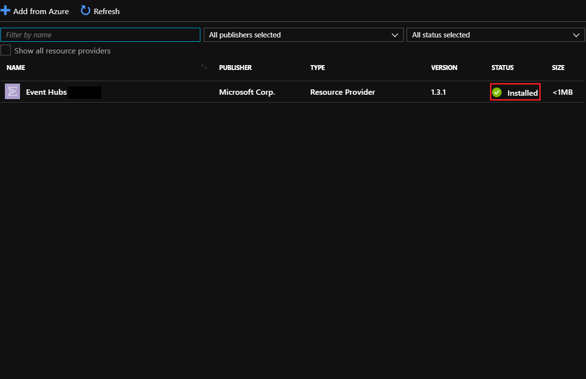

## Register Event Hubs

Now you need to register the Event Hubs resource provider. Registration allows you to use the Event Hubs administration page, to manage the service.

1. In the administrator portal, select **All services** in the top left.
2. Select **Subscriptions**. You're presented with a list of subscriptions. 
   > [!NOTE]
   > Be sure not to select **User Subscriptions**
3. Select **Default Provider Subscription**, on the **Subscriptions** page.
4. Select **Resource providers**, on the left of the **Default Provider Subscription** page.
5. In the **Filter by name** field at the top, search for the string "EventHub".
6. Look at the **Status** column of the "Microsoft.EventHub" and "Microsoft.EventHub.Admin" resource provider rows.
7. If any of them have a status of "Unregistered", select each provider, then select **Register**. 
   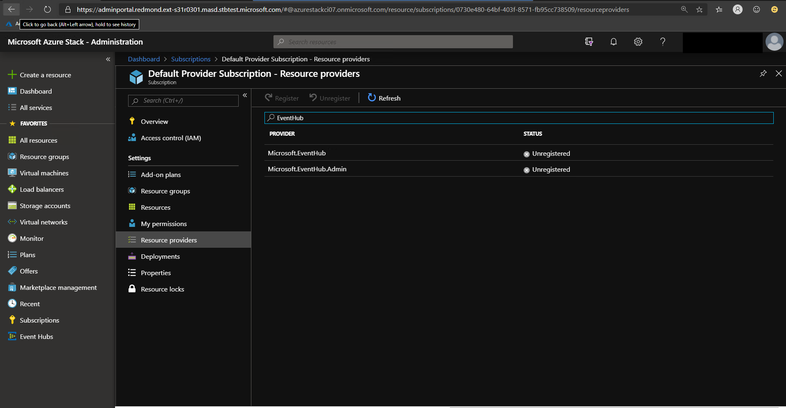
8. After a few seconds, select **Refresh**. You should now see the resource provider with a status of Registered. 
9. You should now see Microsoft.EventHub and Microsoft.EventHub.Admin, with a status of "Registered".
   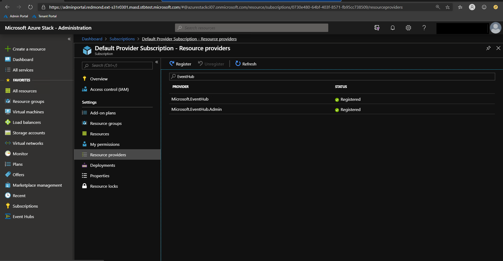

10. Return to the **All services** page.
11. Search for "Event Hubs". You should now see "Event Hubs", which is your entry point to Event Hubs administration page. 
   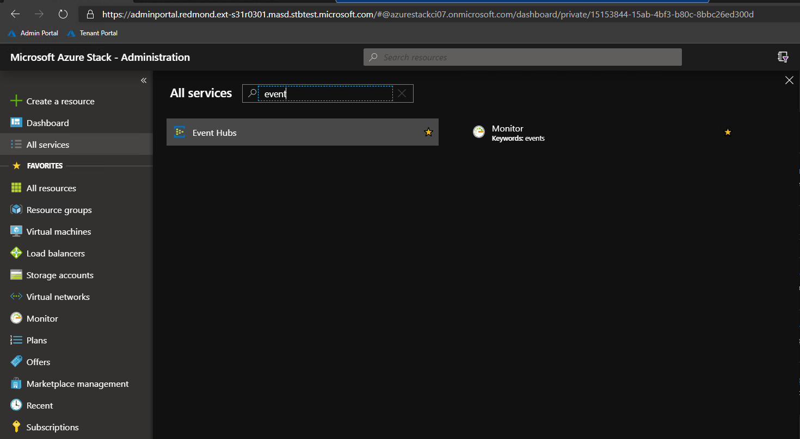
 
## Next steps

Before users can deploy Event Hubs resources, you must create one or more plans, offers, and subscriptions. 

- If this is the first time you're offering a service, start with the [Offer services to users](tutorial-offer-services.md) tutorial. Then continue with the next tutorial, [Test a service offering](tutorial-test-offer.md).
- Once you're familiar with the concept of offering a service, create an offer and plan that includes the Event Hubs resource provider. Then create a subscription for your users, or give them the offer information so they can create their own. For reference, you can also follow the series of articles under the [Service, plan, offer, subscription overview](service-plan-offer-subscription-overview.md).

To check for updates, [How to update Event Hubs on Azure Stack Hub](event-hubs-rp-update.md).

If you need to remove the resource provider, see [Remove the Event Hubs resource provider](event-hubs-rp-remove.md)

To learn more about the user experience, visit the [Event Hubs on Azure Stack Hub overview](../user/event-hubs-rp-overview.md) in the User documents.