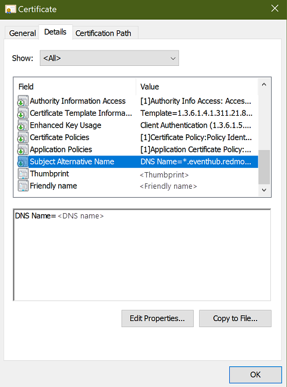

# Prerequisites for installing Azure Event Hubs on Azure Stack Hub

Before you can install Event Hubs on Azure Stack Hub, complete the following prerequisites. **You might need several days or weeks of lead time to complete all steps.**

> [!IMPORTANT]
> These prerequisites assume that you already deployed at least a 4-node Azure Stack Hub integrated system. The Event Hubs resource provider isn't supported on the Azure Stack Development Kit (ASDK).

> [!IMPORTANT]
> Event Hubs requires Azure Stack Hub 2005 build version or higher. Azure Stack Hub builds are incremental. For example, if you have version 1910 installed, you must first upgrade to 2002, then to 2005. You can't skip builds in-between.

## Common prerequisites

[!INCLUDE [Common RP prerequisites](../includes/resource-provider-prerequisites.md)]

## Event Hubs prerequisites

1. Get public key infrastructure (PKI) SSL certificates for Event Hubs. The Subject Alternative Name (SAN) must follow the naming pattern: `CN=*.eventhub.<region>.<fqdn>`. You can specify the Subject Name, but Event Hubs doesn't use it when handling certificates. Only the Subject Alternative Name is used. For the full list of detailed requirements, see [PKI certificate requirements](azure-stack-pki-certs.md).  

   

   > [!NOTE]
   > **PFX files must be password protected**. The installation process later requests the password.

1. Review [Validate your certificate](azure-stack-validate-pki-certs.md). The article shows you how to prepare and validate the certificates you use for the Event Hubs resource provider. 

## Next steps

Next, [install the Event Hubs resource provider](event-hubs-rp-install.md).
