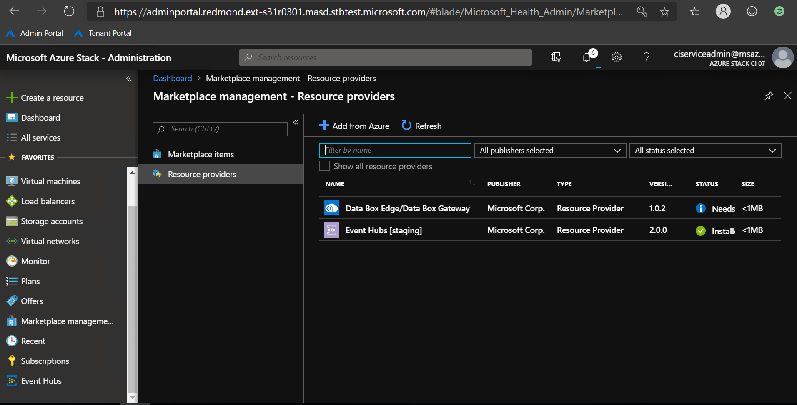
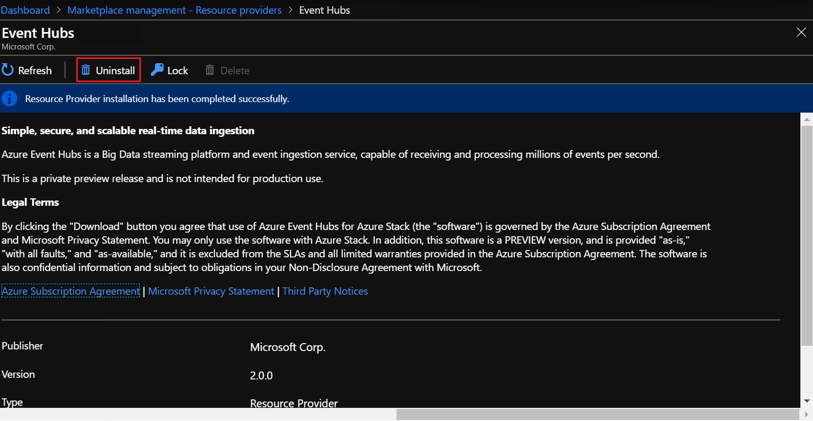
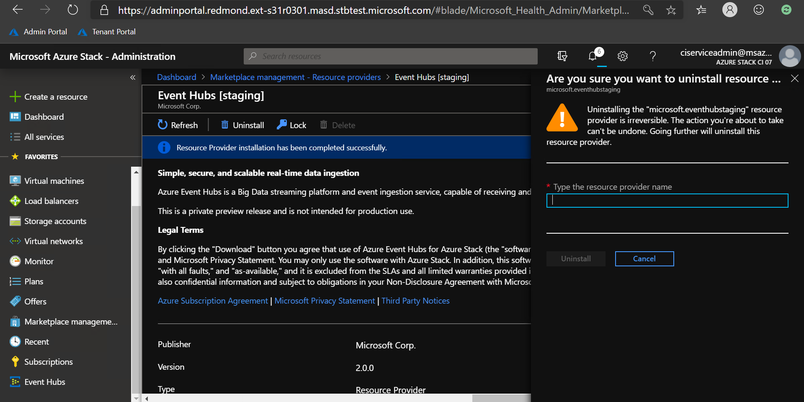
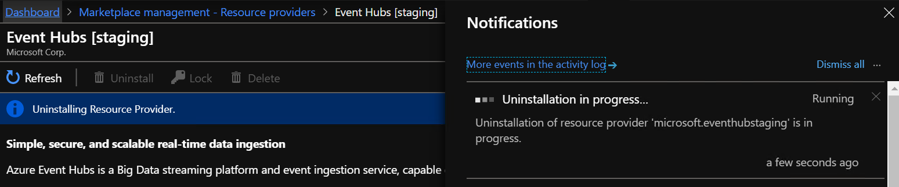

# How to remove Event Hubs on Azure Stack Hub

> [!WARNING]
> Uninstalling Event Hubs will remove (erase) the resource provider, and all user-created Event Hubs clusters, namespaces, and event hubs resources. It will also remove their associated event data.  
> Please proceed with extreme caution before deciding to uninstall Event Hubs. 
> Uninstalling Event Hubs **does not** delete the packages used to install Event Hubs. To achieve that, please refer to [Delete Event Hubs packages](#delete-event-hub-packages).

## Uninstall Event Hubs

This sequence of steps will remove all Event Hubs resources, including clusters, namespaces, event hubs, and the resource provider.

To remove Event Hubs and all related resources created by users, complete the following steps:

1. Sign in to the Azure Stack Hub administrator portal.
2. Select **Marketplace Management** on the left.
3. Select **Resource providers**.
4. Select **Event Hubs** from the list of resource providers. You may want to filter the list by entering "Event Hubs" in the search text box provided.

   

5. Select **Uninstall** from the options provided across the top the page.

   

6. Enter the name of the resource provider, then select **Uninstall**. This action confirms your desire to uninstall:
   - The Event Hubs resource provider
   - All user-created clusters, namespaces, event hubs, and event data.

   

   

   > [!IMPORTANT]
   > You must wait at least 10 minutes after Event Hubs has been removed successfully before installing Event Hubs again. This is due to the fact that cleanup activities might still be running, which may conflict with any new installation.

## Delete Event Hub packages

Use this option if after uninstalling Event Hubs you also wish to remove any packages used to install Event Hubs. 

## Next steps

To reinstall, return to the [Install the Event Hubs resource provider](event-hubs-rp-install.md) article.