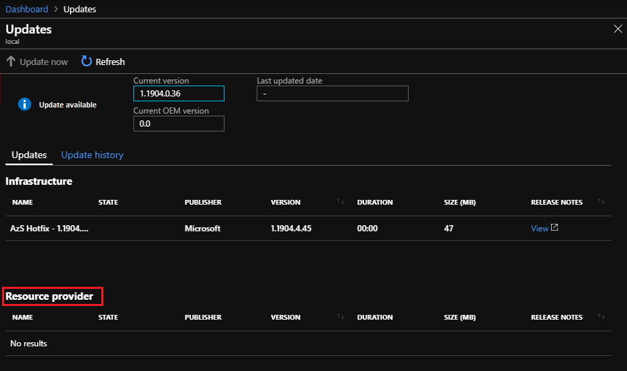

# How to update Event Hubs on Azure Stack Hub

The Event Hubs resource provider will require regular servicing. Servicing is done by applying service updates, provided by Microsoft on a regular basis. Updates can include both new features and fixes.  

## Check for updates

Resource provider updates are accomplished using the same [Dashboard Updates feature](azure-stack-apply-updates) used to apply Azure Stack Hub updates.

1. Sign in to the Azure Stack Hub administrator portal.
2. Select **Dashboard** on the left.
3. Select the **Update** tile on the Dashboard page.

   

4. On the **Updates** page, you find Event Hubs resource provider updates under the **Resource Provider** section.

   

## Apply an update

If in update is available for the Event Hubs resource provider:

1. Select the update row
2. TBD

For detailed release notes that accompany updates, refer to the [Event Hubs on Azure Stack Hub service updates](https://azure.microsoft.com/updates/?product=azure-stack) feed.

## Next steps

