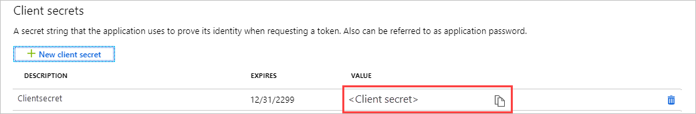
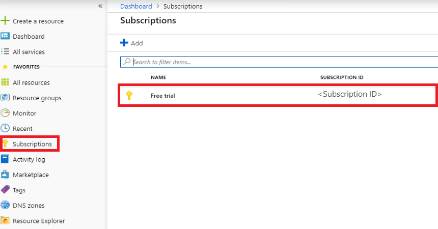
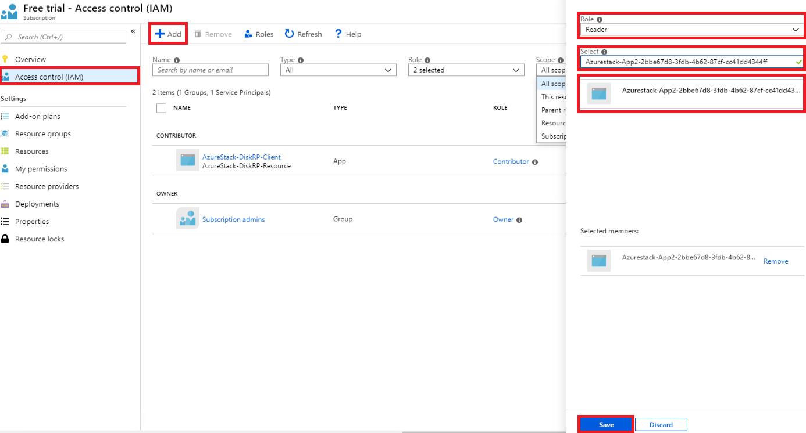
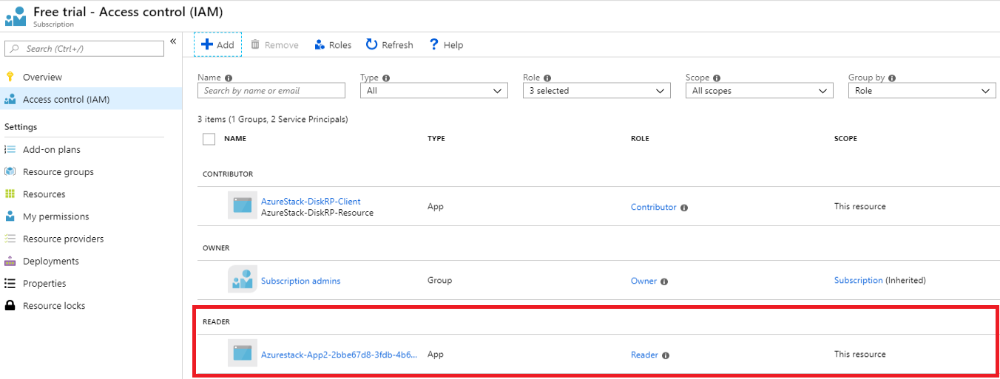

# Give an app access to Azure Stack Hub resources

An application that deploys or configures resources through Azure Resource Manager must be represented by its own identity, known as a security principal. Just as a user is represented by a user principal, an app is represented by a service principal. 

The identity can also be used to delegate only the necessary permissions to the user or app. For example, a configuration management app might use Azure Resource Manager to inventory Azure resources. The app would get registered in the directory, then added to the "reader" role at the appropriate scope, limiting the app to read-only access.

## Overview

Like a user, an app must present credentials during authentication, which requires two elements:

- An **Application ID**, sometimes referred to as a Client ID. A GUID that uniquely identifies the app's registration in your Active Directory tenant.
- A **secret**. You can either generate a client secret string (similar to a password), or specify an X509 certificate thumbprint (which uses its public key).

Running an app under its own identity is preferable to running it under the user's identity for the following reasons:

 - **Stronger credentials** - an app can sign in using an X509 certificate, instead of a textual shared secret/password.  
 - **More restrictive permissions** can be assigned to an app. Typically, these permissions are restricted to only what the app needs to do, known as the *principle of least privilege*.
 - **Credentials and permissions don't change as frequently** for an app as user credentials. For example, when the user's responsibilities change, password requirements dictate a change, or when a user leaves the company.

You start by creating a new app registration in your directory, which creates an associated [service principal object](/azure/active-directory/develop/developer-glossary#service-principal-object) to represent the app's identity within the directory. The registration process varies depending on the directory you chose for your Azure Stack Hub instance:

- **Microsoft Entra ID**: Microsoft Entra ID is a multi-tenant, cloud-based, directory and identity management service. You can use Microsoft Entra ID with a connected Azure Stack Hub instance. The examples presented later will use the Azure portal for Microsoft Entra app registration.
- **Active Directory Federation Services (AD FS)**: AD FS provides simplified, secured identity federation, and web single sign-on (SSO) capabilities. You can use AD FS with both connected and disconnected Azure Stack Hub instances. The examples presented later will use Azure Stack Hub PowerShell for AD FS app registration.

After registering the app you learn how to assign it to a role, limiting its resource access.

::: zone pivot="state-disconnected"
<!-- this is intentionally a noop -->
::: zone-end

::: zone pivot="state-connected"

<a name='manage-an-azure-ad-app'></a>

## Manage a Microsoft Entra app

If you deployed Azure Stack Hub with Microsoft Entra ID as your identity management service, you create and manage identities for apps just like you do for Azure. This section shows you how to perform the steps using the Azure portal. Review [Permissions required for registering an app](/azure/active-directory/develop/howto-create-service-principal-portal#permissions-required-for-registering-an-app) before beginning, to make sure you have sufficient permissions to register an app.

### Create an app registration that uses a client secret credential

In this section, you register your app in your Microsoft Entra tenant using the Azure portal. In following example, you specify a client secret credential, but the portal also supports X509 certificate-based credentials.

1. Sign in to the [Azure portal](https://portal.azure.com) using your Azure account.
2. Select **Microsoft Entra ID** > **App registrations** > **New registration**.
3. Provide a **name** for the app.
4. Select the appropriate **Supported account types**.
5. Under **Redirect URI**, select **Web**  as the app type, and (optionally) specify a redirect URI if your app requires it.
6. After setting the values, select **Register**. The app registration is created and the **Overview** page displays.
7. Copy the **Application ID** for use in your app code. This value is also referred to as the Client ID.
8. To generate a client secret, select the **Certificates & secrets** page. Select **New client secret**.
9. Provide a **description** for the secret, and an **expires** duration.
10. When done, select **Add**.
11. The value of the secret displays. Copy and save this value in another location, because you can't retrieve it later. You provide the secret with the Application ID in your client app for sign-in.

    

Proceed to [Assign a role](#assign-a-role) to learn how to establish role-based access control for the app's identity. 

<a name='additional-azure-ad-app-management-articles'></a>

### Additional Microsoft Entra app management articles

See the following Azure articles for more details on managing Microsoft Entra apps:

- [More details on registering a Microsoft Entra app](/azure/active-directory/develop/quickstart-register-app), including how to create an app registration that uses a certificate credential.
- How to [Remove an app registration](/azure/active-directory/develop/howto-remove-app).
- How to [Restore or remove a recently deleted app registration](/azure/active-directory/develop/howto-restore-app).

::: zone-end

## Manage an AD FS app

If you deployed Azure Stack Hub with AD FS as your identity management service, you must use PowerShell to manage your app's identity. The following examples demonstrate both an X509 certificate and a client secret credential.

The scripts must be run in an elevated ("Run as administrator") PowerShell console, which opens another session to a VM that hosts a privileged endpoint for your Azure Stack Hub instance. Once the privileged endpoint session has been established, additional cmdlets are used to create and manage the app registration. For more information about the privileged endpoint, see [Using the privileged endpoint in Azure Stack Hub](azure-stack-privileged-endpoint.md).

### Create an app registration that uses a certificate credential

When creating a certificate credential, the following requirements must be met:

 - For production, the certificate must be issued from either an internal Certificate Authority or a Public Certificate Authority. When using a public authority, you must include the authority in the base operating system image as part of the Microsoft Trusted Root Authority Program. For the full list, see [List of Participants - Microsoft Trusted Root Program](/security/trusted-root/participants-list). An example of creating a "self-signed" test certificate will also be shown later during [Update a certificate credential](#update-a-certificate-credential). 
 - The cryptographic provider must be specified as a Microsoft legacy Cryptographic Service Provider (CSP) key provider.
 - The certificate format must be in PFX file, as both the public and private keys are required. Windows servers use .pfx files that contain the public key file (TLS/SSL certificate file) and the associated private key file.
 - Your Azure Stack Hub infrastructure must have network access to the certificate authority's Certificate Revocation List (CRL) location published in the certificate. This CRL must be an HTTP endpoint.

Once you have a certificate, use the PowerShell script below to register your app and sign in using the app's identity. Substitute your own values for the following placeholders:

| Placeholder | Description | Example |
| ----------- | ----------- | ------- |
| \<PepVM\> | The name of the privileged endpoint VM on your Azure Stack Hub instance. | "AzS-ERCS01" |
| \<YourCertificateLocation\> | The location of your X509 certificate in the local certificate store. | "Cert:\CurrentUser\My\AB5A8A3533CC7AA2025BF05120117E06DE407B34" |
| \<YourAppName\> | A descriptive name for the new app registration. | "My management tool" |

### [Az modules](#tab/az1)

1. Open an elevated Windows PowerShell session, and run the following script.

    ```powershell  
    # Sign in to PowerShell interactively, using credentials that have access to the VM running the Privileged Endpoint (typically <domain>\cloudadmin)
    $Creds = Get-Credential
    
    # Create a PSSession to the Privileged Endpoint VM
    $Session = New-PSSession -ComputerName "<PepVm>" -ConfigurationName PrivilegedEndpoint -Credential $Creds -SessionOption (New-PSSessionOption -Culture en-US -UICulture en-US)
    
    # To use a managed certificate from the certificate store, use the Get-Item cmdlet.
    # To use a certificate file, use Get-Certificate for a .cer file, or Get-PfxCertificate for a .pfx file.
    # To use a test certificate, use the New-SelfSignedCertificate cmdlet
    #   See https://learn.microsoft.com/powershell/module/pki/new-selfsignedcertificate for usage details, including using the -Provider parameter
    #   $Cert = New-SelfSignedCertificate -CertStoreLocation "cert:\CurrentUser\My" -Subject "CN=<YourAppName>" -KeySpec KeyExchange
    $Cert = Get-Item "<YourCertificateLocation>"
    
    # Use the privileged endpoint to create the new app registration
    $SpObject = Invoke-Command -Session $Session -ScriptBlock {New-GraphApplication -Name "<YourAppName>" -ClientCertificates $using:cert}
    $AzureStackInfo = Invoke-Command -Session $Session -ScriptBlock {Get-AzureStackStampInformation}
    $Session | Remove-PSSession
    
    # Using the stamp info for your Azure Stack Hub instance, populate the following variables:
    # - Az endpoint used for Azure Resource Manager operations 
    # - Audience for acquiring an OAuth token used to access Graph API 
    # - GUID of the directory tenant
    $ArmEndpoint = $AzureStackInfo.TenantExternalEndpoints.TenantResourceManager
    $GraphAudience = "https://graph." + $AzureStackInfo.ExternalDomainFQDN + "/"
    $TenantID = $AzureStackInfo.AADTenantID
    
    # Register and set an Az environment that targets your Azure Stack Hub instance
    Add-AzEnvironment -Name "AzureStackUser" -ArmEndpoint $ArmEndpoint
    
    # Sign in using the new service principal
    $SpSignin = Connect-AzAccount -Environment "AzureStackUser" `
    -ServicePrincipal `
    -CertificateThumbprint $SpObject.Thumbprint `
    -ApplicationId $SpObject.ClientId `
    -TenantId $TenantID
    
    # Output the service principal details
    $SpObject
    
    ```

2. After the script finishes, it displays the app registration info. The `ClientID` and `Thumbprint` are authenticated, and later authorized for access to resources managed by Azure Resource Manager.

   ```shell
   ApplicationIdentifier : S-1-5-21-1512385356-3796245103-1243299919-1356
   ClientId              : 3c87e710-9f91-420b-b009-31fa9e430145
   Thumbprint            : 30202C11BE6864437B64CE36C8D988442082A0F1
   ApplicationName       : Azurestack-MyApp-c30febe7-1311-4fd8-9077-3d869db28342
   ClientSecret          :
   PSComputerName        : azs-ercs01
   RunspaceId            : a78c76bb-8cae-4db4-a45a-c1420613e01b
   ```

Keep your PowerShell console session open, as you use it with the `ApplicationIdentifier` value in the next section.

### [AzureRM modules](#tab/azurerm1)

1. Open an elevated Windows PowerShell session, and run the following script.

    ```powershell  
    # Sign in to PowerShell interactively, using credentials that have access to the VM running the Privileged Endpoint (typically <domain>\cloudadmin)
    $Creds = Get-Credential
    
    # Create a PSSession to the Privileged Endpoint VM
    $Session = New-PSSession -ComputerName "<PepVm>" -ConfigurationName PrivilegedEndpoint -Credential $Creds -SessionOption (New-PSSessionOption -Culture en-US -UICulture en-US)
    
    # To use a managed certificate from the certificate store, use the Get-Item cmdlet.
    # To use a certificate file, use Get-Certificate for a .cer file, or Get-PfxCertificate for a .pfx file.
    # To use a self-signed test certificate, use the New-SelfSignedCertificate cmdlet
    #   See https://learn.microsoft.com/powershell/module/pki/new-selfsignedcertificate for usage details, including using the -Provider parameter
    #   $Cert = New-SelfSignedCertificate -CertStoreLocation "cert:\CurrentUser\My" -Subject "CN=<YourAppName>" -KeySpec KeyExchange
    $Cert = Get-Item "<YourCertificateLocation>"
   
    # Use the privileged endpoint to create the new app registration
    $SpObject = Invoke-Command -Session $Session -ScriptBlock {New-GraphApplication -Name "<YourAppName>" -ClientCertificates $using:cert}
    $AzureStackInfo = Invoke-Command -Session $Session -ScriptBlock {Get-AzureStackStampInformation}
    $Session | Remove-PSSession
    
    # Using the stamp info for your Azure Stack Hub instance, populate the following variables:
    # - AzureRM endpoint used for Azure Resource Manager operations 
    # - Audience for acquiring an OAuth token used to access Graph API 
    # - GUID of the directory tenant
    $ArmEndpoint = $AzureStackInfo.TenantExternalEndpoints.TenantResourceManager
    $GraphAudience = "https://graph." + $AzureStackInfo.ExternalDomainFQDN + "/"
    $TenantID = $AzureStackInfo.AADTenantID
    
    # Register and set an AzureRM environment that targets your Azure Stack Hub instance
    Add-AzureRMEnvironment -Name "AzureStackUser" -ArmEndpoint $ArmEndpoint
    
    # Sign in using the new service principal
    $SpSignin = Connect-AzureRMAccount -Environment "AzureStackUser" `
    -ServicePrincipal `
    -CertificateThumbprint $SpObject.Thumbprint `
    -ApplicationId $SpObject.ClientId `
    -TenantId $TenantID
    
    # Output the service principal details
    $SpObject
    ```

2. After the script finishes, it displays the app registration info. The `ClientID` and `Thumbprint` are authenticated, and later authorized for access to resources managed by Azure Resource Manager.

   ```shell
   ApplicationIdentifier : S-1-5-21-1512385356-3796245103-1243299919-1356
   ClientId              : 3c87e710-9f91-420b-b009-31fa9e430145
   Thumbprint            : 30202C11BE6864437B64CE36C8D988442082A0F1
   ApplicationName       : Azurestack-MyApp-c30febe7-1311-4fd8-9077-3d869db28342
   ClientSecret          :
   PSComputerName        : azs-ercs01
   RunspaceId            : a78c76bb-8cae-4db4-a45a-c1420613e01b
   ```

Keep your PowerShell console session open, as you use it with the `ApplicationIdentifier` value in the next section.

---

### Update a certificate credential

Now that you registered the application, this section will show you how to:

1. Create a new self-signed X509 certificate for testing.
2. Update the application's credentials, by updating its **Thumbprint** property to match the new certificate.

Update the certificate credential using PowerShell, substituting your own values for the following placeholders:

| Placeholder | Description | Example |
| ----------- | ----------- | ------- |
| \<PepVM\> | The name of the privileged endpoint VM on your Azure Stack Hub instance. | "AzS-ERCS01" |
| \<YourAppName\> | A descriptive name for the new app registration. | "My management tool" |
| \<YourCertificateLocation\> | The location of your X509 certificate in the local certificate store. | "Cert:\CurrentUser\My\AB5A8A3533CC7AA2025BF05120117E06DE407B34" |
| \<AppIdentifier\> | The identifier assigned to the application registration. | "S-1-5-21-1512385356-3796245103-1243299919-1356" |

1. Using your elevated Windows PowerShell session, run the following cmdlets:

     ```powershell
     # Create a PSSession to the PrivilegedEndpoint VM
     $Session = New-PSSession -ComputerName "<PepVM>" -ConfigurationName PrivilegedEndpoint -Credential $Creds -SessionOption (New-PSSessionOption -Culture en-US -UICulture en-US)

     # Create a self-signed certificate for testing purposes, using the New-SelfSignedCertificate cmdlet 
     # See https://learn.microsoft.com/powershell/module/pki/new-selfsignedcertificate for usage details, including using the -Provider parameter
     $NewCert = New-SelfSignedCertificate -CertStoreLocation "cert:\CurrentUser\My" -Subject "CN=<YourAppName>" -KeySpec KeyExchange
     # In production, use Get-Item to retrieve a managed certificate from the certificate store.
     # Alteratively, use Get-Certificate for a .cer file, or Get-PfxCertificate for a .pfx file.
     # $Cert = Get-Item "<YourCertificateLocation>"

     # Use the privileged endpoint to update the certificate thumbprint, used by <AppIdentifier>
     $SpObject = Invoke-Command -Session $Session -ScriptBlock {Set-GraphApplication -ApplicationIdentifier "<AppIdentifier>" -ClientCertificates $using:NewCert}
     $Session | Remove-PSSession

     # Output the updated service principal details
     $SpObject
     ```

2. After the script finishes, it displays the updated app registration info, including the thumbprint value for the new self-signed certificate.

     ```Shell  
     ApplicationIdentifier : S-1-5-21-1512385356-3796245103-1243299919-1356
     ClientId              : 
     Thumbprint            : AF22EE716909041055A01FE6C6F5C5CDE78948E9
     ApplicationName       : Azurestack-MyApp-c30febe7-1311-4fd8-9077-3d869db28342
     ClientSecret          : 
     PSComputerName        : azs-ercs01
     RunspaceId            : a580f894-8f9b-40ee-aa10-77d4d142b4e5
     ```

### <a name="create-app-registration-client-secret-adfs"></a>Create an app registration that uses a client secret credential

> [!WARNING]
> Using a client secret is less secure than using an X509 certificate credential. Not only is the authentication mechanism less secure, but it also typically requires embedding the secret in the client app source code. As such, for production apps, you're strongly encouraged to use a certificate credential.

Now you create another app registration, but this time specify a client secret credential. Unlike a certificate credential, the directory has the ability to generate a client secret credential. Instead of specifying the client secret, you use the `-GenerateClientSecret` switch to request that it be generated. Substitute your own values for the following placeholders:

| Placeholder | Description | Example |
| ----------- | ----------- | ------- |
| \<PepVM\> | The name of the privileged endpoint VM on your Azure Stack Hub instance. | "AzS-ERCS01" |
| \<YourAppName\> | A descriptive name for the new app registration. | "My management tool" |

### [Az modules](#tab/az2)

1. Open an elevated Windows PowerShell session, and run the following cmdlets:

    ```powershell  
    # Sign in to PowerShell interactively, using credentials that have access to the VM running the Privileged Endpoint (typically <domain>\cloudadmin)
    $Creds = Get-Credential
    
    # Create a PSSession to the Privileged Endpoint VM
    $Session = New-PSSession -ComputerName "<PepVM>" -ConfigurationName PrivilegedEndpoint -Credential $Creds -SessionOption (New-PSSessionOption -Culture en-US -UICulture en-US)
    
    # Use the privileged endpoint to create the new app registration
    $SpObject = Invoke-Command -Session $Session -ScriptBlock {New-GraphApplication -Name "<YourAppName>" -GenerateClientSecret}
    $AzureStackInfo = Invoke-Command -Session $Session -ScriptBlock {Get-AzureStackStampInformation}
    $Session | Remove-PSSession
    
    # Using the stamp info for your Azure Stack Hub instance, populate the following variables:
    # - Az endpoint used for Azure Resource Manager operations 
    # - Audience for acquiring an OAuth token used to access Graph API 
    # - GUID of the directory tenant
    $ArmEndpoint = $AzureStackInfo.TenantExternalEndpoints.TenantResourceManager
    $GraphAudience = "https://graph." + $AzureStackInfo.ExternalDomainFQDN + "/"
    $TenantID = $AzureStackInfo.AADTenantID
    
    # Register and set an Az environment that targets your Azure Stack Hub instance
    Add-AzEnvironment -Name "AzureStackUser" -ArmEndpoint $ArmEndpoint
    
    # Sign in using the new service principal
    $securePassword = $SpObject.ClientSecret | ConvertTo-SecureString -AsPlainText -Force
    $credential = New-Object -TypeName System.Management.Automation.PSCredential -ArgumentList $SpObject.ClientId, $securePassword
    $SpSignin = Connect-AzAccount -Environment "AzureStackUser" -ServicePrincipal -Credential $credential -TenantId $TenantID
    
    # Output the service principal details
    $SpObject
    ```

2. After the script finishes, it displays the app registration info. The `ClientID` and `ClientSecret` are authenticated, and later authorized for access to resources managed by Azure Resource Manager.

     ```shell  
     ApplicationIdentifier : S-1-5-21-1634563105-1224503876-2692824315-2623
     ClientId              : 8e0ffd12-26c8-4178-a74b-f26bd28db601
     Thumbprint            : 
     ApplicationName       : Azurestack-YourApp-6967581b-497e-4f5a-87b5-0c8d01a9f146
     ClientSecret          : 6RUWLRoBw3EebBLgaWGiowCkoko5_j_ujIPjA8dS
     PSComputerName        : azs-ercs01
     RunspaceId            : 286daaa1-c9a6-4176-a1a8-03f543f90998
     ```

Keep your PowerShell console session open, as you use it with the `ApplicationIdentifier` value in the next section.
### [AzureRM modules](#tab/azurerm2)

1. Open an elevated Windows PowerShell session, and run the following cmdlets:

    ```powershell  
    # Sign in to PowerShell interactively, using credentials that have access to the VM running the Privileged Endpoint (typically <domain>\cloudadmin)
    $Creds = Get-Credential
    
    # Create a PSSession to the Privileged Endpoint VM
    $Session = New-PSSession -ComputerName "<PepVM>" -ConfigurationName PrivilegedEndpoint -Credential $Creds -SessionOption (New-PSSessionOption -Culture en-US -UICulture en-US)
    
    # Use the privileged endpoint to create the new app registration
    $SpObject = Invoke-Command -Session $Session -ScriptBlock {New-GraphApplication -Name "<YourAppName>" -GenerateClientSecret}
    $AzureStackInfo = Invoke-Command -Session $Session -ScriptBlock {Get-AzureStackStampInformation}
    $Session | Remove-PSSession
    
    # Using the stamp info for your Azure Stack Hub instance, populate the following variables:
    # - AzureRM endpoint used for Azure Resource Manager operations 
    # - Audience for acquiring an OAuth token used to access Graph API 
    # - GUID of the directory tenant
    $ArmEndpoint = $AzureStackInfo.TenantExternalEndpoints.TenantResourceManager
    $GraphAudience = "https://graph." + $AzureStackInfo.ExternalDomainFQDN + "/"
    $TenantID = $AzureStackInfo.AADTenantID
    
    # Register and set an AzureRM environment that targets your Azure Stack Hub instance
    Add-AzureRMEnvironment -Name "AzureStackUser" -ArmEndpoint $ArmEndpoint
    
    # Sign in using the new service principal
    $securePassword = $SpObject.ClientSecret | ConvertTo-SecureString -AsPlainText -Force
    $credential = New-Object -TypeName System.Management.Automation.PSCredential -ArgumentList $SpObject.ClientId, $securePassword
    $SpSignin = Connect-AzureRMAccount -Environment "AzureStackUser" -ServicePrincipal -Credential $credential -TenantId $TenantID
    
    # Output the service principal details
    $SpObject
    ```

2. After the script finishes, it displays the app registration info. The `ClientID` and `ClientSecret` are authenticated, and later authorized for access to resources managed by Azure Resource Manager.

     ```shell  
     ApplicationIdentifier : S-1-5-21-1634563105-1224503876-2692824315-2623
     ClientId              : 8e0ffd12-26c8-4178-a74b-f26bd28db601
     Thumbprint            : 
     ApplicationName       : Azurestack-YourApp-6967581b-497e-4f5a-87b5-0c8d01a9f146
     ClientSecret          : 6RUWLRoBw3EebBLgaWGiowCkoko5_j_ujIPjA8dS
     PSComputerName        : azs-ercs01
     RunspaceId            : 286daaa1-c9a6-4176-a1a8-03f543f90998
     ```

Keep your PowerShell console session open, as you use it with the `ApplicationIdentifier` value in the next section.

---

### Update a client secret credential

Update the client secret credential using PowerShell, using the **ResetClientSecret** parameter, which immediately changes the client secret. Substitute your own values for the following placeholders:

| Placeholder | Description | Example |
| ----------- | ----------- | ------- |
| \<PepVM\> | The name of the privileged endpoint VM on your Azure Stack Hub instance. | "AzS-ERCS01" |
| \<AppIdentifier\> | The identifier assigned to the application registration. | "S-1-5-21-1634563105-1224503876-2692824315-2623" |

1. Using your elevated Windows PowerShell session, run the following cmdlets:

     ```powershell
     # Create a PSSession to the PrivilegedEndpoint VM
     $Session = New-PSSession -ComputerName "<PepVM>" -ConfigurationName PrivilegedEndpoint -Credential $Creds -SessionOption (New-PSSessionOption -Culture en-US -UICulture en-US)

     # Use the privileged endpoint to update the client secret, used by <AppIdentifier>
     $SpObject = Invoke-Command -Session $Session -ScriptBlock {Set-GraphApplication -ApplicationIdentifier "<AppIdentifier>" -ResetClientSecret}
     $Session | Remove-PSSession

     # Output the updated service principal details
     $SpObject
     ```

2. After the script finishes, it displays the updated app registration info, including the newly generated client secret.

     ```shell  
     ApplicationIdentifier : S-1-5-21-1634563105-1224503876-2692824315-2623
     ClientId              : 8e0ffd12-26c8-4178-a74b-f26bd28db601
     Thumbprint            : 
     ApplicationName       : Azurestack-YourApp-6967581b-497e-4f5a-87b5-0c8d01a9f146
     ClientSecret          : MKUNzeL6PwmlhWdHB59c25WDDZlJ1A6IWzwgv_Kn
     PSComputerName        : azs-ercs01
     RunspaceId            : 6ed9f903-f1be-44e3-9fef-e7e0e3f48564
     ```

### Remove an app registration

Now you'll see how to remove an app registration from your directory using PowerShell. 

Substitute your own values for the following placeholders:

| Placeholder | Description | Example |
| ----------- | ----------- | ------- |
| \<PepVM\> | The name of the privileged endpoint VM on your Azure Stack Hub instance. | "AzS-ERCS01" |
| \<AppIdentifier\> | The identifier assigned to the application registration. | "S-1-5-21-1634563105-1224503876-2692824315-2623" |

```powershell  
# Sign in to PowerShell interactively, using credentials that have access to the VM running the Privileged Endpoint (typically <domain>\cloudadmin)
$Creds = Get-Credential

# Create a PSSession to the PrivilegedEndpoint VM
$Session = New-PSSession -ComputerName "<PepVM>" -ConfigurationName PrivilegedEndpoint -Credential $Creds -SessionOption (New-PSSessionOption -Culture en-US -UICulture en-US)

# OPTIONAL: Use the privileged endpoint to get a list of applications registered in AD FS
$AppList = Invoke-Command -Session $Session -ScriptBlock {Get-GraphApplication}

# Use the privileged endpoint to remove application <AppIdentifier>
Invoke-Command -Session $Session -ScriptBlock {Remove-GraphApplication -ApplicationIdentifier "<AppIdentifier>"}
```

There will be no output returned from calling the Remove-GraphApplication cmdlet on the privileged endpoint, but you'll see verbatim confirmation output to the console during execution of the cmdlet:

```shell
VERBOSE: Deleting graph application with identifier S-1-5-21-1634563105-1224503876-2692824315-2623.
VERBOSE: Remove-GraphApplication : BEGIN on AZS-ADFS01 on ADFSGraphEndpoint
VERBOSE: Application with identifier S-1-5-21-1634563105-1224503876-2692824315-2623 was deleted.
VERBOSE: Remove-GraphApplication : END on AZS-ADFS01 under ADFSGraphEndpoint configuration
```

## Assign a role

Access to Azure resources by users and apps is authorized through Role-Based Access Control (RBAC). To allow an app to access resources in your subscription, you must *assign* its service principal to a *role* for a specific *resource*. First decide which role represents the right *permissions* for the app. To learn about the available roles, see [Built-in roles for Azure resources](/azure/role-based-access-control/built-in-roles).

The type of resource you choose also establishes the *access scope* for the app. You can set the access scope at the subscription, resource group, or resource level. Permissions are inherited to lower levels of scope. For example, adding an app to the "Reader" role for a resource group, means it can read the resource group and any resources it contains.

1. Sign in to the appropriate portal, based on the directory you specified during Azure Stack Hub installation (the Azure portal for Microsoft Entra ID, or the Azure Stack Hub user portal for AD FS, for example). In this example, we show a user signed in to the Azure Stack Hub user portal.

   > [!NOTE]
   > To add role assignments for a given resource, your user account must belong to a role that declares the `Microsoft.Authorization/roleAssignments/write` permission. For example, either the [Owner](/azure/role-based-access-control/built-in-roles#owner) or [User Access Administrator](/azure/role-based-access-control/built-in-roles#user-access-administrator) built-in roles.  
2. Navigate to the resource you wish to allow the app to access. In this example, assign the app to a role at the subscription scope, by selecting **Subscriptions**, then a specific subscription. You could instead select a resource group, or a specific resource like a virtual machine.

     

3. Select the **Access Control (IAM)** page, which is universal across all resources that support RBAC.
4. Select **+ Add**
5. Under **Role**, pick the role you wish to assign to the app.
6. Under **Select**, search for your app using a full or partial Application Name. During registration, the Application Name is generated as *Azurestack-\<YourAppName\>-\<GUID\>*. For example, if you used an application name of *App2*, and GUID *2bbe67d8-3fdb-4b62-87cf-cc41dd4344ff* was assigned during creation, the full name would be *Azurestack-App2-2bbe67d8-3fdb-4b62-87cf-cc41dd4344ff*. You can search for either the exact string, or a portion, like *Azurestack* or *Azurestack-App2*.
7. Once you find the app, select it and it will show under **Selected members**.
8. Select **Save** to finish assigning the role.

     [](media/give-app-access-to-resources/assign-role.png#lightbox)

9. When finished, the app will show in the list of principals assigned for the current scope, for the given role.

     [](media/give-app-access-to-resources/assigned-role.png#lightbox)

Now that you've given your app an identity and authorized it for resource access, you can enable your script or code to sign in and securely access Azure Stack Hub resources.  

## Next steps

[Manage user permissions](azure-stack-manage-permissions.md)  
[Microsoft Entra Documentation](/azure/active-directory)  
[Active Directory Federation Services](/windows-server/identity/active-directory-federation-services)
