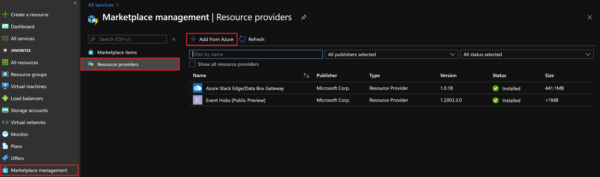
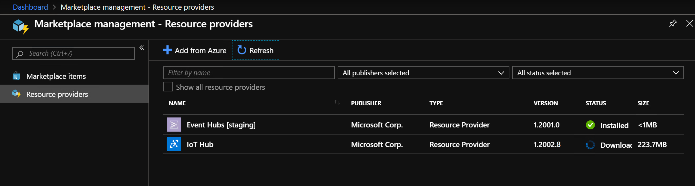
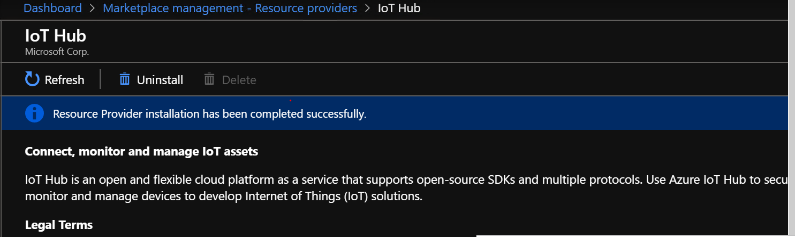
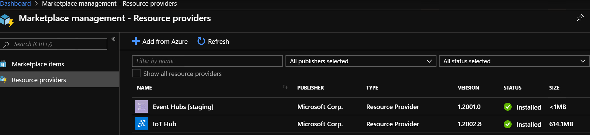

# How to install IoT Hub on Azure Stack Hub

[!INCLUDE [preview-banner](../includes/iot-hub-preview.md)]

This article shows you how to download and install the IoT Hub resource provider, making it available to offer to customers for subscription. The installation process of IoT Hub takes about 2 hours.

## Download IoT Hub

<!-- ### Connected Scenario -->
::: zone pivot="state-connected"
If your Azure Stack Hub can access the Azure Marketplace, follow the steps in this section to download and install IoT Hub and its dependencies. 

To download IoT Hub for a connected deployment, complete the following steps:

1. Sign in to Azure Stack Hub administrator portal. 
2. Select **Marketplace Management** on the left, then select **Resource providers**, then click on **+ Add from Azure**.

    

3. Filter for "IoT Hub" if necessary, then select the **IoT Hub** package.

    

4. On the **IoT Hub** package page, select **Download**

    

5. Wait for the package download to complete. The status will show **Downloading**, and can take up to 10 minutes.

    

6. Once the package is downloaded, the status will change to **Not installed** in the **Marketplace management** page.

    
::: zone-end

<!-- ### Disconnected or partially connected scenario -->
::: zone pivot="state-disconnected"
To download IoT Hub for a disconnected or partially connected deployment, first you download the packages to your local machine. After the download completes, you then import them into your Azure Stack Hub instance.

1. If you haven't already, follow the instructions in [Download Marketplace items - Disconnected or partially connected scenarios](azure-stack-download-azure-marketplace-item.md?pivots=state-disconnected). Here you download and run the Marketplace Syndication tool, which allows you to download the IoT Hub packages.
2. After the syndication tool's "Azure Marketplace Items" window opens, find and select "IoT Hub" to download the required packages to your local machine.
3. Once the download finishes, you import the packages to your Azure Stack Hub instance and publish to Marketplace.
::: zone-end

## Install IoT Hub

From the **Marketplace management** page, follow these steps to install the IoT Hub package:

1. Click on the **IoT Hub** row, then **Start Installation**.

    

2. Click on **Install Prerequisites**.

    

3. The status of the installation can be tracked in the notification pane. This step will take about 10 minutes.

    

4. Wait for the installation of the prerequisites to complete. This step usually takes somewhere between 5-10 minutes depending on the environment.

    

5. Click on **Add Certificates** under **Prepare Secrets**. Provide the pfx certificate created in prerequisites.

    

6. Browse and provide the pfx that was created and the password (the input to the script)

    

    

7. Click on **Install** under **Install Resource Provider**.

    

8. Once the installation starts, deployment status can be found in the Marketplace or in the notification pane.

    

9. Installation can take between 90 – 120 minutes. Wait for the installation to complete.

    

    

The IoT Hub resource provider is installed successfully! To get started, complete the following steps:

1. If necessary, follow the instruction to [create a plan, offers, and subscription](./service-plan-offer-subscription-overview.md).

2. If a subscription already exists, update the associated offer/plan to include **Microsoft.Devices** service. Go to **Plan** -> **Choose the plan to update** -> **Add Service and quota**.

3. Add **Microsoft.Devices Service** and click **Save**.

    

4. You are all set! IoT Hubs can now be created.

## Using IoT Hub

To learn how to use IoT Hub, refer to the [Azure IoT Hub documentation](/azure/iot-hub).

## Next steps

To learn more about managing IoT Hub on Azure Stack Hub, see [How to manage IoT Hub on Azure Stack Hub](iot-hub-rp-manage.md).