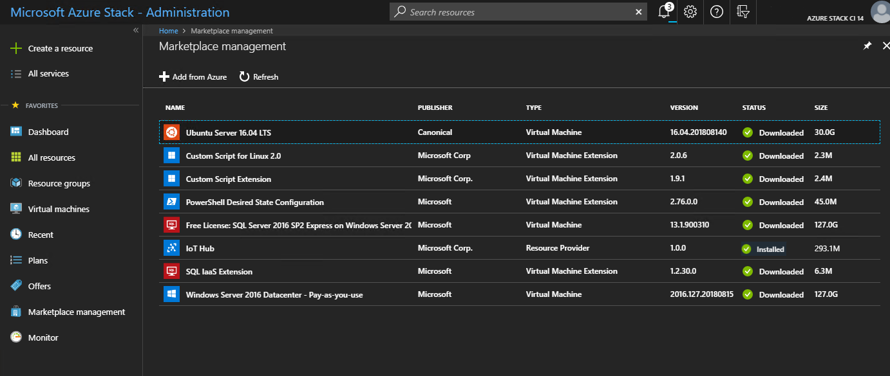
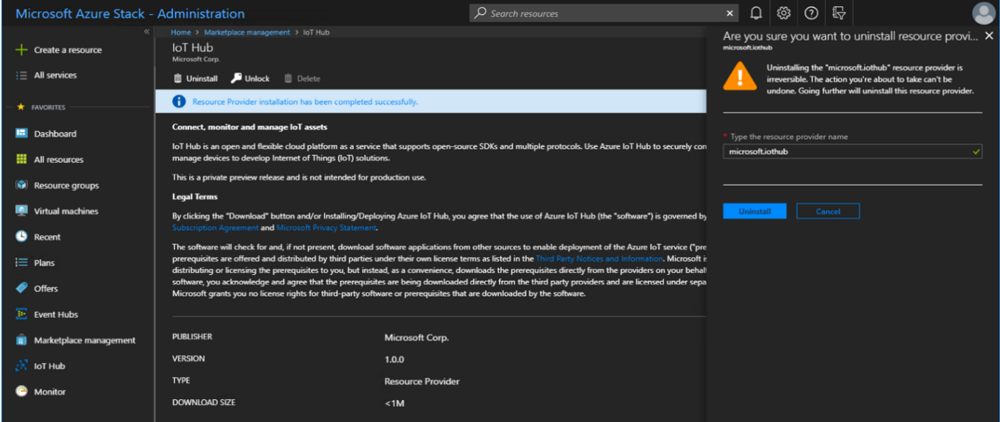

# How to remove IoT Hub on Azure Stack Hub

This article provides instructions on how to remove IoT Hub resource provider on Azure Stack Hub. This process takes around 37 minutes.

> [!WARNING]
> Once IoT Hub is uninstalled, **_all devices and data will be deleted_**. The operation is **NOT** recoverable.

## Uninstalling IoT Hub

1) Go to **Marketplace management**. IoT Hub will be in the list and marked as installed. Click on **IoT Hub**.

    

2) Click **Uninstall** under **IoT Hub**, provide the resource provider name **microsoft.iothub**, then click **Uninstall** button under it.

    

3) Wait for the uninstall to complete. Before trying to install IoT Hub again, wait for at least 10 minutes.

>[!IMPORTANT]
>The dependencies (eg. Event Hub) will **NOT** be uninstalled. Should you want to uninstall/ remove any of the dependencies from marketplace, you will need to do it separately.

## Next steps

To reinstall, refer to [install IoT Hub resource provider on connected Azure Stack](iot-hub-rp-install.md).
