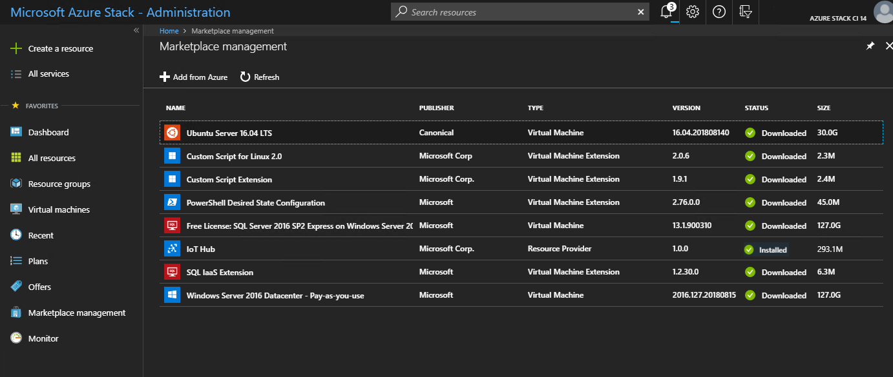
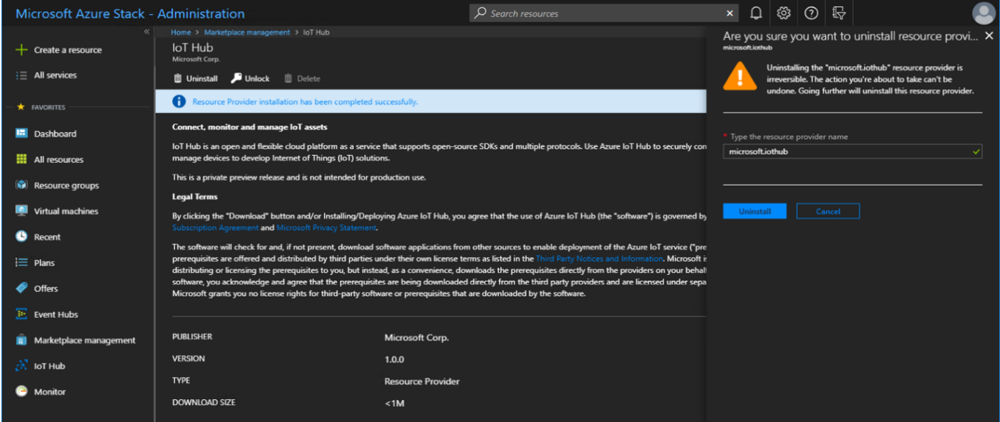

# How to remove Azure IoT Hub on Azure Stack Hub

This article provides instructions on how to remove the IoT Hub resource provider on Azure Stack Hub. This process takes around 37 minutes.

> [!IMPORTANT]
> The preview of the IoT Hub on Azure Stack Hub resource provider is now closed. For more detail, see [IoT Hub on Azure Stack Hub public preview will be retired on 30 September 2022](https://azure.microsoft.com/updates/azure-iot-hub-on-azure-stack-hub-preview-will-be-retired-and-it-will-not-go-to-ga/).

## Uninstalling IoT Hub

> [!WARNING]
> When you uninstall IoT Hub, **_all devices and data are deleted_**. This operation can't be reversed.

1. Go to **Marketplace management**. IoT Hub appears in the list and is marked as installed. Select **IoT Hub**.

    

1. Select **Uninstall** under **IoT Hub**, enter the resource provider name **microsoft.iothub**, and then select the **Uninstall** button.

    

1. Wait for the uninstall to complete. A banner shows at the top of the page that says "Resource Provider installation has been completed successfully".

>[!IMPORTANT]
>The dependencies, such as Azure Event Hubs, aren't uninstalled. To uninstall or remove any of the dependencies from the marketplace, you need to uninstall them separately.

## Next steps

For more information on IoT Hub, see the [Azure IoT Hub Documentation](/azure/iot-hub/).
