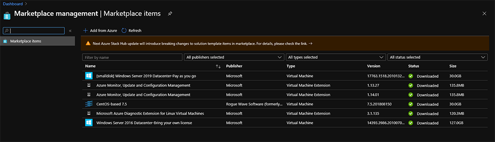

# Update Marketplace items in Azure Stack Hub

As a cloud operator one of your responsibilities is to update the Azure Stack Hub Marketplace. When a new version of a Marketplace item is available in Azure you can download the newer version to take advantage of new features, security fixes and stability improvements.

There are four types of Marketplace items:

-   Virtual machine images
-   Extensions
-   Solution templates
-   Resource providers

New virtual machine (VM) images, extension and solution templates will be used automatically when users deploy new resources. Resource providers use the Azure Stack Hub update experience and are not covered by this article.

You can find more information about recent additions, updates, changes, and removals changes at [Azure Stack Hub Marketplace changes](azure-stack-marketplace-changes.md)

Updating an extension within already deployed VMs require additional steps.

## Retrieve the new version

The process to download a new version of a Marketplace item is the same as the initial download of a Marketplace item.

1.  First check the version of an already downloaded Marketplace item in the Azure Stack Hub Marketplace using the administrator portal.

    [  ](media/marketplace-update-items/check-marketplace-in-azure-stack-hub.png#lightbox)

2.  Follow the instructions in [Download Marketplace items to Azure Stack Hub](azure-stack-download-azure-marketplace-item.md) for connected or disconnected systems to download the new Marketplace item. Only download Marketplace items that have a new version.

## Update already deployed extensions

After the operator has downloaded a new version of an extension the user must take one of the following two actions to ensure the new version is getting applied.

1.  Restart the VM. The extension gets updated automatically when starting the VM. This can be done in the Azure Stack Hub user portal or PowerShell.
2.  Use PowerShell to update the extension without a restart. This is helpful when scheduling a downtime for a VM is not possible and an emergency update is required.

As a **user** you can use the following steps to query VMs and list the used extensions and update the installed extension to the new version without restarting the VM.

Run the PowerShell cmdlets to list all the VMs and the installed extensions. Before running the cmdlets make sure you have installed [PowerShell for Azure Stack Hub](powershell-install-az-module.md).

```powershell  
$VMs=Get-AzVM

Foreach($VM in $VMs)
{
    Get-AzVMExtension -ResourceGroup $VM.ResourceGroupName -VMName $VM.name | ft VMName, Name, TypeHandlerVersion, Publisher, ExtensionType, Location
}
```

If you want to list VMs that are running a specific extension you can use the following script.

```powershell  
$extensionname="SampleExtenionName"
$VMs=Get-AzVM

Foreach($VM in $VMs) {
    $VMExtensions=Get-AzVMExtension -ResourceGroup $VM.ResourceGroupName -VMName $VM.name
    $extensions=$VMExtensions.name

    Foreach($Extension in $Extensions) {
        if ($Extension -eq $extensionname)
        {
            write-host $VM.Name
        }
    }
}
```

Run PowerShell to update the extension to the latest version.

```powershell  
Set-AzVMExtension -ResourceGroupName "SampleRG" -VMName "SampleVM" -Name "ExtensionName" -Publisher "PublisherName" -typeHandlerVersion "NewExtensionVersion" -ExtensionType SampleType -Location local
```

> [!NOTE]  
> It can take several minutes for the extension to be updated. You can safely run the first command to check the version if it got updated.

## List of recently updated extensions

| Name                                 | Publisher                            | TypeHandlerVersion | ExtensionType    |
|--------------------------------------|--------------------------------------|--------------------|------------------|
| Microsoft.EnterpriseCloud.Monitoring | Microsoft.EnterpriseCloud.Monitoring | 1.14               | OmsAgentForLinux |
| microsoft.linuxdiagnostic-3.1.135    | Microsoft.Azure.Diagnostics          | 4.0                | LinuxDiagnostic  |

> [!NOTE]  
> If you have installed any version of the following two extensions:
>
> - Azure Update and Configuration Management
> - Azure Update and Configuration Management for Linux
>
> Ensure you replace them with the **Azure Monitor, Update and Configuration Management for Linux** extension minimum version 1.14.02.

## Next steps

For more information about the Azure Stack Hub Marketplace, see [Azure Stack Hub Marketplace overview](azure-stack-marketplace.md).