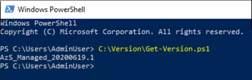

# Azure Stack Hub Operator Access Workstation

The Operator Access Workstation (OAW) is used to deploy a virtual machine (VM)
on an Azure Stack Hub's--Hardware Lifecycle Host (HLH) or any other machine that runs Microsoft Hyper-V. It does require network connectivity to the Azure
Stack Hub endpoints to be used for operator or user scenarios.

The OAW VM is an optional virtual machine that isn't required by Azure Stack
Hub to function. Its purpose is to provide the latest tools to operators or user
as they interact with Azure Stack Hub.

## OAW scenarios

The following tables list common scenarios for the OAW. Use Remote Desktop to connect to the OAW.

| **Scenario**                                                                                                                                          | **Description**                                                                                                                                                                                                                                                                                                         |
|-------------------------------------------------------------------------------------------------------------------------------------------------------|-------------------------------------------------------------------------------------------------------------------------------------------------------------------------------------------------------------------------------------------------------------------------------------------------------------------------|
| [Access the Administration portal](https://docs.microsoft.com/azure-stack/operator/azure-stack-manage-portals?view=azs-2008)                    | Perform administrative operations.                                                                                                                                                                                                                                                                                       |
| [Access PEP](https://docs.microsoft.com/azure-stack/operator/azure-stack-privileged-endpoint?view=azs-2008)                                     | Log collection and upload:<br>-[Create an SMB share](https://docs.microsoft.com/azure-stack/operator/operator-access-workstation?view=azs-2008#transfer-files-between-the-hlh-and-oaw) on the HLH for file transfer from Azure Stack Hub.<br>-Use Azure Storage Explorer to upload logs saved to the SMB share. |
| [Register Azure Stack Hub](https://docs.microsoft.com/azure-stack/operator/azure-stack-registration?view=azs-2008#renew-or-change-registration) | For re-registration, get previous Registration Name and Resource Group from the Administration portal.                                                                                                                                                                                                                   |
| [Marketplace syndication](https://docs.microsoft.com/azure-stack/operator/azure-stack-download-azure-marketplace-item?view=azs-2008)            | [Create an SMB share](https://docs.microsoft.com/azure-stack/operator/operator-access-workstation?view=azs-2008#transfer-files-between-the-hlh-and-oaw) on the HLH to store the downloaded image or extension.                                                                                                     |
| [Create Virtual Machines](https://docs.microsoft.com/azure-stack/user/azure-stack-quick-create-vm-windows-cli?view=azs-2008)                    | Create virtual machines using CLI.                                                                                                                                                                                                                                                                                       |
| [Manage AKS](https://docs.microsoft.com/azure-stack/user/azure-stack-kubernetes-aks-engine-scale?view=azs-2008)                                 | Manage AKS clusters, for example,  scale or upgrade.                                                                                                                                                                                                                                                                        |

## Pre-installed software

The following table lists the pre-installed software on the OAW VM.

| **Software Name**                                                                                              | **Location**                                                         |
|----------------------------------------------------------------------------------------------------------------|----------------------------------------------------------------------|
| [Microsoft Edge for Business](https://www.microsoft.com/edge/business/)                                        | [SystemDrive]\\Program Files (x86)\\Microsoft\\Edge\\Application     |
| [Az Modules](https://docs.microsoft.com/azure-stack/operator/powershell-install-az-module?view=azs-2008) | [SystemDrive]\\ProgramFiles\\WindowsPowerShell\\Modules              |
| [PowerShell 7](https://devblogs.microsoft.com/powershell/announcing-PowerShell-7-0/)                           | [SystemDrive]\\Program Files\\PowerShell\\7                          |
| [Azure Command-Line Interface (CLI)](https://docs.microsoft.com/cli/azure/?view=azure-cli-latest)        | [SystemDrive]\\Program Files (x86)\\Microsoft SDKs\\Azure\\CLI2      |
| [Microsoft Azure Storage Explorer](https://azure.microsoft.com/features/storage-explorer/)                     | [SystemDrive]\\Program Files (x86)\\Microsoft Azure Storage Explorer |
| [AzCopy](https://docs.microsoft.com/azure/storage/common/storage-use-azcopy-v10)                         | [SystemDrive]\\VMSoftware\\azcopy_windows_amd64_10.3.4               |
| [AzureStack-Tools](https://github.com/Azure/AzureStack-Tools/tree/az)                                          | [SystemDrive]\\VMSoftware\\AzureStack-Tools                          |

## Download files

To get the files to create the OAW VM, [download
here](https://aka.ms/OAWDownload). Be sure to review the [Microsoft
Privacy Statement](https://privacy.microsoft.com/privacystatement) and [Legal
Terms](https://docs.microsoft.com/legal/azure-stack-hub/azure-stack-operator-access-workstation-legal-terms) before you
download.

Because of the stateless nature of the solution, there are no updates for the OAW
VM. For each milestone, a new version of the VM image file will be released. Use
the latest version to create a new OAW VM. The image file is based on the latest
Windows Server 2019 version. After installation, you can apply updates,
including any critical updates, using Windows Update.

Validate the hash of the downloaded OAW.zip file to make sure it hasn't been
modified before using it to create the OAW VM. Run the following PowerShell
script. If the return value is `True`, you can use the downloaded OAW.zip:

> [!NOTE]  
> Unblock the script files after extracting the download.

```powershell
param( 
    [Parameter(Mandatory=$True)] 
    [ValidateNotNullOrEmpty()] 
    [ValidateScript({Test-Path $_ -PathType Leaf})] 
    [string] 
    $DownloadedOAWZipFilePath 
) 
$expectedHash = '6E412551C7921A6FA4E9D64812A4D3770EB1B1257E2BE55B8426E5EFBCB2C001' 
$actualHash = (Get-FileHash -Path $DownloadedOAWZipFilePath).Hash 
Write-Host "Expected hash: $expectedHash" 
if ($expectedHash -eq $actualHash) 
{ 
    Write-Host 'SUCCESS: OAW.zip file hash matches.' 
} 
else 
{ 
    Write-Error 'ERROR: OAW.zip file hash does not match! It isn't safe to use it, please download it again.' 
    Write-Error "Actual hash: $actualHash" 
} 
```

## Check HLH version

> [!NOTE]  
> This step is important to determine if you deploy the OAW on a HLH that
was deployed using a Microsoft image or an OEM image. If you deploy the OAW on a
general Microsoft Hyper-V, you can skip this step.

1.  Sign in to the HLH with your credentials.

2.  Open PowerShell ISE and run the following script:
    ```powershell  
    C:\Version\Get-Version.ps1
    ```

    For example:

    

> [!NOTE]  
> This PowerShell cmdlet might not be present on a HLH that was deployed
using an OEM image.

## Create the OAW VM using a script

The following script prepares the virtual machine as the Operator Access
Workstation (OAW), which is used to access Microsoft Azure Stack Hub.

1.  Sign in to the HLH with your credentials.

2.  Download OAW.zip and extract the files.

3.  Open an elevated PowerShell session.

4.  Navigate to the extracted contents of the OAW.zip file.

5.  Run the New-OAW.ps1 script.

### Example: Deploy on HLH using a Microsoft Image

```powershell  
$securePassword = Read-Host -Prompt "Enter password for Azure Stack OAW's local administrator" -AsSecureString 
New-OAW.ps1 -LocalAdministratorPassword $securePassword 
```


### Example: Deploy on HLH using an OEM Image

```powershell  
$securePassword = Read-Host -Prompt "Enter password for Azure Stack OAW's local administrator" -AsSecureString 
New-OAW.ps1 -LocalAdministratorPassword $securePassword `
   -AzureStackCertificatePath 'F:\certroot.cer' `
   -DeploymentDataFilePath 'F:\DeploymentData.json' `
   -AzSStampInfoFilePath 'F:\AzureStackStampInformation.json'
```

If the DeploymentData.json file includes the Naming Prefix for OAW VM, that
value will be used for the `VirtualMachineName` parameter. Otherwise, the
default name is `AzSOAW` or whatever name specified is by the user.

> [!NOTE]  
> The parameter `AzureStackCertificatePath` should only be used when Azure
Stack Hub was deployed using certificates issued from an enterprise certificate
authority.

### Example: Deploy on Microsoft Hyper-V

The machine running Microsoft Hyper-V does requires four cores and four GB of
available memory.

```powershell  
$securePassword = Read-Host -Prompt "Enter password for Azure Stack OAW's local administrator" -AsSecureString 
New-OAW.ps1 -LocalAdministratorPassword $securePassword ` 
-AzureStackCertificatePath 'F:\certroot.cer' ` 
-SkipNetworkConfiguration ` 
-VirtualSwitchName Example  
```

> [!NOTE]  
> The parameter `AzureStackCertificatePath` should only be used when Azure
Stack Hub was deployed using certificates issued from an enterprise certificate
authority. The OAW virtual machine will be deployed without a network
configuration. You can configure a static IP address or retrieve an IP address
via DHCP.

## User account policy

The following user account policy is applied to the OAW VM:
 - Built-in Administrator username: AdminUser
 - MinimumPasswordLength = 14
 - PasswordComplexity is enabled
 - MinimumPasswordAge = 1 (day)
 - MaximumPasswordAge = 42 (days)
 - NewGuestName = GUser (disabled by default)

## New-OAW cmdlet parameters

Two parameter sets are available for New-OAW. Optional parameters are shown in
brackets.

```powershell  
New-OAW  
-LocalAdministratorPassword <Security.SecureString> ` 
[-AzureStackCertificatePath <String>] ` 
[-AzSStampInfoFilePath <String>] ` 
[-CertificatePassword <Security.SecureString>] ` 
[-ERCSVMIP <String[]>] ` 
[-DNS <String[]>] ` 
[-DeploymentDataFilePath <String>] ` 
[-SkipNetworkConfiguration] ` 
[-ImageFilePath <String>] ` 
[-VirtualMachineName <String>] ` 
[-VirtualMachineMemory <int64>] ` 
[-VirtualProcessorCount <int>] ` 
[-VirtualMachineDiffDiskPath <String>] ` 
[-PhysicalAdapterMACAddress <String>] ` 
[-VirtualSwitchName <String>] ` 
[-ReCreate] ` 
[-AsJob] ` 
[-Passthru] ` 
[-WhatIf] ` 
[-Confirm] ` 
[<CommonParameters>] 

```

```powershell  
New-OAW 
-LocalAdministratorPassword <Security.SecureString> ` 
-IPAddress <String> ` 
-SubnetMask <String> ` 
-DefaultGateway <String> ` 
-DNS <String[]> ` 
[-AzureStackCertificatePath <String>] ` 
[-AzSStampInfoFilePath <String>] ` 
[-CertificatePassword <Security.SecureString>] ` 
[-ERCSVMIP <String[]>] ` 
[-ImageFilePath <String>] ` 
[-VirtualMachineName <String>] ` 
[-VirtualMachineMemory <int64>] ` 
[-VirtualProcessorCount <int>] ` 
[-VirtualMachineDiffDiskPath <String>] ` 
[-PhysicalAdapterMACAddress <String>] ` 
[-VirtualSwitchName <String>] ` 
[-ReCreate] ` 
[-AsJob] ` 
[-Passthru] ` 
[-WhatIf] ` 
[-Confirm] ` 
[<CommonParameters>] 

```

The following table lists the definition for each parameter.

| **Parameter**              | **Required/Optional** | **Description**                                                                                                                                                                                                                                                                                                                                     |
|----------------------------|-----------------------|-----------------------------------------------------------------------------------------------------------------------------------------------------------------------------------------------------------------------------------------------------------------------------------------------------------------------------------------------------|
| LocalAdministratorPassword | Required              | Password for the virtual machine's local administrator account AdminUser.                                                                                                                                                                                                                                                                           |
| IPAddress                  | Required              | The static IPv4 address to configure TCP/IP on the virtual machine.                                                                                                                                                                                                                                                                                 |
| SubnetMask                 | Required              | The IPv4 subnet mask to configure TCP/IP on the virtual machine.                                                                                                                                                                                                                                                                                    |
| DefaultGateway             | Required              | IPv4 address of the default gateway to configure TCP/IP on the virtual machine.                                                                                                                                                                                                                                                                     |
| DNS                        | Required              | DNS server(s) to configure TCP/IP on the virtual machine.                                                                                                                                                                                                                                                                                           |
| ImageFilePath              | Optional              | Path of OAW.vhdx provided by Microsoft. Default value is **OAW.vhdx** under the same parent folder of this script.                                                                                                                                                                                                                                  |
| VirtualMachineName         | Optional              | The name to be assigned to the virtual machine. If the Naming Prefix can be found in the DeploymentData.json file, it will be used as the default name. Otherwise, **AzSOAW**will be used as the default name. You can specify another name to overwrite the default value.                                                                         |
| VirtualMachineMemory       | Optional              | Memory to be assigned to the virtual machine. Default value is **4 GB**.                                                                                                                                                                                                                                                                             |
| VirtualProcessorCount      | Optional              | Number of virtual processors to be assigned to the virtual machine. Default value is **8**.                                                                                                                                                                                                                                                         |
| VirtualMachineDiffDiskPath | Optional              | Path to store temporary diff disk files while the management VM was active. Default value is **DiffDisks** subdirectory under the same parent folder of this script.                                                                                                                                                                                |
| AzureStackCertificatePath  | Optional              | Path of certificates to be imported to the virtual machine for Azure Stack Hub access.                                                                                                                                                                                                                                                              |
| AzSStampInfoFilePath       | Optional              | Path of AzureStackStampInformation.json file where the script can retrieve the IPs of the ERCS VM.                                                                                                                                                                                                                                                  |
| CertificatePassword        | Optional              | Password of certificate to be imported to the virtual machine for Azure Stack Hub access.                                                                                                                                                                                                                                                           |
| ERCSVMIP                   | Optional              | IP of Azure Stack Hub ERCS VM(s) to be added to trusted host list of the virtual machine. Won't take effect if **-SkipNetworkConfiguration** is set.                                                                                                                                                                                                |
| SkipNetworkConfiguration   | Optional              | Skips network configuration for the virtual machine so user can configure later.                                                                                                                                                                                                                                                                    |
| DeploymentDataFilePath     | Optional              | Path of DeploymentData.json. Won't take effect if **-SkipNetworkConfiguration** is set.                                                                                                                                                                                                                                                             |
| PhysicalAdapterMACAddress  | Optional              | The MAC address of the host's network adapter that will be used to connect the virtual machine to.<br>- If there's only one physical network adapter, this parameter isn't needed and the only network adapter will be used.<br>- If there's more than one physical network adapter, this parameter is required to specify which one to use. |
| VirtualSwitchName          | Optional              | The name of virtual switch that needs to be configured in Hyper-V for the virtual machine.<br>- If there's VMSwitch with the provided name, such VMSwitch will be selected.<br>- If there's no VMSwitch with the provided name, a VMSwitch will be created with the provided name.                                                            |
| Re-Create                   | Optional              | Removes and re-creates the virtual machine if there's already an existed virtual machine with the same name.                                                                                                                                                                                                                                       |

## Check the OAW VM version

1.  Sign into the OAW VM with your credentials.

2.  Open PowerShell ISE and run the following script:

    ```powershell  
    C:\\Version\\Get-Version.ps1
    ```

    For example:
    
    

## Transfer files between the HLH and OAW

If you need to transfer files between the HLH and the OAW, create an SMB share
by using the [New-SmbShare](https://docs.microsoft.com/powershell/module/smbshare/new-smbshare?view=win10-ps) cmdlet.
New-SmbShare exposes a file system folder to remote clients as a Server Message
Block (SMB) share. For example:

To delete a share that was created by this cmdlet, use
the [Remove-SmbShare](https://docs.microsoft.com/powershell/module/smbshare/remove-smbshare?view=win10-ps) cmdlet.

For example:

## Remove the OAW VM

The following script removes the OAW VM, which is used to access Azure Stack Hub
for administration and diagnostics. This script also removes the disk files and
the guardian associated with the VM.

1. Sign into the HLH with your credentials.

2.  Open an elevated PowerShell session.

3.  Navigate to the extracted contents of the installed OAW.zip file.

4.  Remove the VM by running the Remove-OAW.ps1 script:

    ```powershell  
    Remove-OAW.ps1 -VirtualMachineName \<name\>
    ```
    Where \<name\> is the name of the virtual machine to be removed. By default, the name is **AzSOAW**.

    For example:

    ```powershell  
    Remove-OAW.ps1 -VirtualMachineName AzSOAW
    ```

## Next steps

[Azure Stack Management Tasks](azure-stack-manage-basics.md)
