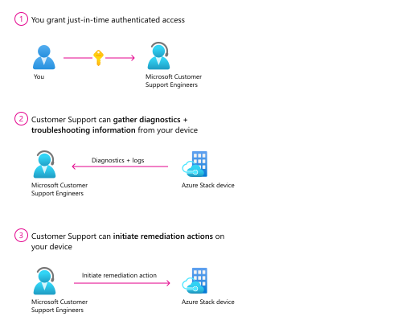

# Remote support for Azure Stack Hub

> [!IMPORTANT]
> Remote support is in public preview and only applies to version 2108.

Use remote support to allow a Microsoft support professional to solve your support case faster by permitting access to your device remotely and performing limited troubleshooting and repair. You can enable this feature by granting consent while controlling the access level and duration of access.

Once enabled, Microsoft support gets just-in-time (JIT) limited time access to your device over a secure, audited, and compliant channel. Remote support uses protocol HTTPS over port 443. The traffic is encrypted with TLS 1.2. Operations performed are *restricted* based on the access level granted using [just enough administration](/powershell/scripting/learn/remoting/jea/overview) (JEA). For more information about cmdlets that Microsoft support can execute during a remote support session, see the [list of Microsoft Support operations](#list-of-microsoft-support-operations) section in this article.



## Why use remote support?

Remote support gives you the ability to:

- Improve the speed to resolution as Microsoft Support no longer needs to arrange a meeting with you for troubleshooting.
- Reduce the number of [privileged endpoint (PEP) session elevation](azure-stack-privileged-endpoint.md#unlocking-the-privileged-endpoint-for-support-scenarios) to resolve issues.
- View the detailed transcript of all executed operations at any time.
- Grant just-in-time authenticated access on an incident-by-incident basis.
- Revoke consent at any time. Access is automatically disabled once the consent duration expires.

## Consent

Before remote support is enabled, you must provide consent to how Microsoft Support collects, stores, and uses your log data. The following text includes the data handling terms:

> By approving this request, the Microsoft support organization or the Azure engineering team supporting this feature ("Microsoft Support Engineer") will be given direct access to your device for troubleshooting purposes and/or resolving the technical issue described in the Microsoft support case.
> During a remote support session, a Microsoft Support Engineer may need to collect logs. By enabling remote support, you have agreed to a diagnostic logs collection by Microsoft Support Engineer to address a support case You also acknowledge and consent to the upload and retention of those logs in an Azure storage account managed and controlled by Microsoft.  These logs may be accessed by Microsoft in the context of a support case and to improve the health of Azure Stack Hub.
> The data will be used only to troubleshoot failures that are subject to a support ticket, and will not be used for marketing, advertising, or any other commercial purposes without your consent. The data may be retained for up to ninety (90) days and will be handled following our standard privacy practices.
> Any data previously collected with your consent will not be affected by the revocation of your permission.

## Remote support examples

In Azure Stack Hub, remote support can be managed using [privileged endpoint](azure-stack-privileged-endpoint.md) (PEP). The following example scenarios show you how to perform various operations to enable remote support access for Microsoft support.

### Enable remote support for diagnostics

In this example, you enable remote support access for diagnostic related operations only. The consent expires in one day after which remote access cannot be established.

```powershell
Enable-RemoteSupport -AccessLevel Diagnostics -ExpireInDays 1
```

### Enable remote support for diagnostics and repair

In this example, you enable remote support access for diagnostic and repair related operations only. Because expiration was not explicitly provided, it expires in seven days by default.

```powershell
Enable-RemoteSupport -AccessLevel DiagnosticsRepair
```

### Retrieve existing consent grants

In this example, you retrieve any previously granted consent. The result includes expired consent in the last 30 days.

```powershell
Get-RemoteSupportAccess -IncludeExpired
```

### Revoke remote access consent

In this example, you revoke remote access consent. Any existing sessions are terminated and new sessions can no longer be established.

```powershell
Disable-RemoteSupport
```

### List existing remote sessions

In this example, you list all the remote sessions that were made to the device since *FromDate*.

```powershell
Get-RemoteSupportSessionHistory -FromDate <Date>
```

### Get details on a specific remote session

In this example, you get the details for remote session with the ID *SessionID*.

```powershell
Get-RemoteSupportSessionHistory -SessionId <SessionId> -IncludeSessionTranscript
```

## List of Microsoft support operations

The following sections list the allowed cmdlets that Microsoft support can execute during a remote support session.

### Access level: Diagnostics

| Name | Description |
|------|-------------|
|`Clear-AzsSupportParentWorkingDirectory` | Clears stale Azs.Support working directory contents across all infrastructure nodes. |
|`Clear-AzsSupportWorkingDirectory` | Clears the contents of the current working directory. |
|`Copy-AzsSupportBlobWithSnapshot` | Copy a blob and all its snapshots between storage accounts. |
|`Copy-AzsSupportFiles` | Copies files from the remote computer to the local working directory file path location (Get-AzsSupportWorkingDirectory). |
|`Debug-AzsSupportStorageSubsystem` | Runs Debug-StorageSubSystem against Storage Sub System *Clustered Windows Storage on \**. |
|`Disable-AzsSupportNetshTrace` | Disables `netsh` tracing. |
|`Disable-AzsSupportSdnTraceFilter` | Disables netsh tracing. |
|`Enable-AzsSupportSdnTraceFilter` | Enables netsh tracing. Supports pre-configured trace providers or custom provider strings. |
|`Get-AzsSupportActionPlanInstance` | Lists ECE Action plans and provides options for filtering by name and status. This command has two behaviors:<br>*Default:* Lists all action plan instances (backup plans filtered out by default), their IDs, status, and timestamps<br>*ActionPlanInstanceId:* Drills into a specified action plan and lists the step, name, status, and timestamps |
|`Get-AzsSupportActionPlanInstanceLogs` | Interactive function used to collect verbose logs and XML file for action plans. |
|`Get-AzsSupportActivePSSessionFromWSMan` | Display WSMan connection info. Allows listing the remote PowerShell sessions currently connected. |
|`Get-AzsSupportBlobContainerPropertiesById` | Gets storage account container properties by ID. |
|`Get-AzsSupportBlobContainerPropertiesByName` | Gets storage account container properties by name. |
|`Get-AzsSupportBlobContainerUsage` | Gets storage account container usage information. |
|`Get-AzsSupportBlobInfo` | Gets storage account blog information. |
|`Get-AzsSupportClusterLog` | Generates a failover cluster log for the specified nodes and returns the file path to the log. If no nodes are specified, generates cluster log from all nodes. |
|`Get-AzsSupportClusterNode` | Gets physical host node information from FailoverClustering. |
|`Get-AzsSupportClusterSharedVolume` | Returns a list of all the cluster shared volumes, sorted by *state*. |
|`Get-AzsSupportComputerInformation` | Collects computer information from the specified *ComputerName* such as *Uptime*, *Localtime*, *OSVersion*, etc. This is a wrapper for `Get-ComputerInfo`. |
|`Get-AzsSupportDiskSpace` | Get available disk space on target computers. |
|`Get-AzsSupportECECloudDefinitionXml` | Retrieves the Azure Stack cloud definition from ECE and caches the data as an XmlDocument. If ECE is unavailable, attempts to load ECE from a well-known backup location. |
|`Get-AzsSupportECEComputerRole` | Retrieves a specified *ComputerName's* role from ECE. |
|`Get-AzsSupportECERoleDefinition` | Retrieves role-specific information from ECE. |
|`Get-AzsSupportECERoleNodes` | Retrieves nodes information from ECE for a given role. |
|`Get-AzsSupportECERoleProvisioningStatus` | Get the provisioning status for virtual machines and physical nodes. |
|`Get-AzsSupportFolderSize` | Get the size of folders and files found in the Path parameter on an infrastructure VM or physical node. |
|`Get-AzsSupportInfrastructureHost` | Gets physical host node information from *FailoverClustering*. |
|`Get-AzsSupportInfrastructureVM` | Gets Hyper-V VM objects for infrastructure VMs such as ACS or *SeedRingServices*. |
|`Get-AzsSupportInfrastructureVMHost` | Retrieves Hyper-V VM objects for infrastructure VMs such as ACS or *SeedRingServices*. |
|`Get-AzsSupportManagedDiskBlobUriAndFilePath` | Gets the blob uri of a managed disk. |
|`Get-AzsSupportProcess` | Gets processes on a remote computer, and sorts them by *Name*, *ProcessID*. Supports WMI, WinRM, and Tasklist /SVC. |
|`Get-AzsSupportRoutingInformation` | Gets detailed information for failed action plans and provides guidance on which engineering team owns the component. |
|`Get-AzsSupportSClusterFileSize` | Gets file size in s-cluster from local file path. |
|`Get-AzsSupportS2SConnectionInformation` | Gets the connections associated with a tenant virtual network gateways. |
|`Get-AzsSupportService` | Gets services on a specified *ComputerName*, and sorts them by *State*, *Name*. Supports WMI, and WinRM. |
|`Get-AzsSupportServiceFabricClusterConfiguration` | Gets the Service Fabric cluster configuration for a given ring. |
|`Get-AzsSupportServiceFabricClusterHealth` | Gets the aggregated cluster health across a specified ring. If no ring is specified, it checks all Service Fabric rings. |
|`Get-AzsSupportServiceFabricClusterManifest` | Gets the Service Fabric cluster manifest for a given ring. |
|`Get-AzsSupportServiceFabricClusterUpgrade` | Gets the Service Fabric cluster upgrade status for a given ring. |
|`Get-AzsSupportServiceFabricNode` | Gets the Service Fabric cluster nodes for a given ring. |
|`Get-AzsSupportServiceFabricReplica` | Gets the replicas for a specified service fabric service. |
|`Get-AzsSupportServiceFabricRuntimeVersion` | Gets the Service Fabric runtime version across all fabric cluster nodes in a specified ring. If no ring is specified, it checks all Service Fabric rings. |
|`Get-AzsSupportServiceFabricService` | Gets service fabric services on the specified ring. |
|`Get-AzsSupportServiceFabricServiceDockerImageName` | Gets image name of a Service Fabric application. |
|`Get-AzsSupportServiceFabricServiceDockerImageTag` | Gets image tag of a Service Fabric application. |
|`Get-AzsSupportServiceFabricServiceManifestNames` | Gets Service Fabric service manifest names. |
|`Get-AzsSupportStampInformation` | Calls `Get-StampInformation` and caches the data to allow faster retrieval. |
|`Get-AzsSupportStampVersion` | Gets the minor version of the stamp version, or the full version of the stamp if the parameter is supplied. |
|`Get-AzsSupportStorageAccountProperties` | Get properties for a specified storage account. |
|`Get-AzsSupportStorageEventLogErrors` | Gets errors from event logs for a specified node. If no node is specified, lists errors from all nodes. |
|`Get-AzsSupportStorageNode` | Gets specified storage node or all nodes if none is provided. |
|`Get-AzsSupportTenantVM` | Gets tenant VM information from CRP. |
|`Get-AzsSupportTenantVMSS` | Gets tenant VMMS information from CRP. |
|`Get-AzsSupportTraceEvent` | Gets the trace events from `Get-AzsSupportTraceFilePath`. |
|`Get-AzsSupportTraceFilePath` | Gets the logfile path that was generated by `New-AzsSupportTraceFilePath`. |
|`Get-AzsSupportVirtualDisk` | Gets all virtual disks and their health states. |
|`Get-AzsSupportVirtualDiskStorageJob` | Gets all active storage jobs for any virtual disk. |
|`Get-AzsSupportVMReport` | Get Hyper-V VM objects for all VMs including infrastructure VMs and tenant VMs from infrastructure hosts. |
|`Get-AzsSupportVolumeUtilization` | Reports the utilization for all Object Stores. |
|`Get-AzsSupportWinEvent` | Gets a list of events from the specified *ComputerNames*. |
|`Get-AzureStackLog` | Collect logs from all the components in an Azure Stack Hub environment. |
|`Invoke-AzsSupportDiskVhdDefrag` | Defragment the specified disk VHD file. |
|`Invoke-AzsSupportGetNetView` | Invokes `Get-Netview` function on the specified *ComputerNames*. |
|`Invoke-AzsSupportGuestLogCollection` | Starts guest log collection and sends the output to a SAS URI, a remote share, or as a local zip. |
|`Invoke-AzsSupportProcDump` | Invokes *ProcDump* on the specified *ComputerName* against a specified process ID. Default arguments are `procdump.exe -ma <pid> "$(Get-AzsSupportWorkingDirectory)\dumps"`. |
|`Invoke-AzsSupportSddcLogCollection` | Invokes `Get-SddcDiagnosticInfo` independently of Azure Stack log collection. |
|`Invoke-AzsSupportWmiTracing` | Enables `netsh` ETL tracing for a series of WMI providers on a specified computer name. Also supports a series of procdumps of winmgt and WmiPrvSE if specified. |
|`Lock-AzsProductSubscription` | Provides support engineers elevated access to add in resource provider. |
|`Move-AzsSupportClusterGroup` | Moves a clustered role from one node to another in a failover cluster. |
|`Move-AzsSupportClusterSharedVolume` | Moves a cluster shared volume (CSV) to ownership by a different node in a failover cluster. |
|`Move-AzsSupportEmptyBlobContainer` | Move an empty blob container to a specified share. |
|`Move-AzsSupportServiceFabricPrimaryReplica` | Moves the primary replica of the provided service to an available node. |
|`Move-AzsSupportVirtualMachine` | Moves a clustered virtual machine to a new scale unit host. |
|`New-AzsSupportBlobContainer` | Create a new blob container on a specified storage account. |
|`New-AzsSupportNetworkShare` | Creates a new network share directory for Microsoft Support. |
|`Resize-AzsSupportBlob` | Resizes a specified storage account blob to a new size. |
|`Save-AzsSupportObjectToFile` | Save an object to a file in a consistent format creating a file that contains the current time as a timestamp in the file name. |
|`Send-AzsSupportDiagnosticLogs` | Enables engineers to quickly transfer files off stamp. |
|`Send-AzureStackDiagnosticLog` | Sends Azure Stack diagnostic logs to Microsoft. |
|`Start-AzsSupportClusterPerfAnalysis` | Analyzes key performance data such as cluster performance history and exports performance data. |
|`Start-AzsSupportKerberosEventLogging` | Start Kerberos event logging. |
|`Start-AzsSupportRingManager` | Provides a simplified management experience for working with Service Fabric clusters. |
|`Start-AzsSupportSdnDiagnostic` | Automated network diagnostics and data collection/tracing script. |
|`Start-AzsSupportStorageDiagnostic` | Runs a series of storage specific diagnostic tests and generates a storage report. |
|`Test-AzsSupportKIBlobRequetsFailwithHTTP500` | Test known issues. |
|`Test-AzsSupportKIBlobSvcShareNotificationMissing` | Check if file handlers opened to volume was not closed on the previous host. |
|`Test-AzsSupportKICSVLocalMountPointAccessible` | Checks whether CSV is inaccessible or not when all volumes are in online status and all VirtualDisks are in healthy status. |
|`Test-AzsSupportKICSVMountPoint` | Validates that the CSV mount point is referencing a local path and not a GUID. |
|`Test-AzsSupportKICultureIsNotEnUs` | Verifies that the PEP session was created using en-US culture. |
|`Test-AzsSupportKIDuplicateVMs` | Checks Hyper-V to identify if there are any duplicate infrastructure or tenant virtual machines. |
|`Test-AzsSupportKIExternalNetworkConnectivity` | Performs TCP connectivity check to the Microsoft Login Windows Server URL for all infrastructure VMs that are designed to have internet access. |
|`Test-AzsSupportKIGPMachinePolicyCorruption` | Validates the file header integrity of the group policy machine store to ensure the file is not corrupted. |
|`Test-AzsSupportKIHealthAgentDirIsMissing` | Checks if `C:\HealthAgent` exists. |
|`Test-AzsSupportKIJumboPacketsEnabled` | Validates that jumbo packets used by SDN infrastructure are able to successfully traverse the TOR switches. |
|`Test-AzsSupportKINetworkInterfacePlacement` | Tests to ensure that the network interfaces reported in network controller map to what actually exists for VM placement within Hypervisor. |
|`Test-AzsSupportKIRDMADisabled` | Validates the storage adapters on the physical nodes are RDMA capable. |
|`Test-AzsSupportKIRegressedNcHostAgentBinaries` | Detects if the Hypervisor hosts are leveraging updated NCHostAgent binaries that were regressed and may cause network connectivity problems for tenant and infra resources. |
|`Test-AzsSupportKISdnDiagnosticLoggingEnabled` | Tests to validate SdnDiagnostic tracing is enabled appropriate roles due to a known issue with 1908 and 1910 builds. |
|`Test-AzsSupportKISdnRemoteLogLocation` | Checks to see if remote UNC path location is defined for network controller diagnostic logs and switches back to local. |
|`Test-AzsSupportKISdnRoleHealth` | Checks the health status reported by SDN components such as gateway, load balancers, and servers. |
|`Test-AzsSupportKISdnServicesStopped` | Validates that core services related to the SDN infrastructure are running. |
|`Test-AzsSupportKIServiceFabricClusterHealth` | Validates the health of the service fabric clusters in Azure Stack. |
|`Test-AzsSupportKISmphostHang` | Performs validation test against storage subsystem and virtual disks to detect if smphost may be encountering problems. |
|`Test-AzsSupportKITableServerESENTError59` | After upgrading to 1908 or later release, Table or Queue requests may fail with HTTP 500 during or after admin operations like FRU and PNU which requires CSV move or physical node reboot. The Table/Queue requests failure may impact portal or ARM which depends on it. |
|`Test-AzsSupportKITempDirIsAFile` | Checks if `C:\temp` is a file instead of a directory. This is the default behavior when running `New-Item C:\temp`, and can cause various stamp actions to fail. |
|`Test-AzsSupportKITempDirIsMissing` | Checks if `C:\temp` exists. |
|`AzsSupportKIUnexpectedReboot` | Checks event viewer logs to determine if there was an unexpected reboot recently. |
|`Test-AzsSupportKIVPNConnectionError901` | Known issue function that validates that none of the S2S connections are reporting connectionErrorStatus 901 indicating tunnel is already connected. |
|`Test-AzsSupportKIVPNNoRedundantGateway` | Checks for a known issue where VPN S2S connection might be reporting no redundant gateway. |
|`Test-AzsSupportKIVPNPolicyMisconfiguration` | Identifies S2S VPN connections that might be reporting a policy misconfiguration failure. |
|`Test-AzsSupportKIWinrmRegistryKeysMissing` | Checks for missing winrm registry keys across all infrastructure nodes. |
|`Test-AzsSupportKIWMIID5612QuotaViolation` | Checks for Event ID 5612 for provider Microsoft-Windows-WMI which indicates a WMI quota violation and that WMIPRVSE was forcefully restarted. |
|`Test-AzsSupportKIWMIPrvseMemoryLeak` | Checks WMI provider host process to identify if there is memory leak happening on physical hosts. |
|`Test-AzureStack` | Validation tool to run a series of system-level tests and basic cloud scenarios which provide insight into the current state. |
|`Unlock-AzsProductSubscription` | Provides support engineers elevated access to add in resource provider. |

### Access level: Diagnostics and Repair

| Name | Description |
|------|-------------|
|`Clear-AzSSupportDiskSpace` | Clear infra VM or host disk space. |
|`Invoke-AzsSupportNrpResourceRequest` | Allows a user to perform GET or PUT requests to NRP REST API endpoint. |
|`Invoke-AzsSupportSdnResourceRequest` | Invokes a web request to SDN API for the requested resource. |
|`Invoke-AzsSupportSpaceDB` | Invokes `spacedb.exe` on the specified host. If no host is provided, runs spacedb on the first node in the cluster. |
|`Invoke-AzsSupportSysinternalsDownload` | Downloads the Sysinternals suite from the internet, or checks for a well-known location for disconnected stamps. |
|`Move-AzsSupportClusterGroup` | Moves a clustered role from one node to another in a failover cluster. |
|`Move-AzsSupportClusterSharedVolume` | Moves a Cluster Shared Volume (CSV) to ownership by a different node in a failover cluster. |
|`Move-AzsSupportServiceFabricPrimaryReplica` | Moves the primary replica of the provided service to an available node. |
|`Move-AzsSupportVirtualMachine` | Moves a clustered Virtual Machine to a new scale unit host. |
|`Remove-AzsSupportItem` | Remove items from a specified path from an infra VM or host. |
|`Remove-AzsSupportItemByStopSerivce` | Remove items from a specified path from an infra VM or host, stopping the specified service prior to removal. |
|`Restart-AzsSupportService` | Restart services on a specified *ComputerName*. |
|`Restart-AzsSupportServiceFabricPrimaryReplica` | Restarts the primary replica of the provided service. Only supports services that contain one primary replica. |
|`Start-AzsSupportContainerHotpatch` | Patches a docker image on fabric ring machines. |
|`Start-AzsSupportService` | Start services on a specified *ComputerName*. |
|`Stop-AzsSupportProcess` | Stops a process on a specified *ComputerName*. |
|`Stop-AzsSupportService` | Stops a service on a specified *ComputerName*. |
|`Test-AzsSupportKnownIssue` | Executes a suite of known issue and infrastructure health checks. |
|`Update-AzsSupportStorageHealthCache` | Refreshes the storage cache and health cluster resources. |

## Next steps

Learn about [Azure Stack Hub help and support](azure-stack-help-and-support-overview.md).
