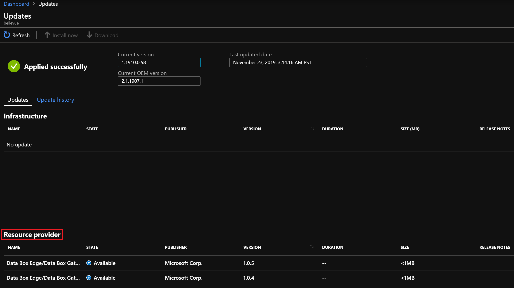

# How to update an Azure Stack Hub resource provider

Resource providers installed from Marketplace will require regular servicing. Servicing is done by applying service updates, provided by Microsoft on a regular basis. Updates can include both new features and fixes.  

## Check for updates

Resource providers are updated using the same update feature that is used to apply Azure Stack Hub updates.

1. Sign in to the Azure Stack Hub administrator portal.
2. Select the **All services** link on the left, then under the **Administration** section select **Updates**.
3. On the **Updates** page, you find updates for the resource providers, under the **Resource Provider** section.

   

## Apply an update

If an update is available for a given resource provider:

1. Select the row of the resource provider update.
2. Install the update.

## Next steps

Learn more about the [administrator dashboard updates feature](azure-stack-apply-updates.md).
