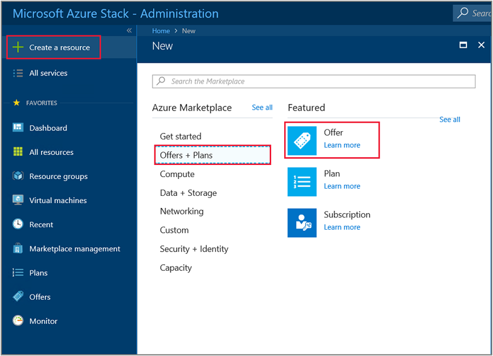
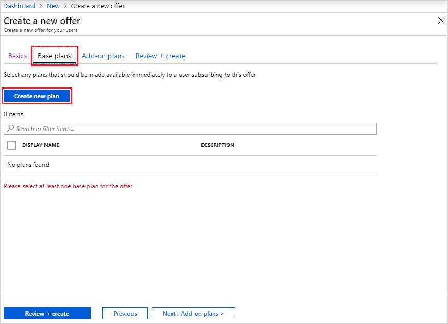
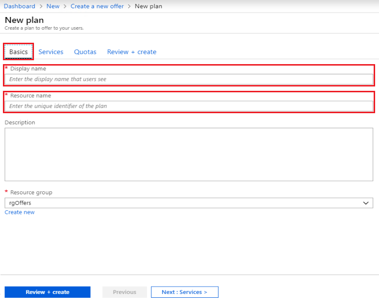
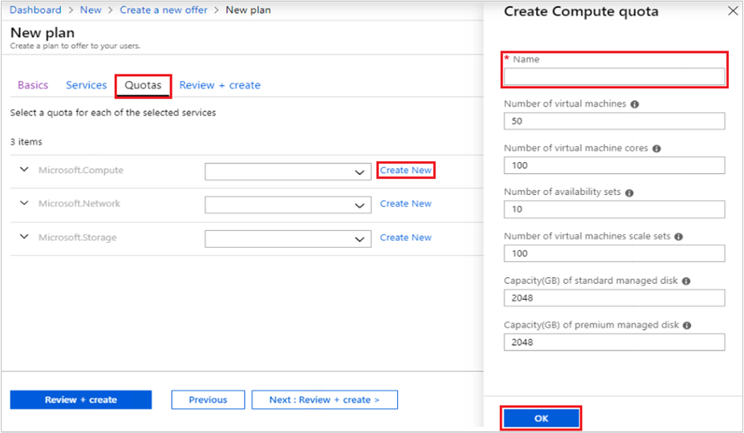
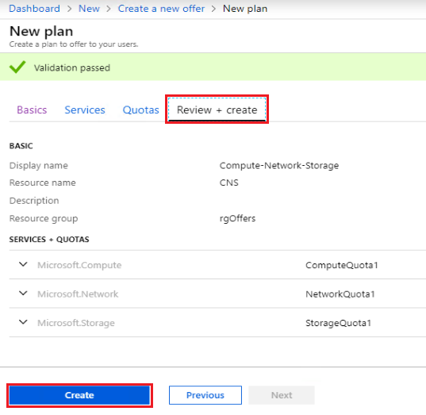
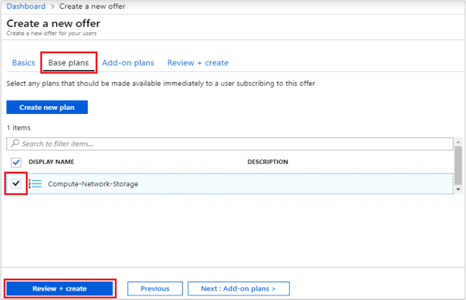
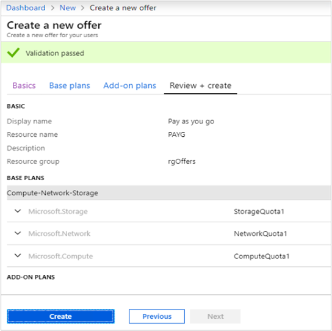
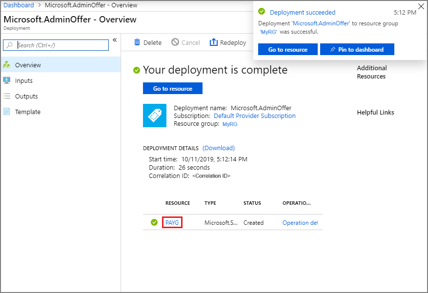
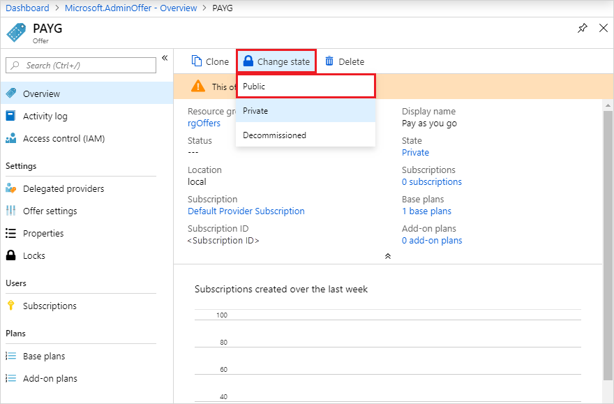

# Tutorial: Offer a service to users

This tutorial shows an operator how to create an offer. An offer makes services available to users on a subscription basis. Once subscribed to an offer, a user is entitled to create and deploy resources within the services specified by the offer.

In this tutorial, you learn how to:

> [!div class="checklist"]
> * Create an offer
> * Create a plan
> * Assign services and quotas to a plan
> * Assign a plan to an offer

## Overview

An offer consists of one or more plans. A plan entitles access to one or more services, by specifying the corresponding resource provider and a quota. Plans can be added to an offer as the base plan, or extend the offer as an add-on plan. To learn more, see the [Service, plan, offer, subscription overview](service-plan-offer-subscription-overview.md).

### Resource providers

A resource provider supports creation, deployment, and management of its resources as services. A common example is the Microsoft.Compute resource provider, which offers the ability to create and deploy virtual machines (VMs). See [Azure Resource Manager](/azure/azure-resource-manager/resource-group-overview) for an overview of the Azure resource management model.

In Azure Stack, there are two general categories of resource providers: ones that deploy resources as foundational services, and ones that deploy as add-on services.

### Foundational services

>[!NOTE]
> In this tutorial, you learn how to create an offer based on foundational services. 

Foundational services are supported by the following resource providers, which are available natively with every installation of Azure Stack:

| Resource Provider | Example resources |
| ----------------- | ------------------|
| Microsoft.Compute | Virtual machines, disks, virtual machine scale sets |
| Microsoft.KeyVault | Key Vaults, secrets |
| Microsoft.Network | Virtual networks, public IP addresses, load balancers |
| Microsoft.Storage | Storage accounts, blobs, queues, tables |

### Add-on services

>[!NOTE]
> In order to offer an add-on service, the corresponding resource provider must first be installed in Azure Stack Marketplace. Once installed, its resources are offered to users the same way as foundational services. Please see the **How-to guides** section of the TOC, for the current set of resource providers that support add-on service offerings.

Add-on services are supported by resource providers that are installed after Azure Stack has been deployed. Examples include:

| Resource Provider | Example resources |
| ----------------- | ------------------------- |
| Microsoft.Web | App Service function apps, web apps, API apps | 
| Microsoft.MySqlAdapter | MySQL hosting server, MySQL database | 
| Microsoft.SqlAdapter | SQL Server hosting server, SQL Server database |

::: moniker range=">=azs-1902"
## Create an offer

During the offer creation process, you create both an offer and a plan. The plan is used as the offer's base plan. During plan creation, you specify the services made available in the plan, and their respective quotas.

1. Sign in to the administrator portal with a cloud administrator account.

   - For an integrated system, the URL varies based on your operator's region and external domain name, using the format https://adminportal.&lt;*region*&gt;.&lt;*FQDN*&gt;.
   - If you're using the Azure Stack Development Kit, the URL is https://adminportal.local.azurestack.external.

   Then select **+ Create a resource** > **Offers + Plans** > **Offer**.

   

1. In **Create a new offer** under the **Basics** tab, enter a **Display name**, **Resource name**, and select an existing or create a new **Resource group**. The Display name is the offer's friendly name. Only the cloud operator can see the Resource name, which is the name that administrators use to work with the offer as an Azure Resource Manager resource.

   

1. Select the **Base plans** tab, select **Create new plan** to create a new plan. The plan will also be added to the offer as a base plan.

   

1. In **New plan** under the **Basics** tab, enter a **Display name** and **Resource name**. The Display name is the plan's friendly name that users see. Only the cloud operator can see the Resource name, which is the name that cloud operators use to work with the plan as an Azure Resource Manager resource. **Resource group** will be set to the one specified for the Offer.

   

1. Select the **Services** tab, and you see a list of services available from the installed resource providers. Select **Microsoft.Compute**, **Microsoft.Network**, and **Microsoft.Storage**. 

   

1. Select the **Quotas** tab, and you see the list of services you enabled for this plan. Click  **Create New** to specify a custom quota for **Microsoft.Compute**. Quota **Name** is required; you can accept or change each quota value. Select **OK** when finished, then repeat these steps for the remaining services.

   

1. Select the **Review + create** tab. You should see a green "Validation passed" banner at the top, indicating the new base plan is ready to be created. Select **Create**. You'll see a notification once the plan has been created.

   

1. After returning to **Base plans** tab of the **Create a new offer** page, you notice that the plan has been created. Be sure the new plan is selected for inclusion in the offer as the base plan, then select **Review + create**.

   

1. On the **Review + create** tab, you should see a green "Validation passed" banner at the top. Review the "Basic" and "Base Plans" info, and select **Create** when ready. 

   

1. The "Your deployment is underway" page shows initially, followed by "Your deployment is complete" once the offer is deployed. Click on the name of the offer, under the **Resource** column.ks

   

1. Notice the banner, showing your offer is still private, preventing it from user consumption. Change it to public, by selecting **Change State**, and then chose **Public**.

    
::: moniker-end

::: moniker range="<=azs-1901"
## Create an offer (1901 and earlier)

During the offer creation process, you create both an offer and a plan. The plan is used as the offer's base plan. During plan creation, you specify the services made available in the plan, and their respective quotas.

1. Sign in to the administrator portal with a cloud administrator account.

   - For an integrated system, the URL varies based on your operator's region and external domain name, using the format https://adminportal.&lt;*region*&gt;.&lt;*FQDN*&gt;.
   - If you're using the Azure Stack Development Kit, the URL is https://adminportal.local.azurestack.external.
   
   Then select **+ Create a resource** > **Offers + Plans** > **Offer**.

   

1. In **New offer**, enter a **Display name** and **Resource name**, and then select a new or existing **Resource group**. The Display name is the offer's friendly name. Only the cloud operator can see the Resource name, which is the name that admins use to work with the offer as an Azure Resource Manager resource.

   

1. Select **Base plans**, and in the **Plan** section, select **Add** to add a new plan to the offer.

   

1. In the **New plan** section, fill in **Display name** and **Resource name**. The Display name is the plan's friendly name that users see. Only the cloud operator can see the Resource name, which is the name that cloud operators use to work with the plan as an Azure Resource Manager resource.

   

1. Select **Services**. From the list of Services, pick  **Microsoft.Compute**, **Microsoft.Network**, and **Microsoft.Storage**. Choose **Select** to add these services to the plan.

   

1. Select **Quotas**, and then select the first service that you want to create a quota for. For an IaaS quota, use the following example as a guide for configuring quotas for the Compute, Network, and Storage services.

   - First, create a quota for the Compute service. In the namespace list, select **Microsoft.Compute** and then select **Create new quota**.

     

   - In **Create quota**, enter a name for the quota. You can change or accept any of the quota values that are shown. In this example, we accept the default settings and select **OK**.

     

   - Pick **Microsoft.Compute** in the namespace list, and then select the quota that you created. This step links the quota to the Compute service.

     

      Repeat these steps for the Network and Storage services. When you're finished, select **OK** in **Quotas** to save all the quotas.

1. In **New plan**, select **OK**.

1. Under **Plan**, select the new plan and then **Select**.

1. In **New offer**, select **Create**. You'll see a notification when the offer is created.

1. On the dashboard menu, select **Offers** and then pick the offer you created.

1. Select **Change State**, and then chose **Public**.

    
::: moniker-end
 
## Next steps

In this tutorial you learned how to:

> [!div class="checklist"]
> * Create an offer
> * Create a plan
> * Assign services and quotas to a plan
> * Assign a plan to an offer

Advance to the next tutorial to learn how to:
> [!div class="nextstepaction"]
> [Test the services offered in this tutorial](tutorial-test-offer.md)
