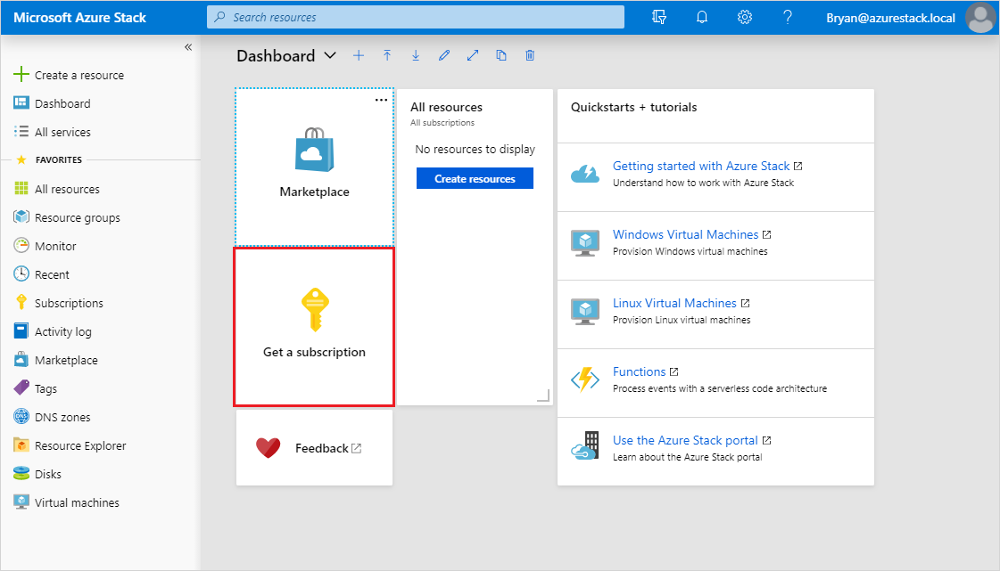

# Tutorial: Test a service offering

In the previous tutorial, you created an offer for users. This tutorial shows you how to test that offer, by using it to create a subscription, then deploy a resource. 

In this tutorial, you learn how to:

> [!div class="checklist"]
> * Create a subscription
> * Deploy resources entitled by the subscription

## Prerequisites

Before starting this tutorial, you must complete the following prerequisites:

- Complete the [Offer a service to users](tutorial-offer-services.md) tutorial. In it, you learn how to create the offer used by this tutorial.

- The offer you subscribe to in this tutorial enables deployment of a virtual machine (VM) resource. Before a VM can be deployed, you must make a VM image available in Azure Stack Marketplace, by downloading it from Azure Marketplace. See [Download marketplace items from Azure to Azure Stack](azure-stack-download-azure-marketplace-item.md) for instructions. 

## Subscribe to the offer

1. Sign in to the user portal with a user account 

   - For an integrated system, the URL varies based on your operator's region and external domain name, using the format https://portal.&lt;*region*&gt;.&lt;*FQDN*&gt;.
   - If you're using the Azure Stack Development Kit, the portal address is https://portal.local.azurestack.external.

1. Select the **Get a Subscription** tile.

   

1. In **Get a Subscription**, enter a name for your subscription in the **Display Name** field. Select **Offer**, and then choose one of the offers in the **Choose an offer** list. Select **Create**.

   

1. To view the subscription, select **All services**, and then under the **GENERAL** category select **Subscriptions**. Select your new subscription to view the offer it's associated with, and its properties.

   >[!NOTE]
   >After you subscribe to an offer, you might have to refresh the portal to see which services are part of the new subscription.

::: moniker range=">=azs-1902"
## Deploy a storage account resource

From the user portal, you provision a storage account using the new subscription.

1. Sign in to the user portal with a user account.

1. Select **+Create a resource** > **Data + Storage** > **Storage account - blob, file, table, queue**.

1. In **Create storage account**, provide the following information:
  
   - Enter a **Name**
   - Select a **Subscription**
   - Select a **Resource group** (or create a one.) 
   - Select **Create** to create the storage account.

1. Once deployment starts, you return to the dashboard. To see the new storage account, select **All resources**. Search for the storage account and select its name from the search results. From here, you can manage the storage account and its contents.

## Deploy a virtual machine resource

From the user portal, you provision a virtual machine using the new subscription.

1. Sign in to the user portal with a user account.

1. Select **+Create a resource** > **Compute** > **\<image-name\>** (where `image-name` is the name of the virtual machine you downloaded in prerequisites, such as **Windows Server 2016 Datacenter- Pay-as-you-use**).
1. In **Create virtual machine** / **Basics**, provide the following information:
  
   - Enter a **Name** for the VM.
   - Enter a **User name** for the administrator account.
   - For Linux VMs, select "Password" for **Authentication type**.
   - Enter a **Password** and the same for **Confirm password**, for the administrator account.
   - Select a **Subscription**.
   - Select a **Resource group** (or create a one). 
   - Select **OK** to validate this information and continue.

1. In **Choose a size**, filter the list if necessary, select a VM SKU, and select **Select**.  
1. In **Settings**, specify the port(s) to be opened under **Select public inbound ports**, and select **OK**.
   > [!NOTE]
   > Selecting "RDP(3389)", for example, allows you to connect to the VM remotely when it's running.
1. In **Summary**, review your choices, then select **OK** to create the virtual machine.  
1. Once deployment starts, you return to the dashboard. To see the new virtual machine, select **All resources**. Search for the virtual machine and select its name from the search results. From here, you can access and manage the virtual machine.
   > [!NOTE]
   > Full deployment and starting of the VM can take several minutes. Once the VM is ready for use, the [status](/azure/virtual-machines/windows/states-lifecycle) will change to "Running".

::: moniker-end

::: moniker range="<=azs-1901"
## Deploy a virtual machine resource (1901 and earlier)

From the user portal, you provision a virtual machine using the new subscription.

1. Sign in to the user portal with a user account.

1. On the dashboard, select **+Create a resource** > **Compute** > **Windows Server 2016 Datacenter Eval**, and then select **Create**.

1. In **Basics**, provide the following information:
  
   - Enter a **Name**
   - Enter a **User name**
   - Enter a **Password**
   - Choose a **Subscription**
   - Create a **Resource group** (or select an existing one.) 
   - Select **OK** to save this information.

1. In **Choose a size**, select **A1 Standard**, and then **Select**.  
1. In **Settings**, select **Virtual network**.

1. In **Choose virtual network**, select **Create new**.

1. In **Create virtual network**, accept all the defaults, and select **OK**.

1. Select **OK** in **Settings** to save the network configuration.

1. In **Summary**, select **OK** to create the virtual machine.  

1. To see the new virtual machine, select **All resources**. Search for the virtual machine and select its name from the search results.
::: moniker-end

## Next steps

In this tutorial you learned how to:

> [!div class="checklist"]
> * Create a subscription
> * Deploy resources entitled by the subscription

Learn more about deploying resource providers for add-on services. They'll allow you to offer even more services in your plans, and your subscribers to deploy new resources from Azure Stack Marketplace:

- [Offer SQL on Azure Stack](azure-stack-sql-resource-provider.md)
- [Offer MySQL on Azure Stack](azure-stack-mysql-resource-provider.md)
- [Offer App Service on Azure Stack](azure-stack-app-service-overview.md)
