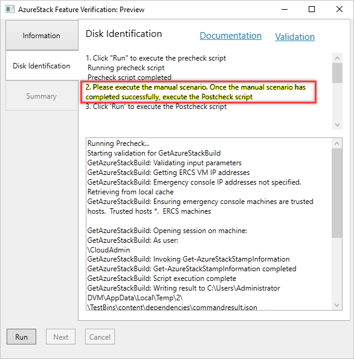

# Interactive feature verification testing  

[!INCLUDE [Azure_Stack_Partner](./includes/azure-stack-partner-appliesto.md)]

You can use the interactive feature verification testing framework to request tests for your system. When you request a test, Microsoft uses the framework to prepare tests that require manual interactive steps. Microsoft can use the framework to chain together several standalone automated tests.

This article describes a simple manual scenario. The test checks replacing a disk in Azure Stack Hub. The framework gathers diagnostic logs at each step. You can debug issues as you find them. The framework also allows the sharing of logs produced by other tools or processes and enables you to provide feedback on the scenario.

> [!Important]  
> This article references the steps to perform a Disk Identification Test. This is simply a demonstration and any results gathered from the Test Pass workflow can't be used for new solution verification.

## Overview of interactive testing

A test for disk replacement is a common scenario. In this example, the test has five steps:

1. Create a new **Test Pass** workflow.
2. Select the **Disk Identification Test**.
3. Complete the manual step when prompted.
4. Check the result of the scenario.
5. Send the test result to Microsoft.

## Create a new test pass

If you don't have an existing test pass available, please follow the directions for [scheduling a test](azure-stack-vaas-schedule-test-pass.md).

## Schedule the test

1. Select **Disk Identification Test**.

    > [!Note]  
    > The version of the test will increment as improvements to the test collateral are made. The highest version should always be used unless Microsoft indicates otherwise.

    

2. Select **Edit** and provide the domain admin username and password.

3. Select the appropriate test execution agent/DVM to launch the test on.

    

4. Select **Submit** to start the test.

    

5. Access the UI for the interactive test from the agent selected in the previous step.

    

6. Follow the **Documentation** and **Validation** links to review instructions from Microsoft on how to perform this scenario.

    

7. Select **Next**.

    

8. Follow the instructions to run the precheck script.

    

9. Once the precheck script has completed successfully, run the manual scenario (Disk replacement) as described in the **Documentation** and **Validation** links from the **Information** tab.

    

    > [!Important]  
    > Don't close the dialog box while you're performing the manual scenario.

10. When you're finished performing the manual scenario, follow the instructions to run the post check script.

    

11. On successful completion of the manual scenario (Disk replacement), select **Submit**.

    

    > [!Important]  
    > If you close the window, the test will stop before it's done.

12. Provide feedback for the test experience. These questions will help Microsoft assess the success rate and release quality of the scenario.

    

13. Attach any log files you wish to submit to Microsoft.

    

14. Accept the feedback submission EULA.

15. Select **Submit** to send the results to Microsoft.

## Next steps

- [Monitor and manage tests in the VaaS portal](azure-stack-vaas-monitor-test.md)
