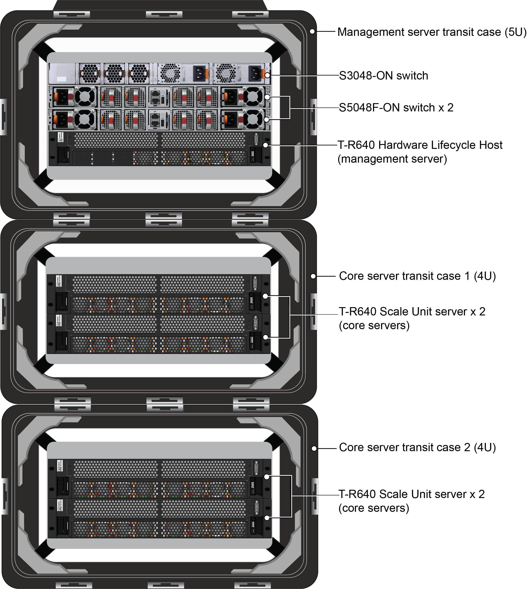
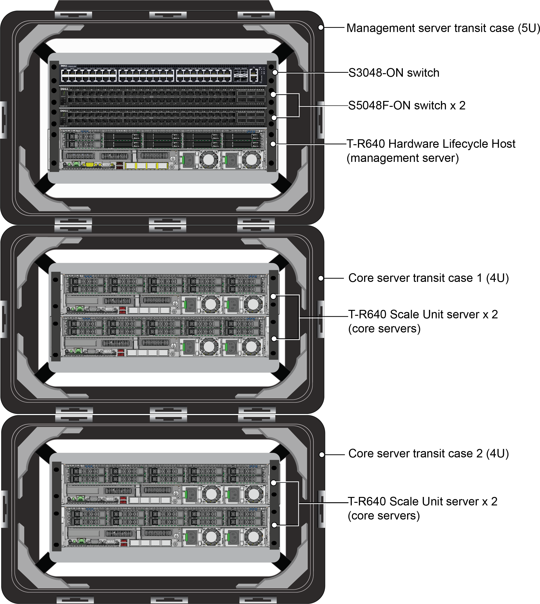

# Azure Stack Hub hardware diagram

The following figures show the complete stack with
Hardware Lifecycle Host, switches, and Scale Unit servers for the Dell
EMC Integrated System for Microsoft Azure Stack Hub Tactical.

Figure 1. Front

Figure 2. Rear

