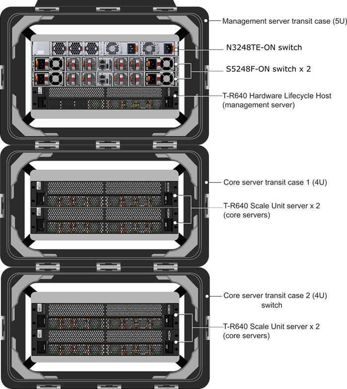

# Azure Stack Hub hardware diagram

The following figures show the complete stack with Hardware Lifecycle Host, switches, and scale unit servers for Microsoft Azure Stack Hub ruggedized.

Figure 1. Front

Figure 2. Rear

