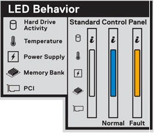
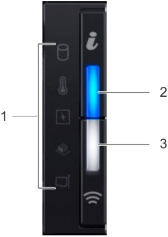
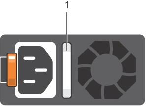

# Dell EMC PowerEdge Tactical indicators and codes

The features described in this section are the same for the Hardware
Lifecycle Host and Scale Unit node servers.

## System information label

The following figure shows the system information label, which is on
the front panel.

Figure 10. LED behavior

## iDRAC Direct LED indicator codes

The iDRAC Direct LED indicator lights up to indicate that the port is
connected and is being used as a part of the iDRAC subsystem.

You can configure the iDRAC Direct by using a USB to micro-USB (type
AB) cable, which you can connect to your laptop or tablet. The
following table describes the iDRAC Direct activity when the iDRAC
Direct port is active and explains iDRAC Direct LED indicator codes.

Table 4. LED indicator codes

| **Indicator codes**                                         | **Condition**                                                |
|-------------------------------------------------------------|--------------------------------------------------------------|
| Solid green for two seconds                                 | Indicates that the laptop or tablet is connected.            |
| Flashing green (on for two seconds and off for two seconds) | Indicates that the laptop or tablet connected is recognized. |
| Not illuminated                                             | Indicates that the laptop or tablet is unplugged.            |

## Left control panel

The following figure shows the left control panel status and health
indicators.

Figure 11. Left control panel

The following table describes the features on the left panel.

Table 5. PowerEdge left control panel status and health indicators

|     Item       |     Indicator or button                       |     Icon                                |     Description                                                                                                  |
|-------------------|--------------------------------------------------|--------------------------------------------|---------------------------------------------------------------------------------------------------------------------|
|     1          |     Status LED indicators                     |     N/A                                 |     Indicates the status of the system. For more information, see PowerEdge status LED indicators on page 61.    |
|     2 and 3    |     System health and system ID indicators    |  |     Indicates the system health.                                                                                 |

The following table lists the PowerEdge status LED indicators.

> [!NOTE]
> The status LED indicators are always off and only change to
a solid amber if any error occurs.

Table 6. PowerEdge status LED indicators

|  Icon |  Description           |  Condition                                                                                                                                                                       |  Corrective action                                                                                                                                                                                                                                                                                                    |
|----------|---------------------------|-------------------------------------------------------------------------------------------------------------------------------------------------------------------------------------|--------------------------------------------------------------------------------------------------------------------------------------------------------------------------------------------------------------------------------------------------------------------------------------------------------------------------|
|          |  Drive indicator       |  The indicator turns solid amber if there is a drive error.                                                                                                                      | 1. Check the System Event Log to determine if the drive has an error. 2. Run the appropriate Online Diagnostics test. 3. Restart the system and run embedded diagnostics (ePSA). 4. If the drives are configured in a RAID array, restart the system, and enter the host adapter configuration utility program. |
|          |  Temperature indicator |  The   indicator turns solid amber if the system experiences a thermal error (for   example, the ambient temperature is out of range or there is a fan failure).                 | Ensure that none of the following conditions exist: * A cooling fan has been removed or has failed.  * System cover, air shroud, memory module blank, or back filler bracket is removed. * Ambient temperature is too high. * External airflow is obstructed.                                                 |
|          |  Electrical indicator  |  The   indicator turns solid amber if the system experiences an electrical error   (for example, voltage out of range, or a failed power supply unit (PSU) or voltage regulator. | 1. Check the System Event Log or system messages for the specific issue. 2. If the log indicates a problem with the PSU, check the LED on the PSU. 3. Reseat the PSU.                                                                                                                                              |
|          |  Memory indicator      |  The indicator turns solid amber if a memory error occurs.                                                                                                                       | 1. Check the System Event Log or system messages for the location of the failed memory. 2. Reseat the memory module.                                                                                                                                                                                                  |
|          |  PCIe   indicator      |  The   indicator turns solid amber if a PCIe card experiences an error.                                                                                                          | 1. Restart the system. 2. Update any required drivers for the PCIe card. 3. Reinstall the card.                                                                                                                                                                                                                    |

## Power supply unit indicator codes

AC power supply units (PSUs) have an illuminated translucent handle
that serves as an indicator. DC PSUs have an LED that serves as an
indicator. The indicator shows whether power is present or a power
fault has occurred.

The following figure shows the AC PSU.

Figure 12. AC PSU

The following table defines the indicator codes.

Table 7. AC PSU indicator codes

| Power indicator codes         | Condition                                                                                                                                                                                                                                                                                                                                                                                                                                                                                                                                                                                                                                                                                                                                                                                                                                                                                                                                                                                                                                                                                                                                                                                                                                                                                              |
|-------------------------------|--------------------------------------------------------------------------------------------------------------------------------------------------------------------------------------------------------------------------------------------------------------------------------------------------------------------------------------------------------------------------------------------------------------------------------------------------------------------------------------------------------------------------------------------------------------------------------------------------------------------------------------------------------------------------------------------------------------------------------------------------------------------------------------------------------------------------------------------------------------------------------------------------------------------------------------------------------------------------------------------------------------------------------------------------------------------------------------------------------------------------------------------------------------------------------------------------------------------------------------------------------------------------------------------------------|
| Green                         | A valid power source is connected to the PSU and the PSU is operational.                                                                                                                                                                                                                                                                                                                                                                                                                                                                                                                                                                                                                                                                                                                                                                                                                                                                                                                                                                                                                                                                                                                                                                                                                               |
| Blinking amber                | Indicates a problem with the PSU.                                                                                                                                                                                                                                                                                                                                                                                                                                                                                                                                                                                                                                                                                                                                                                                                                                                                                                                                                                                                                                                                                                                                                                                                                                                                      |
| Not illuminated               | Power is not connected to the PSU.                                                                                                                                                                                                                                                                                                                                                                                                                                                                                                                                                                                                                                                                                                                                                                                                                                                                                                                                                                                                                                                                                                                                                                                                                                                                     |
| Blinking green                | When the firmware of the PSU is being updated, the PSU handle blinks green.  Do not disconnect the power cord or unplug the PSU when updating firmware. If firmware update is interrupted, the PSUs do not function.                                                                                                                                                                                                                                                                                                                                                                                                                                                                                                                                                                                                                                                                                                                                                                                                                                                                                                                                                                                                                                                                                |
| Blinking green and turns off  | When hot-plugging a PSU, the PSU handle blinks green five times at a rate of 4 Hz and turns off. This indicates a PSU mismatch with respect to efficiency, feature set, health status, or supported voltage.   If two PSUs are installed, both the PSUs must have the same type of label; for example, Extended Power Performance (EPP) label. Mixing PSUs from previous generations of PowerEdge servers is not supported, even if the PSUs have the same power rating. This results in a PSU mismatch condition or failure to turn the system on.  When correcting a PSU mismatch, replace only the PSU with the blinking indicator. Swapping the PSU to make a matched pair can result in an error condition and  unexpected system shutdown. To change from a high output configuration to a low output configuration or vice versa, you must turn off the system.  AC PSUs support both 240 V and 120 V input voltages with the exception of Titanium PSUs, which support only 240 V. When two identical PSUs receive different input voltages, they can output different wattages, and trigger a mismatch.  If two PSUs are used, they must be of the same type and have the same maximum output power.  Combining AC and DC PSUs is not supported and triggers a mismatch. |
