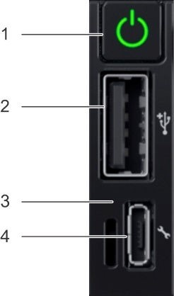
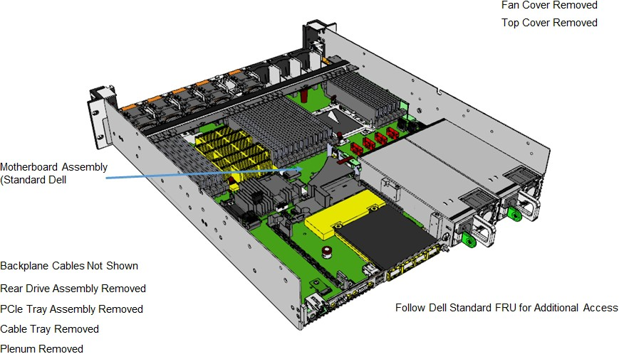
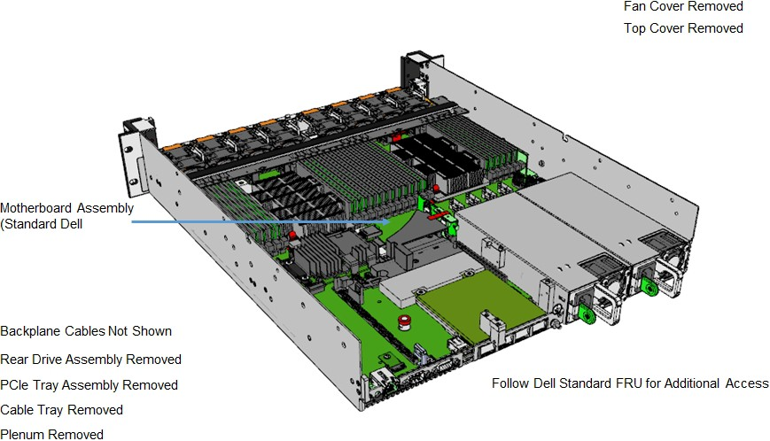
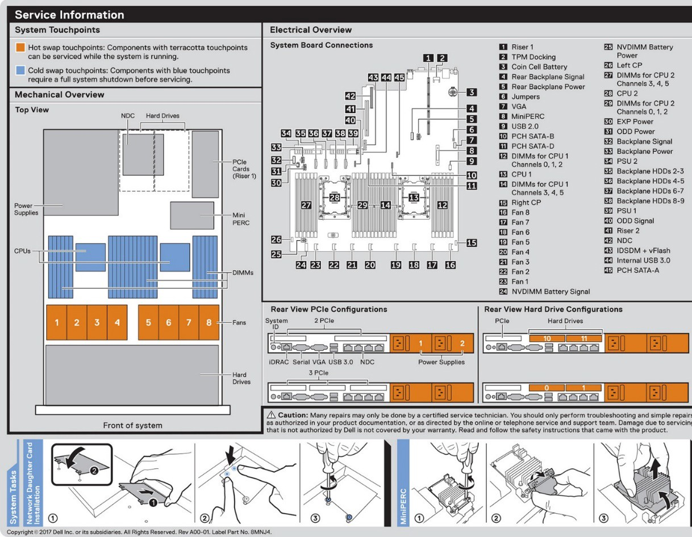
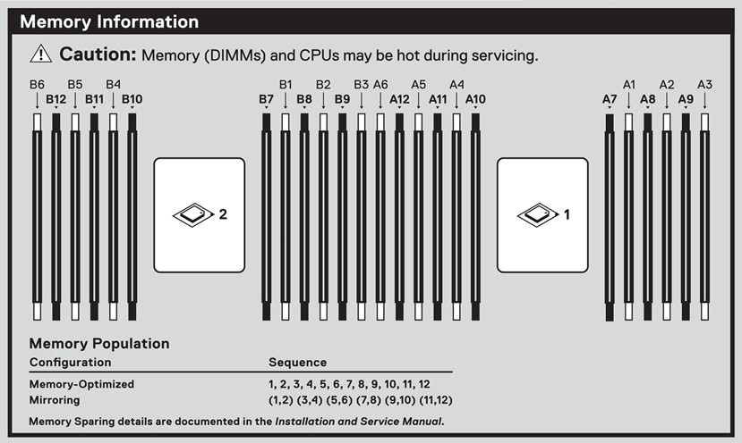

# Dell EMC PowerEdge Tactical R640 server overview

This section is an overview of the Dell EMC PowerEdge Tactical R640
server components.

## Chassis front view

The following figure shows the PowerEdge Tactical R640 server, a 2U
server.

Figure 3. PowerEdge Tactical R640 HLH and SU front chassis view

The following table describes the PowerEdge Tactical R640\'s front
panel features.

Table 1. PowerEdge Tactical R640 front panel features

| Ports, panels, and slots  | Description                                                                                                                                                                                                                                                                                                                                                                                                                                                                                                                                                                                                                                                                                                                                                                                        |
|---------------------------|----------------------------------------------------------------------------------------------------------------------------------------------------------------------------------------------------------------------------------------------------------------------------------------------------------------------------------------------------------------------------------------------------------------------------------------------------------------------------------------------------------------------------------------------------------------------------------------------------------------------------------------------------------------------------------------------------------------------------------------------------------------------------------------------------|
| Left control panel        | Contains the system health and system ID, status LED, and the iDRAC Quick Sync 2 (wireless) indicator.  **Note:** The iDRAC Quick Sync 2 indicator is available only on certain configurations.  Status LED: Enables you to identify any failed hardware components. There are up to five status LEDs and an overall system health LED (chassis health and system ID) bar. For more information, see PowerEdge status LED indicators on page 61.  Quick Sync 2 (wireless): Indicates a Quick Sync enabled system. The Quick Sync feature is optional. This feature allows management of the system by using mobile devices. This feature aggregates hardware or firmware inventory and various system-level diagnostic and error information that can be used in troubleshooting the system.  |
| VGA port                  | Enables you to connect a display device to the system.                                                                                                                                                                                                                                                                                                                                                                                                                                                                                                                                                                                                                                                                                                                                             |
| Right control panel       | Contains the power button, USB port, iDRAC Direct micro port, and the iDRAC Direct status LED.                                                                                                                                                                                                                                                                                                                                                                                                                                                                                                                                                                                                                                                                                                     |

## Chassis back view

The following figure shows the PowerEdge Tactical R640 back chassis
components.

Figure 4. PowerEdge Tactical R640 HLH back chassis view

The following table describes the features on the PowerEdge Tactical
R640 back panel.

Table 2. PowerEdge Tactical R640 back panel features

| Ports, panels and slots       | Icon                      | Description                                                                                                                                                                                                                                                                 |
|-------------------------------|---------------------------|-----------------------------------------------------------------------------------------------------------------------------------------------------------------------------------------------------------------------------------------------------------------------------|
| Hard drives                   | N/A                       | OS and data storage for the HLH and SU server nodes.                                                                                                                                                                                                                        |
| BOSS module                   | N/A                       | Boot Optimized Storage Solution (BOSS), used to install the operating system or hypervisor.                                                                                                                                                                                 |
| Power supply units (2)        | N/A                       | These supply power to the server and are provided in tandem for redundancy.                                                                                                                                                                                                 |
| USB 3.0 ports                 |  :::image type="icon" source="media/image-62.png"::: | The USB ports are 9-pin and 3.0-compliant. These ports enable you to connect USB devices to the system.                                                                                                                                                                     |
| VGA port                      |   :::image type="icon" source="media/image-63.png":::  | Enables you to connect a display device to the system.                                                                                                                                                                                                                      |
| Serial port                   |   :::image type="icon" source="media/image-64.png":::  | Enables you to connect a serial device to the system.                                                                                                                                                                                                                       |
| iDRAC9 Enterprise port        |   :::image type="icon" source="media/image-65.png":::  | Enables you to remotely access iDRAC.                                                                                                                                                                                                                                       |
| CMA power port                | N/A                       | The Cable Management Arm (CMA) power port enables you to connect the Status Indicator Cable to the CMA.                                                                                                                                                                     |
| System identification button  |   :::image type="icon" source="media/image-66.png"::: | The System Identification (ID) button is available on the server's front and back. Pressing the button causes the System health\System ID indicator to blink. You can also use the system ID button to reset the iDRAC and to access the BIOS using the step-through mode.  |

## Right control panel

The following figure shows the PowerEdge Tactical R640 right control
panel.

Figure 5. PowerEdge Tactical R640 right control panel

The following table describes the controls and indicators on the right
panel.

Table 3. PowerEdge Tactical R640 right control panel controls and indicators

| Item  | Indicator or button  | Icon                      | Description                                                                                                                                                                                               |
|-------|----------------------|---------------------------|-----------------------------------------------------------------------------------------------------------------------------------------------------------------------------------------------------------|
| 1     | Power button         |   :::image type="icon" source="media/image-68.png":::  | Indicates if the system is turned on or off. Press the power button to manually turn on or off the system.  **Note:** Press the power button to gracefully shut down an ACPI- compliant operating system.  |
| 2     | USB port             | :::image type="icon" source="media/image-70.png":::    | The USB port is 4-pin, 2.0-compliant. This port enables you to connect USB devices to the system.                                                                                                         |
| 3     | iDRAC Direct LED     | N/A                       | The iDRAC Direct LED indicator lights up to indicate that the iDRAC Direct port is actively connected to a device.                                                                                        |
| 4     | iDRAC Direct port    |   :::image type="icon" source="media/image-65.png"::: | The iDRAC Direct port is micro USB 2.0-compliant. This port enables you to access the iDRAC Direct features.                                                                                              |

## Inside the PowerEdge Tactical R640

The following figure shows the internal PowerEdge Tactical R640
components.

Figure 6. Inside the PowerEdge Tactical R640 HLH

Figure 7. Inside the PowerEdge Tactical R640 SU

## Motherboard

The following figure shows the motherboard layout.

Figure 8. PowerEdge Tactical R640 motherboard layout

## Memory

The following figure shows the PowerEdge Tactical R640 memory
information.

Figure 9. PowerEdge Tactical R640 memory information

