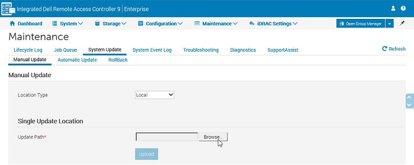

# Installing firmware using the iDRAC interface

The integrated Dell Remote Access Card (iDRAC) enables you to remotely
update firmware (one per one) using the **Update and Rollback**
feature. It works even if the server is running.

Go to the [Integrated System for Microsoft Azure Stack Hub 14G
Documentation](https://www.dell.com/support/home/product-support/product/cloud-for-microsoft-azure-stack14g/docs)
page to download the most recent Support Matrix, which contains a list
of supported firmware versions.

Use the following procedure to update the single device firmware using
the iDRAC web interface.

**Steps**

1.  Go to **Maintenance** \**System
    Update**. The **Firmware Update** page is displayed.

    

2.  In the **Update** tab, select **Local** as the File Location.

3.  Select **Browse**, select the firmware image for the required
    component, and then select **Upload**.

4.  After the upload is complete, the **Update Details** section
    displays each firmware file that is uploaded to iDRAC and its
    status. If the firmware image file is valid and was successfully
    uploaded, the **Contents** column displays a (+) icon next to the
    firmware image file name. Expand the name to view the **Device
    Name**, **Current**, and **Available firmware version** information.

5.  Select the required firmware file and do one of the following:

    -   For firmware images that don't require a host system reboot,
        select **Install**.

    -   For firmware images that require a host system reboot, select
        **Install and Reboot** or **Install Next Reboot**.

    -   To cancel the firmware update, select **Cancel**.

6.  To display the **Job Queue** page, select **Job Queue**. Use this
    page to view and manage the staged firmware updates or select

    **OK** to refresh the current page and view the firmware update
    status.
    
