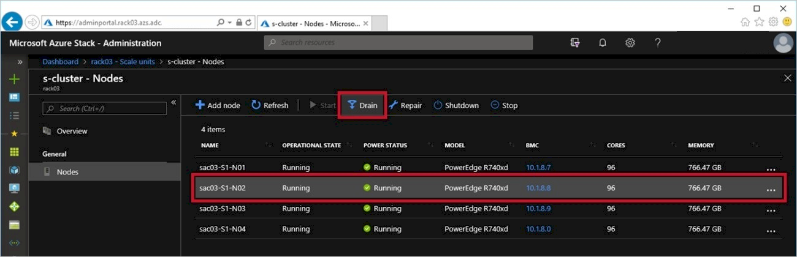
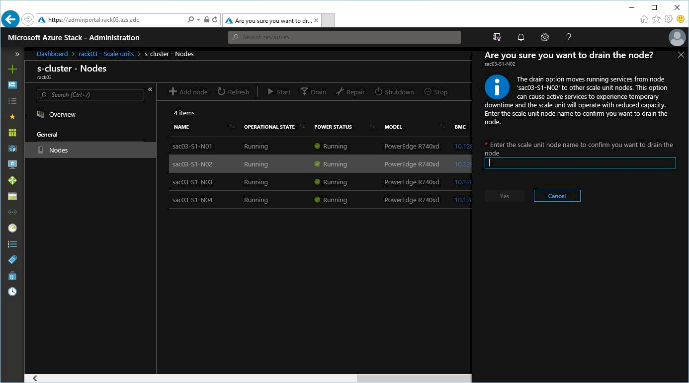
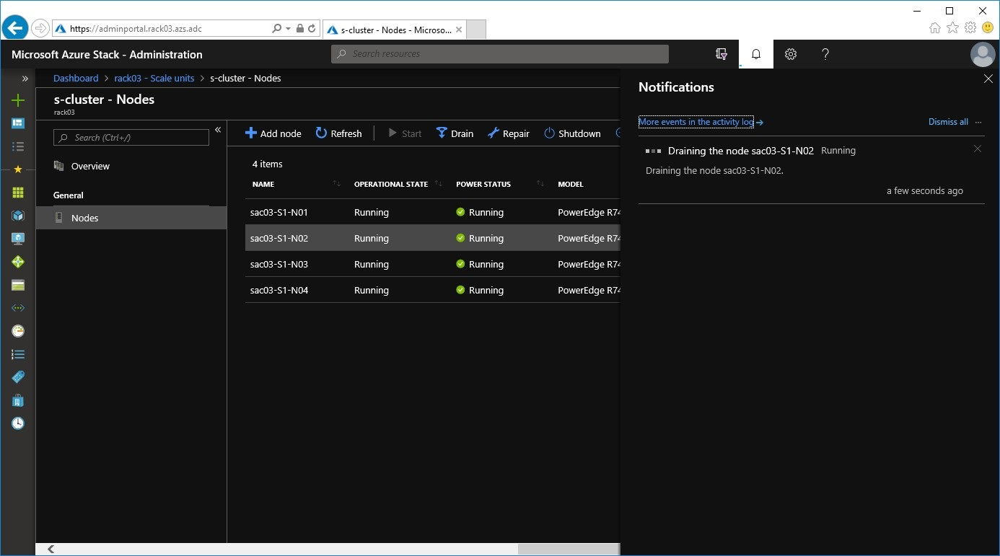
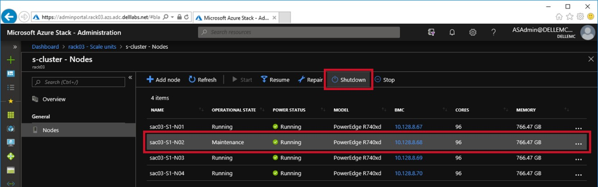
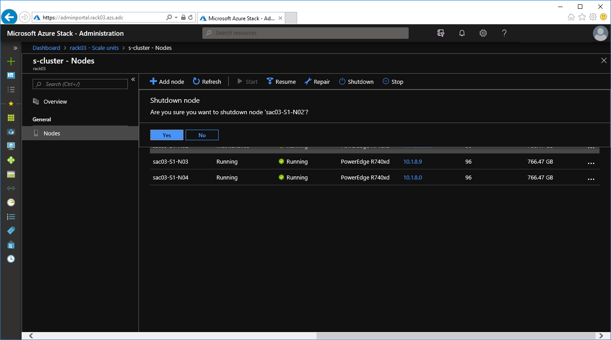
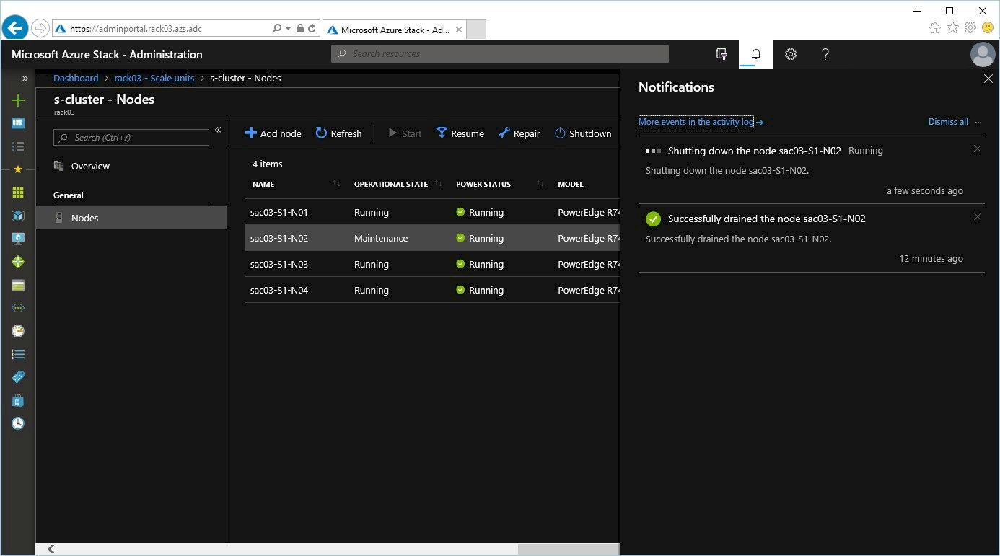
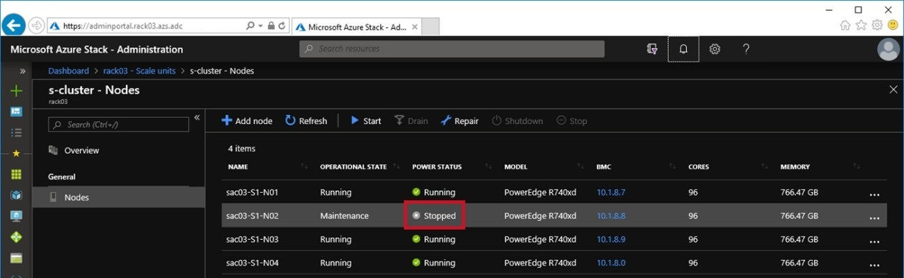

# Powering off Scale Unit nodes

Before a Scale Unit node can be powered off you must verify the Scale
Unit\'s health and identify the node that needs repairing.

If the node\'s **Power Status** is not **Stopped**, use the following
procedure below to safely shut down the node.

**Steps**

1.  Drain the Scale Unit node.

    1.  From the Administration Portal, select the node in need of
        repair and then select **Drain**.

        
        
    1.  When prompted, enter the name of the
        node to drain and select **Yes**.

        
    
    1.  You will see a notification saying the drain is in progress.
    
        
        
    1.  Log in to the iDRAC interface and verify the node\'s service tag in the **System Information**.
    

2.  Shut down the Scale Unit node.

    1.  Once the drain is completed, select the node again, verify that
        the **Operational State** is **Maintenance** and select **Shutdown**.

        
        
    1.  When prompted, select **Yes** to confirm the shutdown.
    
        
        
    1.  You will see a notification saying
        the shutdown is in progress.

        
    
    1.  When the shutdown is complete, the **Power Status** is **Stopped**.
    
        
        