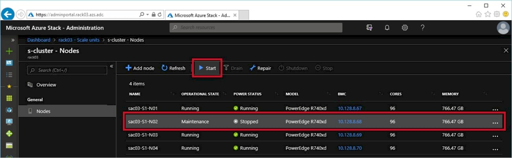
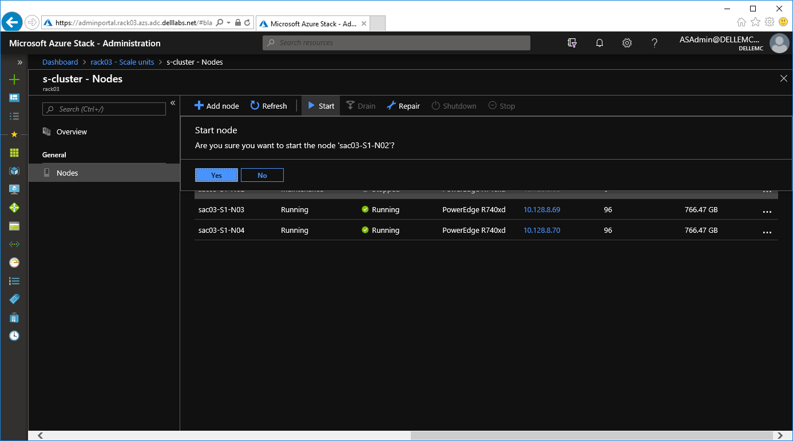
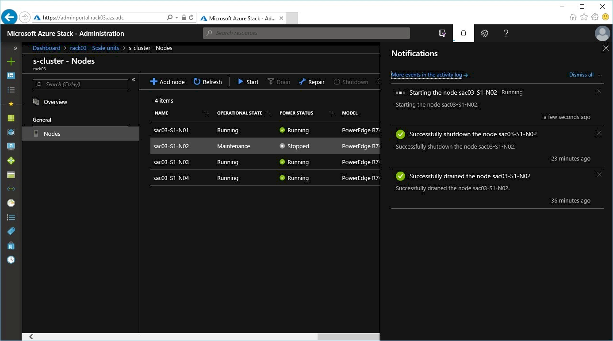
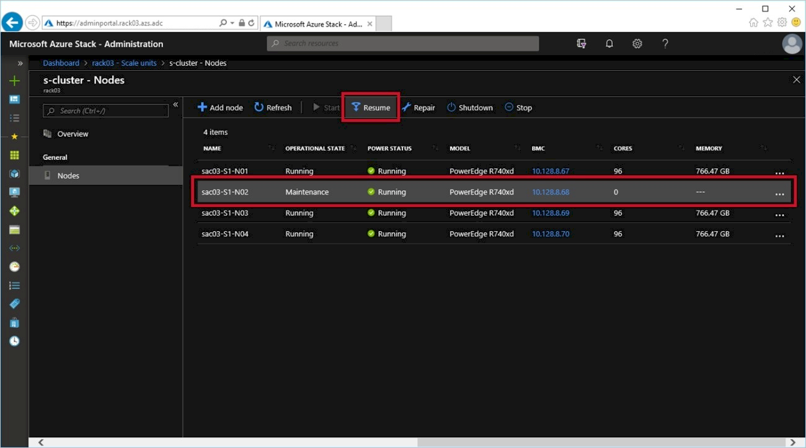
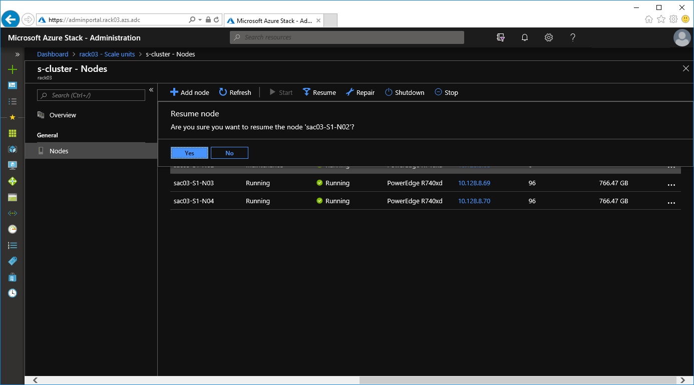
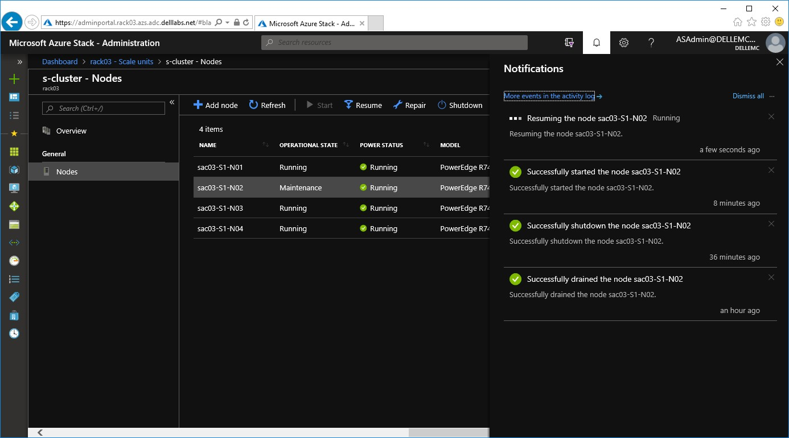

# Powering on a scale unit node

**Steps**

1.  Start the scale unit node.

    1.  Return to the **Administration Portal**, if
        the node is still **Stopped**, select the node and select
        **Start**:
        

    1.  Select **Yes** to confirm the start operation:

        
        
    1.  Monitor the progress in the notification pane:
    
        
            
    > [!NOTE]
    > You can also use the iDRAC virtual console to verify there
    are no issues with the swapped component during POST.
    
2.  Resume the scale unit node.

    1.  Now that the node has successfully powered back up, in the
        **Administration Portal**, select the node and select
        **Resume**.

        
        
    1.  Select **Yes** to confirm the resume
        operation:
    
        
    
    1.  Monitor the progress in the notification pane:
    
        
        
