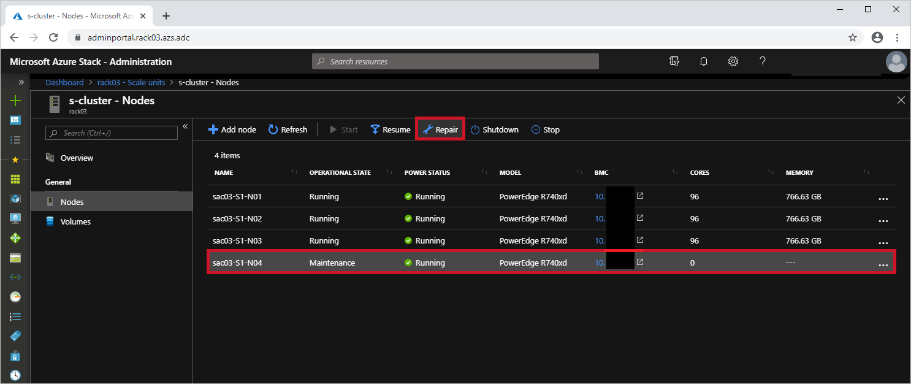
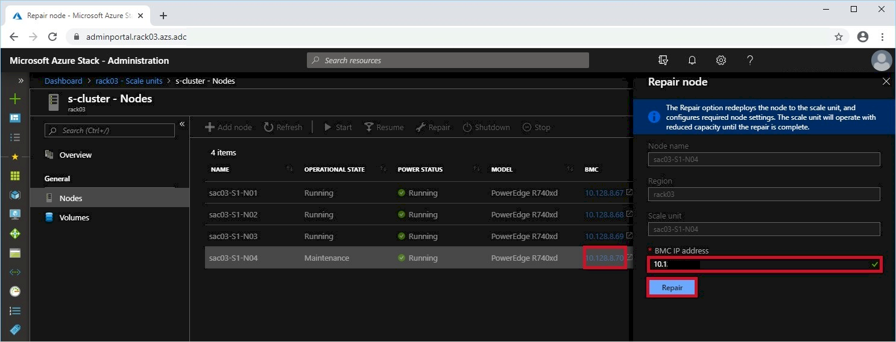
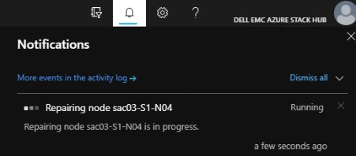

# Powering on and repairing a Scale Unit node

**Steps**

To repair and bring a Scale Unit node back into production you must
run the Azure Stack Hub repair procedure.

> [!NOTE]
> The repair procedure takes approximately three hours to
complete.

1.  In the **Administration Portal**, select the node and select **Repair**.

    

1.  Provide the **BMC IP Address** that corresponds to the node you are repairing and select **Repair**.

    

1.  Monitor the progress in the notification pane:

    
    
    
    > [!NOTE]
    > If the repair procedure does not complete in three hours or
    an issue occurs, then open a case with Dell Technologies Support who
    may engage Microsoft Support for further troubleshooting.
    
    When the repair process is complete, the node returns to a **Running
    Operational Status**.
    
