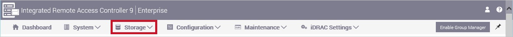
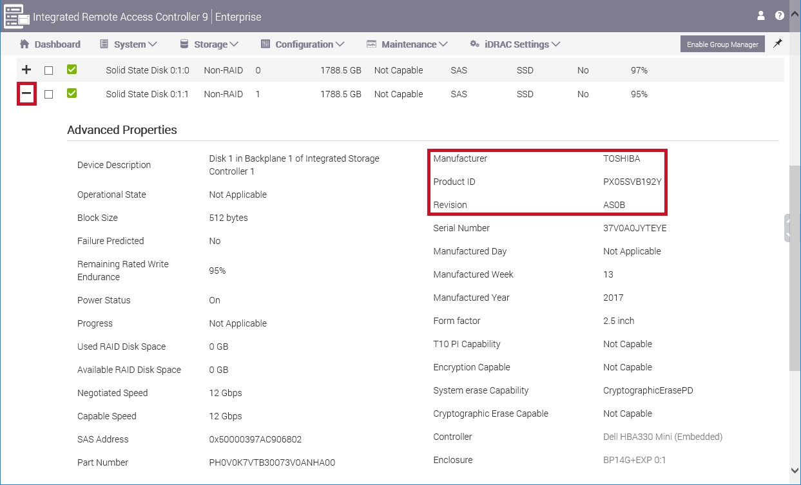

# Replacing a failed external storage disk

Use the following procedure to replace a failed external disk.

## Prerequisites

1.  Review *Notes, cautions, and warnings* at the beginning of this
    guide

2.  Review Handling precautions.

3.  Review

    -   Required knowledge for working with Scale Unit nodes in a
        Tactical Cloud
        Appliance if you are working with a Scale Unit node

    -   Required knowledge for working with the Hardware Lifecycle
        Host if you are working with the Hardware Lifecycle Host

4.  Complete

    -   Verifying Scale Unit node access and health if you are working with a Scale Unit node

    -   Verifying Hardware Lifecycle Host access and
        health if you are working with the Hardware Lifecycle Host

5.  Complete

    -   Powering off Scale Unit nodes if you are working with a Scale Unit node

    -   Powering off the Hardware Lifecycle
        Host if you are working with the Hardware Lifecycle Host

## Steps

1.  Locate the physical node in the rack.

2.  Verify the disk model.

    Verify the new disk model is listed as supported in the [Integrated
    System for Microsoft Azure Stack Hub 14G
    Support](https://www.dell.com/support/home/product-support/product/cloud-for-microsoft-azure-stack14g/docs#q%3Dsupport%20matrix%26sort%3Ddate%20descending%26f%3Alang%3D%5Ben%5D)
    [Matrix](https://www.dell.com/support/home/product-support/product/cloud-for-microsoft-azure-stack14g/docs#q%3Dsupport%20matrix%26sort%3Ddate%20descending%26f%3Alang%3D%5Ben%5D)*.
    If the disk is not in the support matrix, then you must request
    another replacement.
    
    > [!CAUTION]
    > Inserting a disk that is not in the support matrix results in the new disk being quarantined.
        
    To check the model, locate the label and verify the component is in
    the support matrix.
    
3.  Replace the failed external storage disk.

    Follow the disk drive carrier replacement process in the [Dell EMC
    PowerEdge R640 Installation and Service
    Manual](https://www.dell.com/support/manuals/us/en/04/poweredge-r640/per640_ism_pub/dell-emc-poweredge-r640-overview?guid=guid-f39be9ba-158c-45e3-b8b1-f07bb750d6d4)
    for Scale Unit nodes or Hardware Lifecycle Hosts.
    
    You must also refer to the relevant sections on removing a disk drive
    from and installing a disk drive into a disk drive carrier or a disk
    drive adapter.
    
4.  After replacing the disk, verify the firmware is supported according to the support matrix. To retrieve the disk\'s firmware version, do
the following:

    1.  Log in to the iDRAC using either the routable IP address or
        directly by Accessing the iDRAC interface over a direct USB
        connection.

    1.  From the top menu select **Storage**:

        
    
    1.  Locate the replaced disk and expand the item. Compare the disk
        **Revision** to the revision in the support matrix. If the disk
        is not in the support matrix, then engage support to remediate
        the problem.

        
        
## Next steps

If you are working with a Scale Unit node:

1.  Complete Verifying Scale Unit node
    health

2.  Complete Verifying Scale Unit node disk health If you're working with the Hardware Lifecycle Host:

    -   Complete Verifying Hardware Lifecycle Host health
    
