# Replacing the Heater

Read the following sections before you remove the old heater and install the new heater. 

## Unpacking and taking inventory of the heater 

The Tactical 1U Heater – V2 (the heater) typically ships as a pre-installed sub-component of the Tactical Cloud Appliance system. When shipped separately, the heater is shipped in a standard commercial shipping carton with protective packing material. 

Carefully remove the heater from the shipping carton. When packed in a shipping carton, the heater has all key components installed in the chassis. The heater is usually part of a transit case and integrated with an entire group of devices in a transit case. Keep the shipping carton and packing materials for any possible need to re-ship the heater in the future. While the heater is robust, ensure that the unit is properly packed for shipment. 

Do an inventory check to ensure that everything is accounted for. For discrepancies, contact Microsoft. 

## Heater installation planning 

Before you begin your installation, ensure that you are familiar with the configuration requirements of the heater unit. Before you begin the installation: 

1. Prepare the transit case for heater installation. 

2. Verify that you have all necessary screws and washers for the heater installation: 

    * Four black screws 10-32 x 7/8 with four split washers and four flat washers 
    
    * Four silver 10-32 x 5/8 screws with four split washers and four flat washers 
    
3. Ensure that cables or cords are not in the way of installation. 

## Heater installation notes 

The heater is mounted into a transit case capable of holding the unit. 

* Remove the lids of the transit case and any shipping covers while the heater is in use. 

* Ensure that there is a minimum gap of six inches in the front and rear of the heater to maintain the correct airflow around the unit. 

* Mount the heater into the rack in the transit case. 

* Mount the heater into the 19-inch rack in the transit case. Use two or more individuals to manage the weight of the unit during the mounting process. 

* Install any other required component such as plenums, cables, or brackets. 

> [!NOTE]
> Ensure that the socket outlet is installed near the equipment and is easily accessible.

## Removing the heater

1. Starting with the front pod cover, turn the eight cover latches counterclockwise to release the cover from the pod. Hold or secure the cover as you release all eight latches. 

    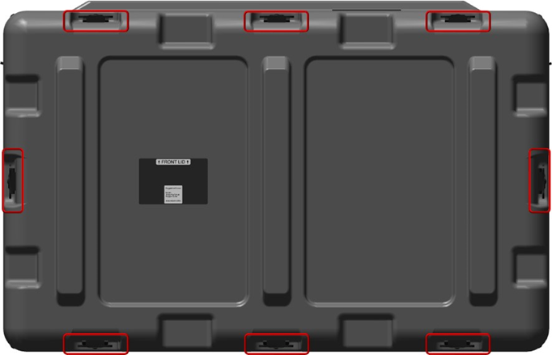

1. Remove the pod cover. 

    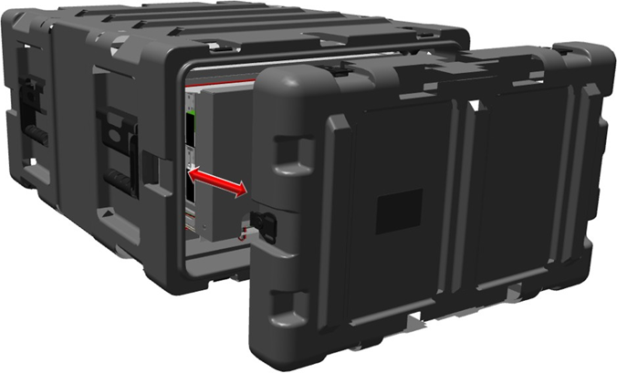

1. Repeat steps 1 and 2 to remove the rear pod cover. Now you can access the components inside the pods. 

1. Fully loosen the screws and then pull the filter assembly away from the server, as shown in the following figures. 

    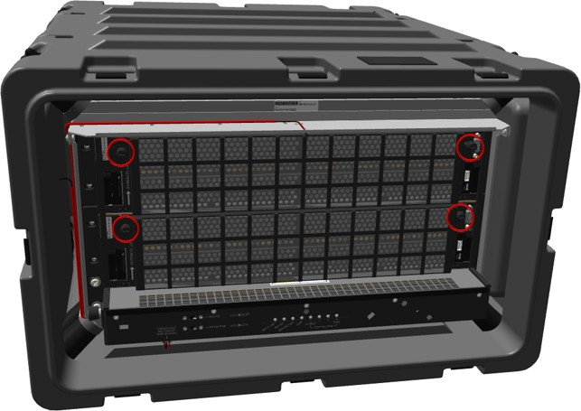

    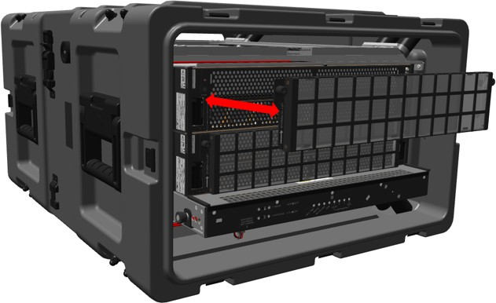

1. Pull the release tabs away from the Tactical 1U Heater - V2 until the cover releases and then move the cover outward from the chassis rack in the pod. 

    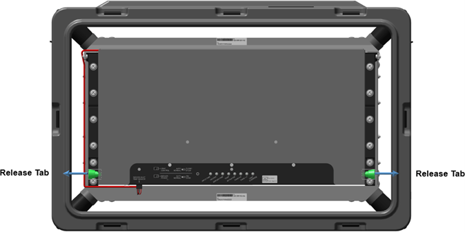

1. When the lower section of the plenum clears the base, pull outward to approximately forty degrees. The angle allows you to move the top of the plenum toward the server or switches, and then up and away before pulling the plenum out of the pod. 

    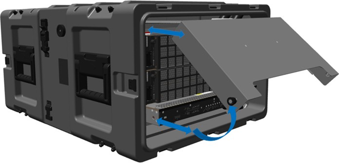

1. In the front of the case, remove the zip tie from under the Tactical 1U Heater - V2. Use the diagonal cutters if necessary. 

    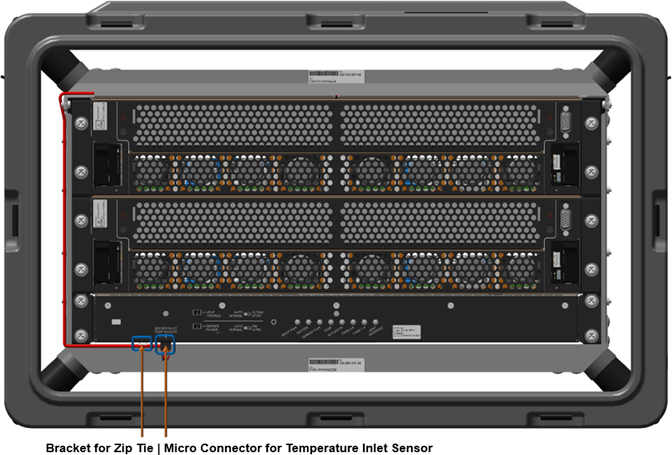

1. Squeeze the micro-connector front tab with your thumb and index finger and pull downward until the connection is free from the bottom of heater. Move the cable out of the way of the heater. 

    

1. At the front of the case, remove the four 10-32 screws, lock washers, and flat washers from the management server or bottom Scale Unit node server. 

    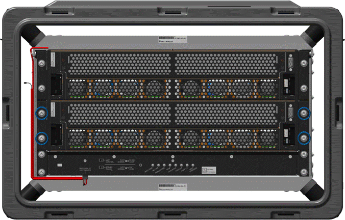

    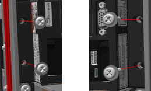

1. At the front of the case, remove the front four 10-32 screws, lock washers, and flat washers from the heater.

    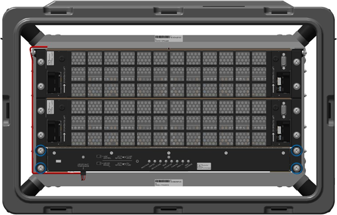

    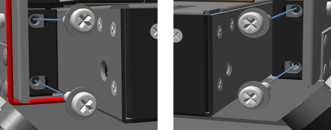

1. Unwind ethernet cables from the rear plenum, then remove any cable connected to the management server or bottom Scale Unit node server. 

1. At the back of the case, loosen the six Velcro straps and pull the cables out from the Velcro. 

    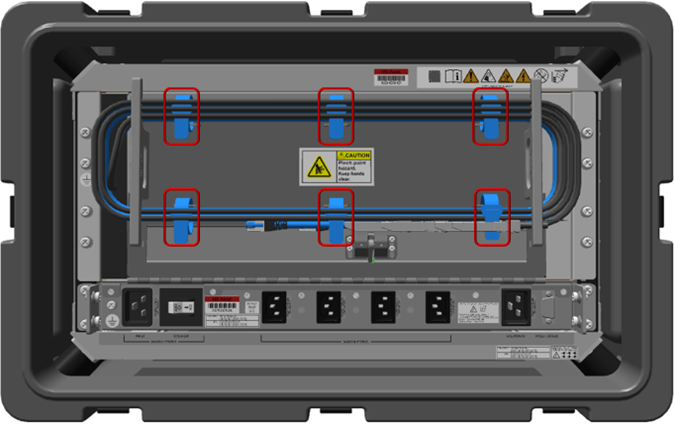

1. At the back of the case, after the Velcro is loosened, remove the cables from around the cable stowage brackets. 

1. Allow all cables to hang out and away from the plenum. Hanging cables are not shown in following figure. 

    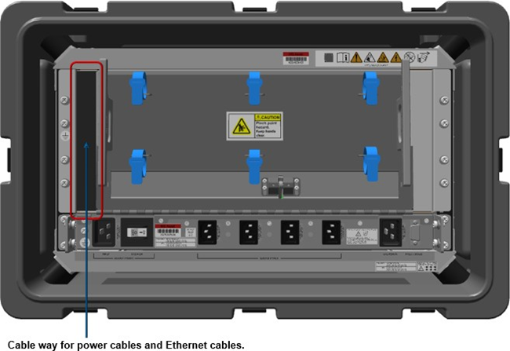

1. At the back of the case, quickly pull the plenum door down using the top lip of the plenum door. The plenum door should be disconnected from the linkage, allowing the door to hang freely. 

1. Pull the plenum downward if the linkage is still attached. 

    

    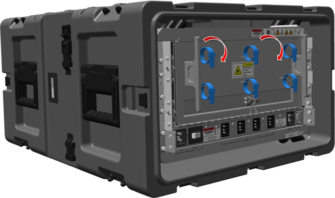

1. At the back of the case, unplug the server power cables from the Tactical 1U Heater - V2 and allow them to hang freely. 

    

1. Unplug the power cables from the server and allow them to hang freely. 

1. At the back of the case, remove the bottom server ground cable. 

1. Place an electrostatic discharge-safe bag or foam over the heater vent. 

1. In the following order, remove from the server: 

    1. hex nut 
    
    1. washer 
    
    1. connection terminal ring 
    
    1. two washers 

    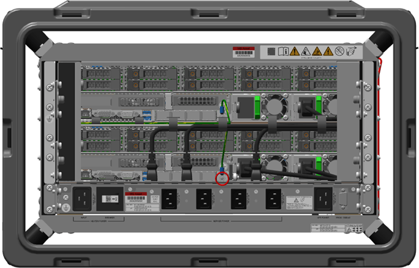

    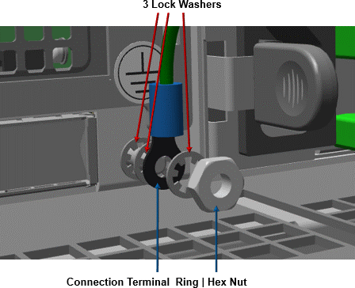

1. Place the hex nut and washers back on the grounding post or in safe location for reinstallation. 

1. At the back of the case, fully loosen the two captive screws holding the right filler bracket in place.

    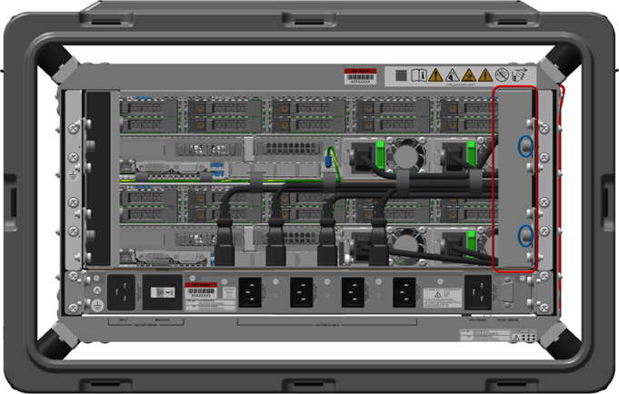

    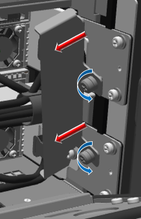

1. Pull the right filler bracket towards center of case to remove it. 

1. At the back of the case, fully loosen the two captive screws holding the left cableway bracket in place. 

    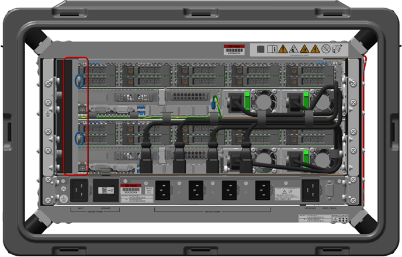

    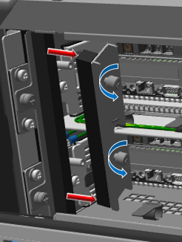

1. Pull the left cableway bracket towards center of case to remove it. 

1. Place the brackets in a safe location for reinstallation. 

1. At the back of the case, remove the one Cat 6 blue and two 25 Gbps black ethernet cables from the management or bottom Scale Unit node server. 

    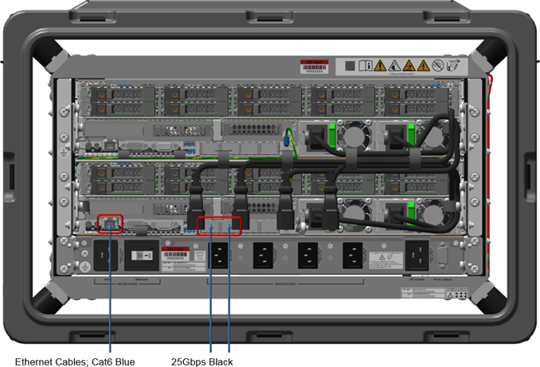

1. Place the cables in safe location for reinstallation. 

1. At the back of the case, fully loosen the two captive screws holding the left inner cableway bracket in place. 

    

    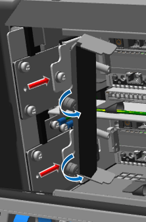

1. Pull the left inner cableway bracket towards center of case to remove it. 

1. At the back of the case, unscrew the six hinge screws from the top of the heater, leaving the door and hinge pin together as one unit. 

    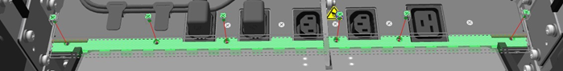

1. Place the bracket and screws in a safe location for reinstallation. 

1. At the back of the pod, remove the two 10-32 rail screws, lock washers, and flat washers that secure the server rail to the pod rack.

    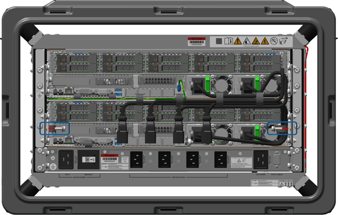

    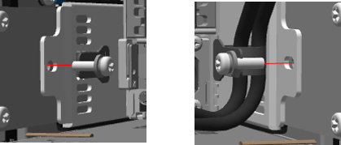

1. At the back of the pod, remove the four 10-32 screws, lock washers, and flat washers that secure the heater to the pod rack. 

    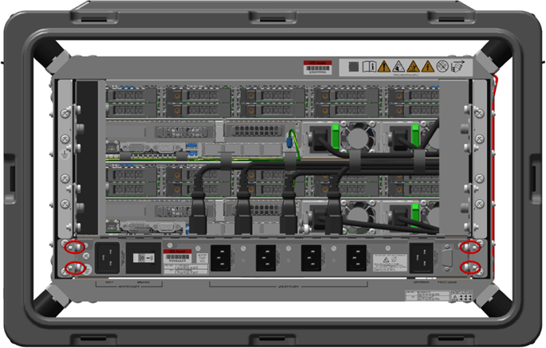

    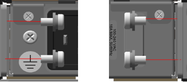

1. Ensure all cables are unplugged and hanging freely out of the way. 

1. At the front of the pod, carefully slide the server out. Hold the center of the server for even weight distribution as it is moved outward. 

    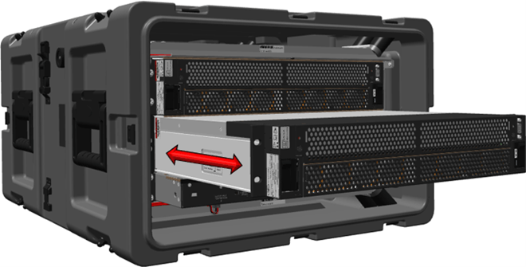

1. Place the server on an electrostatic discharge-safe location. 

1. At the front of the pod, pull the heater from the bottom of the rack. Hold the center of the heater for even weight distribution as it is moved outward. 

    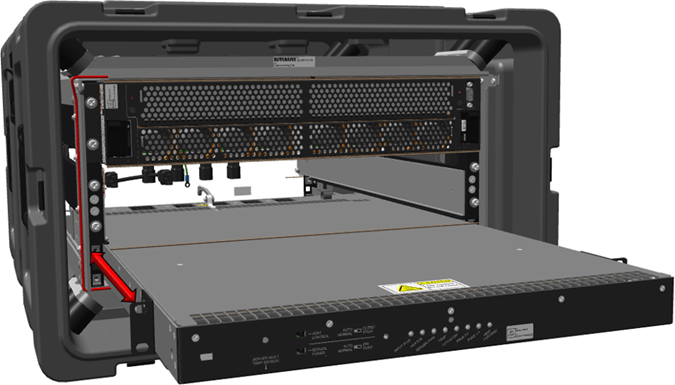

## Installing the heater

> [!WARNING]
> Electric shock hazard. 

> [!NOTE]
> When installing hardware in the front or back of the server, place an electrostatic discharge-safe cover over the heater vents to prevent foreign object damage to the heater. 

> [!WARNING]
> Use caution when lifting the pod to prevent damage to the equipment and personal injury. For best results, use a two-person lift or lifting equipment to reduce personal injury or damage to the components or pod. 

1. At the front of the pod, slide a new zip tie though the loop in the bottom front of the Tactical 1U Heater - V2, but do not zip the tie into place. 

    

1. At the front of the pod, insert the Tactical 1U Heater - V2 by sliding it in from front to back. Ensure that the zip tie does not fall out. 

1. At the front of the pod, install the two .064 inch shims between the rack and the Tactical 1U Heater - V2. 

    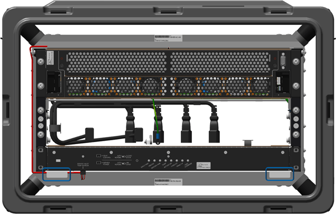

1. At the back of the pod, install the two .064 inch shims between the rack and the Tactical 1U Heater - V2. 

    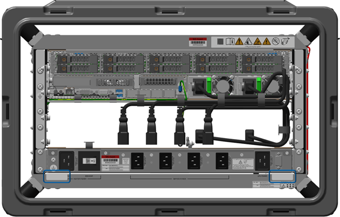

1. At the front of the pod, reattach the four 10-32 screws, lock washers, and flat washers. Apply primer and low strength threadlocker to the screw threads, and torque the screws to 27 inch-pounds. 

    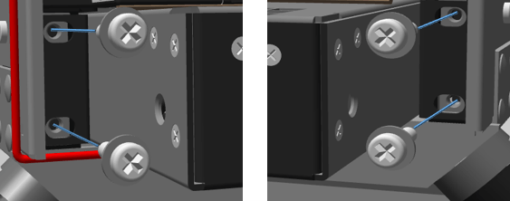

1. At the front of the pod, install the management server or lower Scale Unit node server, sliding it in from front to rear. Ensure there are no loose cables in the way of the server. 

1. At the front of the pod, reattach the four 10-32 screws, lock washers, and flat washers. Apply primer and low strength threadlocker to the screw threads, and torque the screws to 27 inch-pounds. 

    

1. At the back of the pod, reattach the two server rear mounting 10-32 screws, lock washers, and flat washers. Apply primer and low strength threadlocker to the screw threads, and torque to 27 inch-pounds. 

    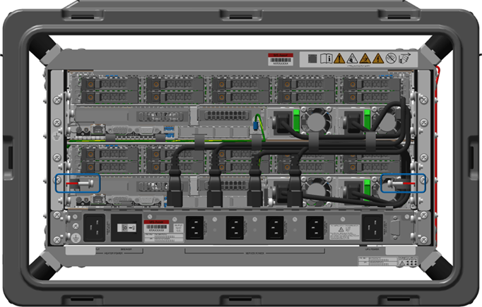

1. At the back of the pod, install the Tactical 1U Heater - V2 four rear mounting 10-32 screws, lock washers, and flat washers. Apply primer and low strength threadlocker to the screw threads, and torque the screws to 27 inch-pounds. 

    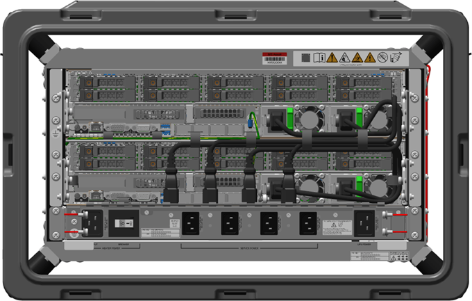

1. At the back of the pod, remove the two shims from below the Tactical 1U Heater - V2 and place them in the Heater Kit for future use. 

1. At the front of the pod, remove the two shims from below the Tactical 1U Heater - V2 and place them in the Heater Kit for future use. 

1. At the back of the pod, install the six 4-40 screws that attach the plenum hinge to the Tactical 1U Heater - V2. Apply primer and low strength threadlocker to the screw threads, and torque the screws to 4.5 inch-pounds. 

    > [!NOTE]
    > Place an electrostatic discharge (ESD) bag or ESD foam over the Tactical 1U Heater - V2 vent to prevent foreign object damage to the heater. 

1. At the back of the pod, install the left inner cableway bracket. While pressing the bracket inwards toward the rack, fully tighten the captive 6-32 screws then torque the screws to 9 inch-pounds. 

1. At the back of the case, install the one Cat 6 blue and two 25 Gbps black ethernet cables into the management or bottom Scale Unit node server. 

1. At the back of the pod, install the left cableway bracket in its original location. Carefully align all cables back into position while pressing the bracket inwards toward the rack. 

1. Fully tighten the two captive 6-32 screws then torque the screws to 9 inch-pounds. 

1. At the back of the pod, install the right filler bracket in its original location while pressing the bracket inwards toward the rack. Fully tighten the two captive 6-32 screws then torque the screws to 9 inch-pounds.

1. At the back of the pod, install the management server or lower Scale Unit node server ground hardware in this order: 

    1. two washers 
    
    1. terminal ring connection 
    
    1. washer 
    
    1. hex nut 

1. Torque the nut to 16 inch-pounds. 

1. At the back of the pod, reconnect the two server power cables, then the four Tactical 1U Heater - V2 power cables into their original locations. 

1. At the back of the pod, linkage should be resting up and behind the ball detents, if not move the linkage arm up to the required position. 

    Hold the plenum door steady while adjusting the arm behind the ball detents. 
    
    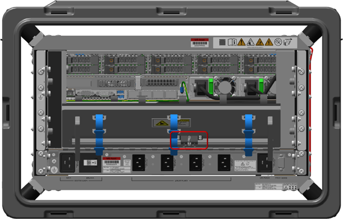
    
    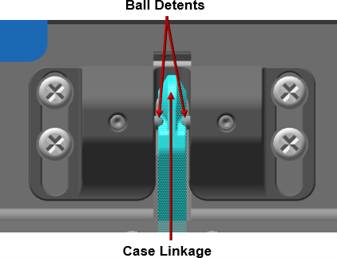
    

1. At the back of the pod, press either location A or B with both thumbs (simultaneously press both left and right or upper and lower) until an audible click is heard from the linkage engaging the plenum. 

    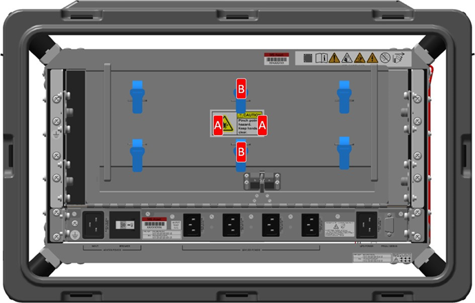

1. At the back of the pod, wind the six ethernet cables (two blue Cat 6 and four black 25 Gbps cables) around the cable stowage spooling brackets and tighten the six Velcro straps around the cables. 

1. At the front of the pod, install the micro connector to the server inlet temperature sensor. You should hear an audible click. 

1. At the front of the pod, route the cable under the loop, wrap the zip tie around cable, and zip it into place. Clip the excess zip tie. 

    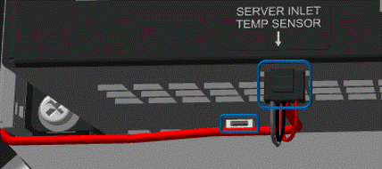

1. At the front of the pod, install the front plenum, by holding the plenum at approximately a forty degree angle (minimum) while placing your index fingers on the front angled flat section. Guide the folded metal of the plenum onto the chassis rack folded metal. 

    

1. When aligned properly, use the release tabs to place the plenum into position. 

1. Press and turn the release tabs so that they engage their original locations and lock into position. 

1. At the back and front of the pod, place the pod covers place back into their original locations, then connect the latches and turn them clockwise to secure them to the pod. 

1. Hold or secure the cover as you connect all eight latches. 

