# Verifying Hardware Lifecycle Host access and health

Log in to the iDRAC and the Hardware Lifecycle Host (HLH) OS and
verify the system health.

1.  Connect to the iDRAC.

    1.  Using a web browser, navigate to the iDRAC web interface and log in using the credentials provided by the customer.

        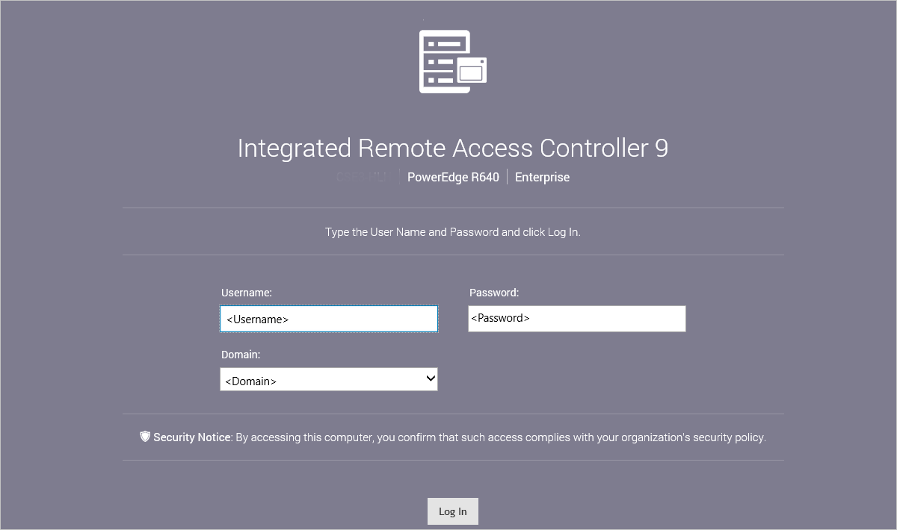 
    
    1.  From the top navigation menu, select **System**.

        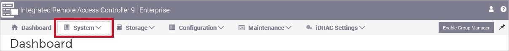
        
    1.  From the **Overview** tab, verify the system is
        completely healthy or shows the issue expected that should be
        remediate during this hardware replacement.
    
        
    
2.  Connect to the HLH OS using the iDRAC virtual console.

    > [!NOTE]
    > You can skip this step if you log in using a crash cart with
    VGA and USB connections.
    
    1.  In the iDRAC web interface, select
        **Dashboard**.

        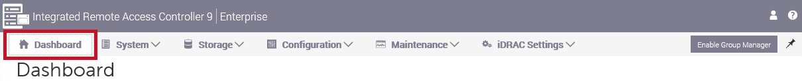
    
    1.  In the **Virtual Console** pane, select **Settings**.
    
        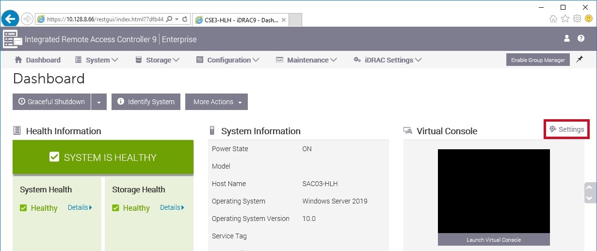
        
    1.  Check the **Plug-in Type** is set to **HTML 5**. If it is not,
        change this, select **Apply**, and then **OK** when prompted.
    
        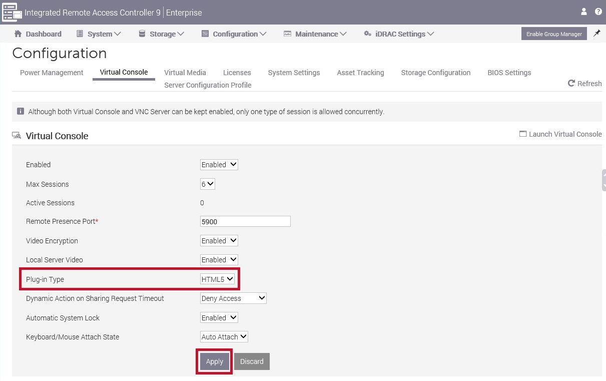
        
    1.  Select **Launch Virtual Console**.

        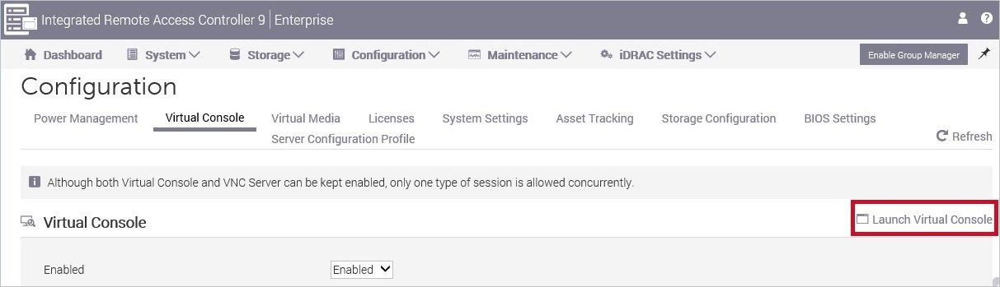
    
    1.  If a pop-up warning is displayed, change the browser settings to
        always allow. For example, in Internet Explorer, select **Options for
        this site** and select **Always allow**. If required, after changing
        the browser setting, repeat the previous step to launch the virtual
        console.
    
        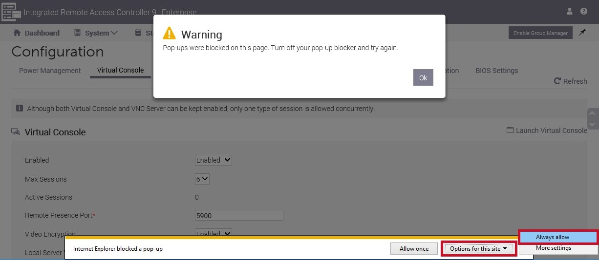
        
    1.  The virtual console should now be present. To log in to the
        operating system, from the top hand menu, select **Console
        Controls**.
    
        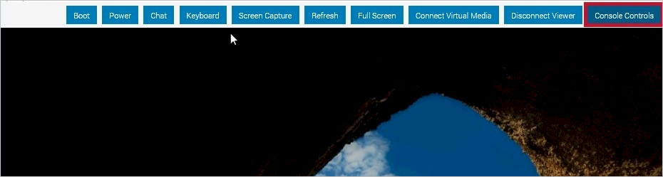
        
    1.  Select the **Keyboard Macro**, **Ctrl+Alt-Del** and select **Apply**
        and then **Close**.
    
        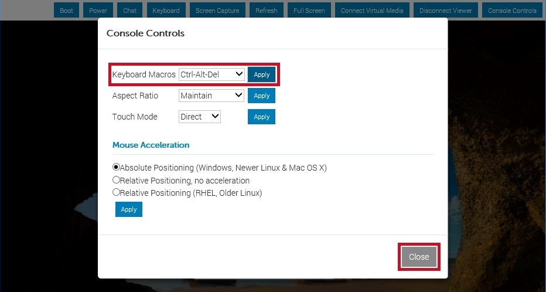
        
    1.  Select the **user** based on the credentials provided by the
        customer, enter the password and select the **arrow** to log in.
    
        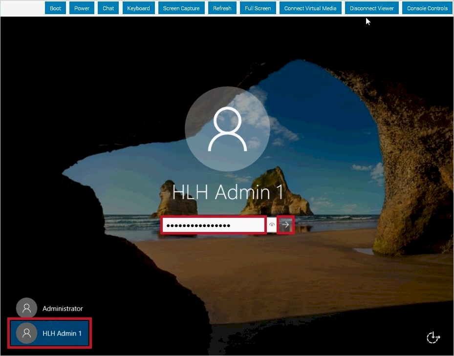
        
        You are now logged in to the HLH.
        
3.  Verify health.

    1.  Launch **Server Manager**.

        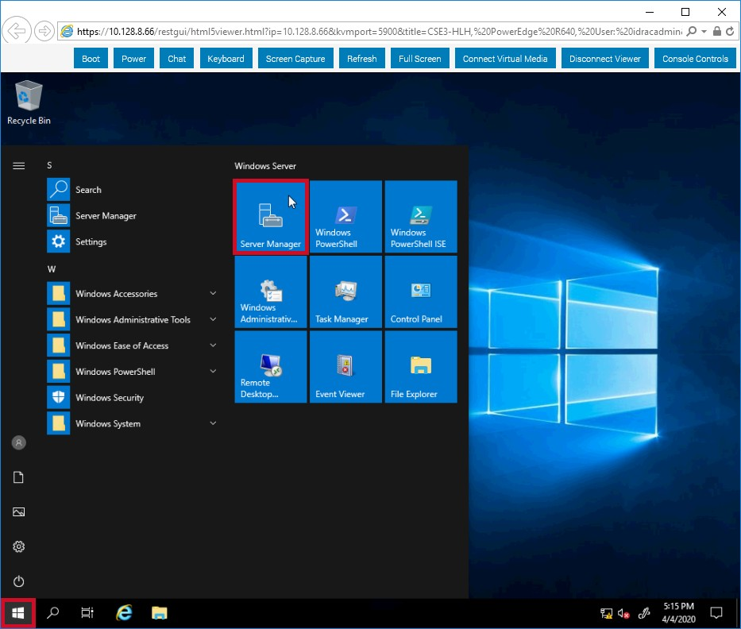
        
    1.  Select **Yes** to the **User Account Control** prompt.
    
        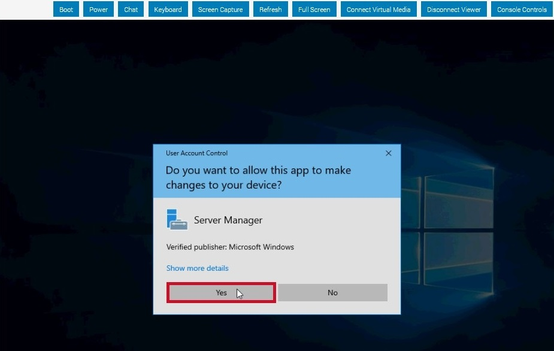
        
    1.  From the **Tools** menu, select **Hyper-V Manager**.
    
        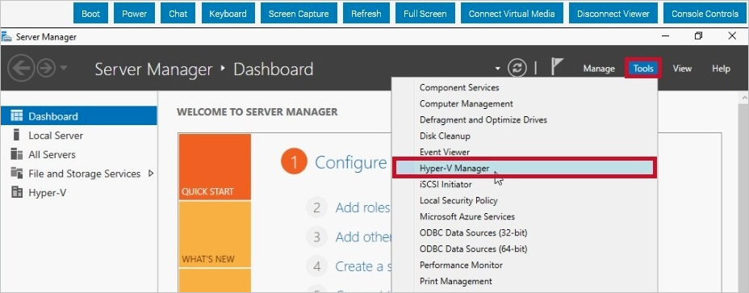
        
    1.  In **Hyper-V Manager**, select the top node in the left menu and then
        verify that VMs such as the **Privileged Access Workstation**, if
        applicable, are in a **Running** state.