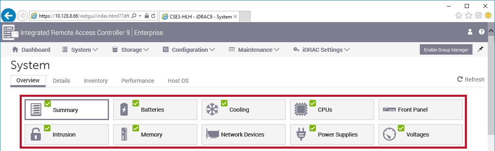
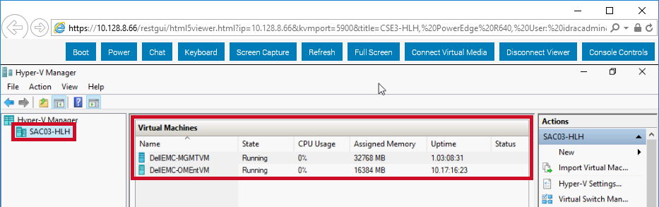

# Verifying Hardware Lifecycle Host health

When the hardware replacement is complete and BEFORE you leave the
site, use the iDRAC to verify the Hardware Lifecycle Host health.

1.  Verify the system health in the iDRAC web interface and check that
the issue you worked on has cleared, if it was present in the web
interface before the FRU process.

    
    
2.  Verify that the Hyper-V virtual
    machines are in a **Running** state.

     

