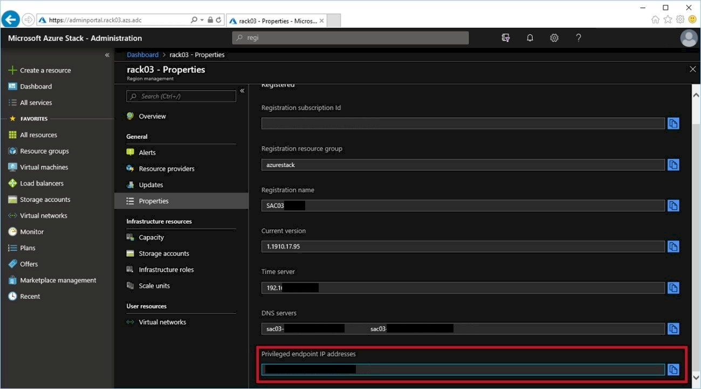
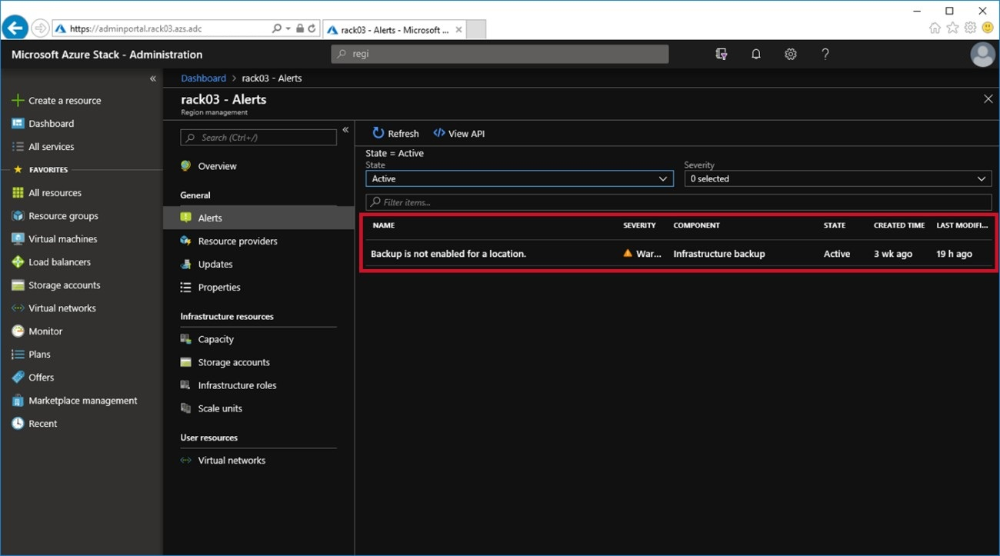
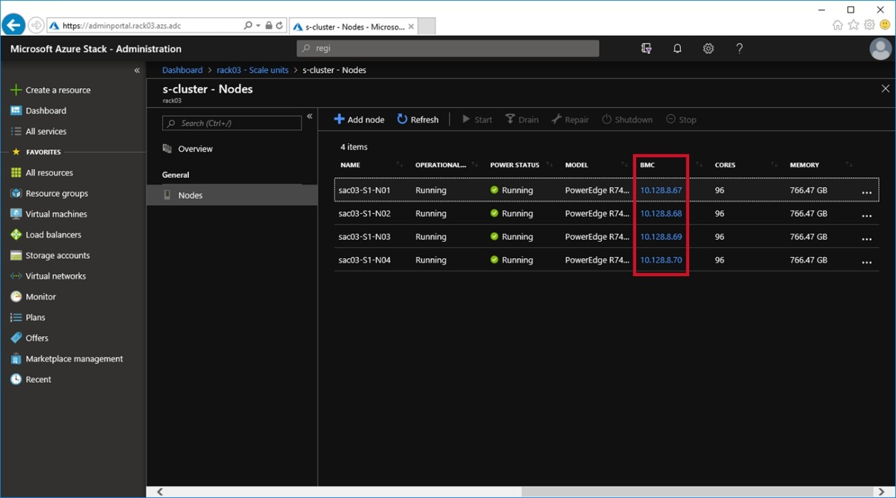
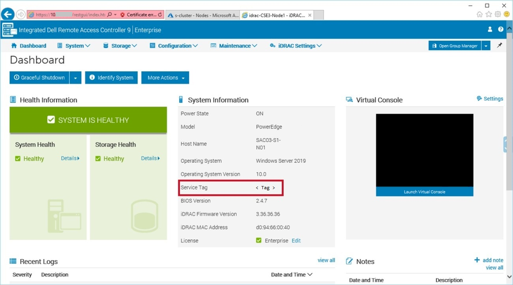

# Verifying Scale Unit node access and health

Log in to the Privileged Access Workstation, launch the Administrator
Portal, verify the system health, obtain the privileged endpoint IP
addresses, and identify which nodes will need to be drained or
resumed.

1.  Using Remote Desktop, connect to the Privileged Access Workstation.

2.  Access the Azure Stack Hub Administrator Portal.

    Log in to the Azure Stack Hub Administrator Portal with the
    credentials obtained from the customer.
        
3.  Obtain the privileged endpoint IP addresses.

    Select the **Region Management** tile and
    select **Properties**. Scroll to the bottom of the pane and locate the
    IP addresses in the **Privileged endpoint IP addresses** field. Take
    note of these as may be needed later in this procedure or will be
    needed by support in the event of any issues.

    
    
4.  Review any current alerts.

    In **Region Management**, select **Alerts** and review the current
    alerts. If any unexpected alerts are present, verify with Dell
    Technologies Support that they can be cleared or safely ignored.
    
    
    
5.  Identify the Scale Unit nodes.

    If you are only provided the service tag and you are unable to
    identify which node has the issue from the Azure Stack Hub Admin
    Portal (that is the node power status is already stopped), then use
    the following steps to correlate the scale unit node to the service
    tag:
    
    1.  In **Region Management**, select **Scale Units** and then select the
        cluster **s-cluster**. Select **Nodes**.
    
    1.  To obtain the node service tag, select
        on the **BMC** IP address link, which opens the server's iDRAC web
        interface in a new tab or window.

         
    
    1.  Log in to the iDRAC interface and verify the service tag of the node
        in the **System Information** pane.
    
    1.  Repeat this procedure for every node
        and correlate these service tags with the scheduled hardware
        replacement to determine which node or nodes need to be serviced.

        
    
