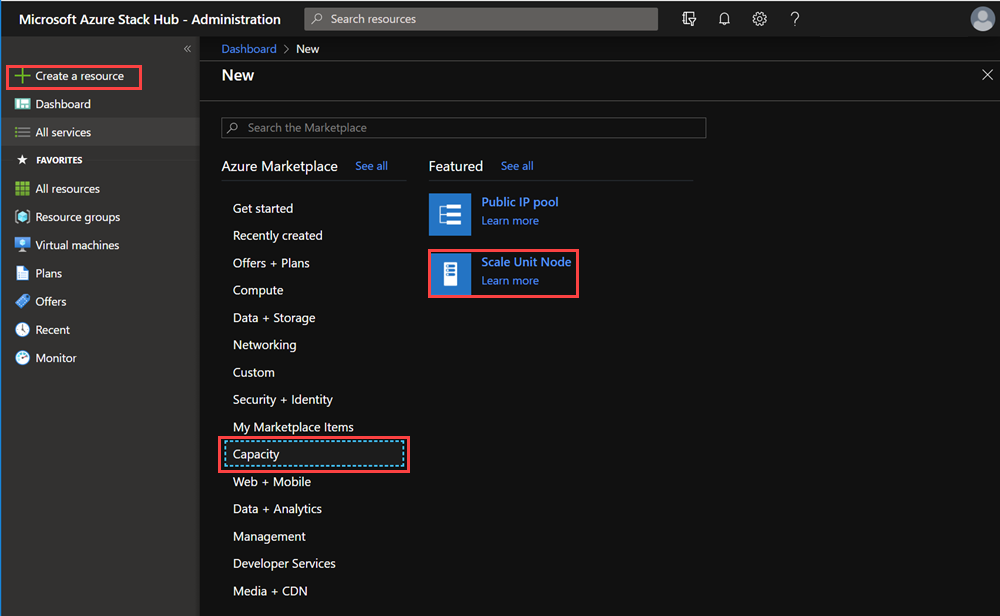
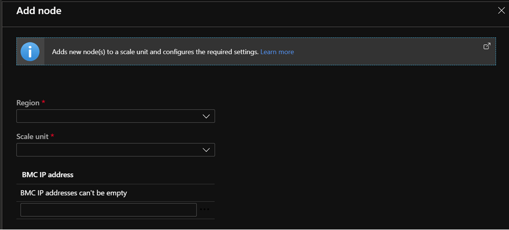

# Add scale unit nodes in Azure Stack Hub - Ruggedized

You can increase the overall capacity of an existing scale unit by adding another physical computer. The physical computer is also referred to as a *scale unit node*. Each new node must have the same CPU type, memory, disk number, and size as the nodes already present in the scale unit. Azure Stack Hub doesn't support removing scale unit nodes for scaling down because of architectural limitations. It's only possible to expand capacity by adding nodes.

To add a scale unit node, sign in to in Azure Stack Hub. Run the tools from your hardware equipment manufacturer (OEM). The OEM tool runs on the hardware lifecycle host (HLH) to make sure the new physical computer matches the same firmware level as existing nodes.

The following flow diagram shows the general process to add a scale unit node:


<br> *Whether your OEM hardware vendor enacts the physical server rack placement and updates the firmware varies based on your support contract.*

Take into consideration the following limitations when adding a new node:
- The operation to add a new node can take several hours or days to complete. There isn't an impact to running workloads on the system while another scale unit node is added.
- The operation to add another scale unit Node includes two distinct phases: *compute* and *storage*.
- During the compute expansion phase, your Azure Stack Hub will show a state of **Expanding**. After the compute expansion completes, and the storage expansion is running, the stamp will show a state of **Configuring Storage**.
Let your Azure Stack Hub return to the **Running** state before adding another node. This means when adding multiple nodes you will need to add a node and wait for the state to return to **Running** before adding another node. 

> [!WARNING]  
> Don't attempt any of the following operations while an add scale unit node operation is already in progress:
>
>  - Update Azure Stack Hub
>  - Rotate certificates
>  - Stop Azure Stack Hub
>  - Repair scale unit node
>  - Add another node (the previous add-node action failure is also considered in progress)

## Add scale unit nodes

The following steps are a high-level overview of how to add a node. Don't follow these steps without first referring to your OEM-provided capacity expansion documentation.

1. Place the new physical server in the rack and cable it appropriately. 
2. Enable physical switch ports on both TOR devices using SSH:
   1. Enter configuration mode:

      ```shell
      configure terminal
      ```

   2. Remove interfaces 1/5-8 from VLAN 2 (unused ports VLAN):

      ```shell
      Interface vlan 2
      no untagged twentyFiveGigE 1/5-1/8
      exit
      ```

   3. Remove existing L2 and switchport configuration from interfaces 1/5-8:

      ```shell
      Interface range twentyFiveGigE 1/5-1/8
      no spanning-tree rstp edge-port bpduguard
      no spanning-tree rstp rootguard
      no switchport
      ```

   4. Enable interfaces 1/5-8 and give them identical config to interfaces 1/1-4:

      ```shell
      description CL01 Nodes NIC
      mtu 9216
      portmode hybrid
      switchport
      spanning-tree rstp edge-port bpduguard 
      spanning-tree rstp rootguard 
      dcb-map AZS_SERVICES
      no shutdown
      exit
      ```

   5. Add interfaces 1/5-8 as untagged to VLAN 7 and tagged to VLAN 107:

      ```shell
      Interface vlan 7
      untagged twentyFiveGigE 1/5-1/8
      exit
      interface vlan 107
      tagged twentyFiveGigE 1/5-1/8
      exit
      ```

3. Enable physical switch ports on the BMC device using SSH:

   1. Enter configuration mode:

      ```shell
      configure terminal
      ```

   2. Enable interfaces 1/5-8 and give them an identical configuration to interfaces 1/1-4:

      ```shell
      interface range gigabitethernet 1/5-1/8
      description BMCMgmt Ports
      no shutdown
      exit
      ```

   3. Remove interfaces 1/5-8 from the unused ports VLAN (VLAN2) and add them to the BMC VLAN (VLAN125):

      ```shell
      interface vlan 2
      no untagged gigabitethernet 1/5-1/8
      exit
      interface vlan 125
      untagged gigabitethernet 1/5-1/8
      exit
      ```

4. Prepare physical nodes and apply latest firmware and BIOS settings. For more information, see [Server firmware updates](server-firmware-updates-ruggedized.md).
5. Run the add node operation in the Azure Stack Hub administrator portal.
6. Validate that the add node operation succeeds. To do so, check the [**Status** of the Scale Unit](#monitor-add-node-operations).

### Cabling and IP changes for interfaces on Nodes 5-8

The following are the steps for cabling the new nodes into the existing switches, and describes the IP changes needed for the BMC interfaces on the 4 additional nodes.

1. Once the 2nd RCA has been un-crated and stacked adjacent to the 1st RCA, connect all power cables from the nodes in the Pod1 and Pod2 cases.

   - Do not connect power cables from anything in the management case at this time.
   - If the nodes in the Pod1 and Pod2 cases begin booting up, force-power them off by holding down their power buttons for a few seconds until the power button's light turns off and you see no other lights on the disks on the front of the node.

2. You must now re-IP each node's BMC management IP. This must be done on a laptop that you can cable directly into each node's BMC NIC directly, as follows:

   - On the laptop you are going to use for the IP address changes, give the 1 Gbps NIC the following IP configuration:

     - IP address – 10.10.21.90
     - Subnet mask – 255.255.255.192
     - Gateway – None

   - Starting with Node 1 of the 2nd RCA and working your way through all 4 nodes, directly attach the laptop to the BMC NIC of each node and connect via web browser to its current BMC web portal. Sign in using the standard RCA credentials (user: changeme, password: <stamp default password assigned to your RCA>), and change the IP for that node per the following table:

     | 2nd RCA Node | Current BMC IP | New BMC IP  |
     |--------------|----------------|-------------|
     | Node 1       | 10.10.21.67    | 10.10.21.71 |
     | Node 2       | 10.10.21.68    | 10.10.21.72 |
     | Node 3       | 10.10.21.69    | 10.10.21.73 |
     | Node 4       | 10.10.21.70    | 10.10.21.74 |

3. Using the RCA Port Mapping document as a guide, cable the new nodes from the 2nd RCA into the switches contained within the 1st RCA's management case, using the node equivalency as follows:

   - Node 1 of 2nd RCA = Node 5
   - Node 2 of 2nd RCA = Node 6
   - Node 3 of 2nd RCA = Node 7
   - Node 4 of 2nd RCA = Node 8

## Add the node

You can use the administrator portal or PowerShell to add new nodes. The add node operation first adds the new scale unit node as available compute capacity and then automatically extends the storage capacity. The capacity expands automatically because Azure Stack Hub is a hyperconverged system where *compute* and *storage* scale together.

### [Administrator portal](#tab/portal)

1. Sign in to the Azure Stack Hub administrator portal as an Azure Stack Hub operator.
2. Navigate to **+ Create a resource** > **Capacity** > **Scale Unit Node**.
   
3. On the **Add node** pane, select the *Region*, and then select the *Scale unit* that you want to add the node to. Also specify the *BMC IP ADDRESS* for the scale unit node you're adding. You can only add one node at a time.
   

### [PowerShell Az](#tab/Az)

Use the **Add-AzsScaleUnitNode** cmdlet to add a node.  

Before using either of the following sample PowerShell scripts, replace the values *name_of_new_node*,  *name_of_scale_unit_cluster*, *BMCIP_address_of_new_node* with values from your Azure Stack Hub environment.

  > [!Note]  
  > When naming a node you must keep the name to less than 15 characters in length. You also can't use a name that contains a space or contains any of the following characters: `\`, `/`, `:`, `*`, `?`, `"`, `<`, `>`, `|`, `\`, `~`, `!`, `@`, `#`, `$`, `%`, `^`, `&`, `(`, `)`, `{`, `}`, `_`.

#### Add a node

  ```powershell
  ## Add a single node 
    Add-AzsScaleUnitNode -BMCIPv4Address "<BMCIP_address_of_new_node>" -computername "<name_of_new_node>" -ScaleUnit "<name_of_scale_unit_cluster>" 
  ```  

### [PowerShell AzureRM](#tab/AzureRM)

Use the **New-AzsScaleUnitNodeObject** cmdlet to add a node.  

Before using either of the following sample PowerShell scripts, replace the values *node names* and *IP addresses* with values from your Azure Stack Hub environment.

  > [!Note]  
  > When naming a node you must keep the name to less than 15 characters in length. You also can't use a name that contains a space or contains any of the following characters: `\`, `/`, `:`, `*`, `?`, `"`, `<`, `>`, `|`, `\`, `~`, `!`, `@`, `#`, `$`, `%`, `^`, `&`, `(`, `)`, `{`, `}`, `_`.

#### Add a single node

  ```powershell
  ## Add a single Node 
  $NewNode=New-AzsScaleUnitNodeObject -computername "<name_of_new_node>" -BMCIPv4Address "<BMCIP_address_of_new_node>" 
 
  Add-AzsScaleUnitNode -NodeList $NewNode -ScaleUnit "<name_of_scale_unit_cluster>" 
  ```  

---

## Monitor add node operations

Use the administrator portal or PowerShell to get the status of the add node operation. Add node operations can take several hours to days to complete.

### Use the administrator portal

To monitor the addition of a new node, review the scale unit or scale unit node objects in the administrator portal. To do so, go to **Region management** > **Scale units**. Next, select the scale unit or scale unit node you want to review. 

### Use PowerShell

The status for scale unit and scale unit nodes can be retrieved using PowerShell as follows:

  ```powershell
  #Retrieve Status for the Scale Unit
  Get-AzsScaleUnit|select name,state
 
  #Retrieve Status for each Scale Unit Node
  Get-AzsScaleUnitNode |Select Name, ScaleUnitNodeStatus
  ```

### Status for the add node operation

#### For a scale unit

|Status               |Description  |
|---------------------|---------|
|Running              |All nodes are actively participating in the scale unit.|
|Stopped              |The scale unit node is either down or unreachable.|
|Expanding            |One or more scale unit nodes are currently being added as compute capacity.|
|Configuring Storage  |The compute capacity has been expanded and the storage configuration is running.|
|Requires Remediation |An error has been detected that requires one or more scale unit nodes to be repaired.|

#### For a scale unit node

|Status                |Description  |
|----------------------|---------|
|Running               |The node is actively participating in the scale unit.|
|Stopped               |The node is unavailable.|
|Adding                |The node is actively being added to the scale unit.|
|Repairing             |The node is actively being repaired.|
|Maintenance           |The node is paused, and no active user workload is running. |
|Requires Remediation  |An error has been detected that requires the node to be repaired.|

## Troubleshooting

The following are common issues seen when adding a node.

### Scenario 1: The add scale unit node operation fails but one or more nodes are listed with a status of Stopped
  
- Remediation: Use the repair operation to repair one or more nodes. Only a single repair operation can run at one time.

### Scenario 2: One or more scale unit nodes have been added but the storage expansion failed

In this scenario, the scale unit node object reports a status ofRunning but the Configuring Storage task isn't started.  

- Remediation: Use the privileged endpoint to review the storage health by running the following PowerShell cmdlet:

  ```powershell
     Get-VirtualDisk -CimSession s-cluster | Get-StorageJob
  ```

### Scenario 3: You received an alert that indicates the storage scale-out job failed.

- Remediation: In this case, the storage configuration task has failed. This problem requires you to contact support.

## Next steps

[Add public IP addresses](../../operator/azure-stack-add-ips.md)
