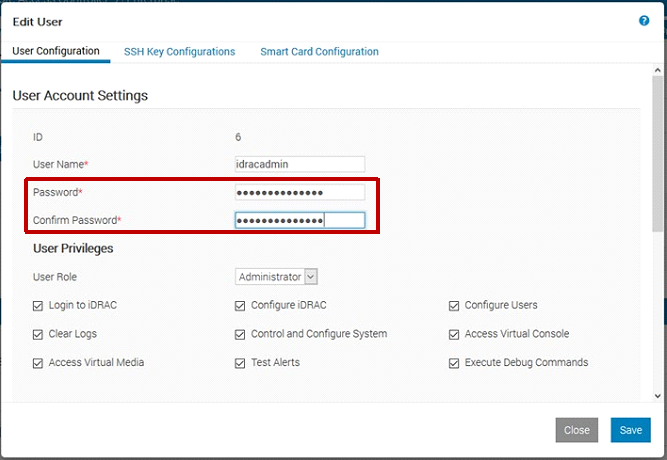

# Update user credentials for the Integrated Dell Remote Access Controller

This section describes how to change the Integrated Dell Remote Access Controller (iDRAC) credentials. 

## Prerequisites

Before running the procedure: 

- Use Remote Desktop to connect to the MGMT virtual machine. 
- Ensure that you have the new credentials for the account or accounts. 
 
## Update the iDRAC credentials

To update the iDRAC credentials for all PowerEdge servers (HLH and scale unit nodes) in the environment:

1. In a web browser, sign in to "https://<iDRAC_IP>". 
1. Go to **iDRAC Settings** > **Users**. 
1. Choose a user to modify, and then select **Edit**. 
1. In the **Edit User** window, enter the new password in the **Password** and **Confirm Password** boxes: 

   

1. Select **Save**, and then **OK**. 

## Next steps

[Rotate secrets in Azure Stack Hub](../../operator/azure-stack-rotate-secrets.md)