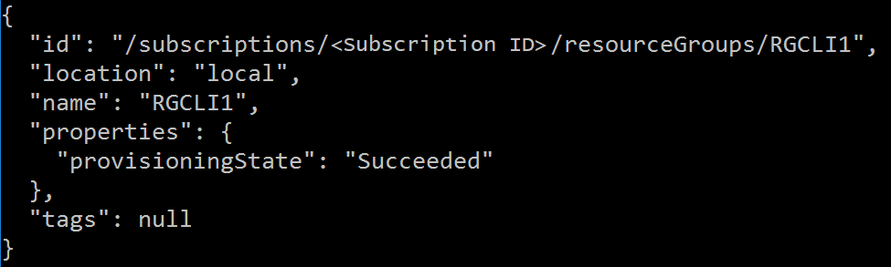

# Manage and deploy resources to Azure Stack Hub with Azure CLI

*Applies to: Azure Stack Hub integrated systems*

Follow the steps in this article to set up the Azure Command-Line Interface (CLI) to manage Azure Stack Hub resources from Linux, Mac, and Windows client platforms.

## Prepare for Azure CLI

**The virtual machine aliases endpoint** provides an alias, like "UbuntuLTS" or "Win2012Datacenter." This alias references an image publisher, offer, SKU, and version as a single parameter when deploying VMs.  

The following section describes how to set up the virtual machine aliases endpoint.

### Set up the virtual machine aliases endpoint

You can set up a publicly accessible endpoint that hosts a VM alias file. The VM alias file is a JSON file that provides a common name for an image. You use the name when you deploy a VM as an Azure CLI parameter.

1. If you publish a custom image, make note of the publisher, offer, SKU, and version information that you specified during publishing. If it's an image from the Marketplace, you can view the information by using the ```Get-AzureVMImage``` cmdlet.  

2. Download the [sample file](https://raw.githubusercontent.com/Azure/azure-rest-api-specs/master/arm-compute/quickstart-templates/aliases.json) from GitHub.

3. Create a storage account in Azure Stack Hub. When that's done, create a blob container. Set the access policy to "public."  

4. Upload the JSON file to the new container. When that's done, you can view the URL of the blob. Select the blob name and then selecting the URL from the blob properties.

### Install or upgrade CLI

Sign in to your development workstation and install CLI. Azure Stack Hub requires version 2.0 or later of Azure CLI. The latest version of the API Profiles requires a current version of the CLI. You install the CLI by using the steps described in the [Install the Azure CLI](https://docs.microsoft.com/cli/azure/install-azure-cli) article. 

To verify whether the installation was successful, open a terminal or command prompt window and run the following command:

```shell
az --version
```

You should see the version of Azure CLI and other dependent libraries that are installed on your computer.
    


## Windows/Linux (Azure AD)

This section walks you through setting up CLI if you're using Azure AD as your identity management service, and are using CLI on a Windows/Linux machine.

### Connect to Azure Stack Hub

1. Register your Azure Stack Hub environment by running the `az cloud register` command.

2. Register your environment. Use the following parameters when running `az cloud register`:

    | Value | Example | Description |
    | --- | --- | --- |
    | Environment name | AzureStackUser | Use `AzureStackUser`  for the user environment. If you're operator, specify `AzureStackAdmin`. |
    | Resource Manager endpoint | `https://management.local.azurestack.external` | <!-- TZLASDKFIX The **ResourceManagerUrl** in the ASDK is: `https://management.local.azurestack.external/`--> The **ResourceManagerUrl** in integrated systems is: `https://management.<region>.<fqdn>/` If you have a question about the integrated system endpoint, contact your cloud operator. |
    | Storage endpoint | local.azurestack.external | <!-- TZLASDKFIX `local.azurestack.external` is for the ASDK.--> For an integrated system, use an endpoint for your system.  |
    | Keyvault suffix | .vault.local.azurestack.external | <!-- TZLASDKFIX `.vault.local.azurestack.external` is for the ASDK.--> For an integrated system, use an endpoint for your system.  |
    | VM image alias doc endpoint- | https://raw.githubusercontent.com/Azure/azure-rest-api-specs/master/arm-compute/quickstart-templates/aliases.json | URI of the document, which contains VM image aliases. For more info, see [Set up the VM aliases endpoint](#set-up-the-virtual-machine-aliases-endpoint). |

    ```azurecli  
    az cloud register -n <environmentname> --endpoint-resource-manager "https://management.local.azurestack.external" --suffix-storage-endpoint "local.azurestack.external" --suffix-keyvault-dns ".vault.local.azurestack.external" --endpoint-vm-image-alias-doc <URI of the document which contains VM image aliases>
    ```

1. Set the active environment by using the following commands.

      ```azurecli
      az cloud set -n <environmentname>
      ```

1. Update your environment configuration to use the Azure Stack Hub specific API version profile. To update the configuration, run the following command:

    ```azurecli
    az cloud update --profile 2019-03-01-hybrid
   ```
 
1. Sign in to your Azure Stack Hub environment by using the `az login` command. Sign in to the Azure Stack Hub environment either as a user or as a service principal. 

   - Sign in as a *user*: 

     You can either specify the username and password directly within the `az login` command, or authenticate by using a browser. You must do the latter if your account has multi-factor authentication enabled:

     ```azurecli
     az login -u <Active directory global administrator or user account. For example: username@<aadtenant>.onmicrosoft.com> --tenant <Azure Active Directory Tenant name. For example: myazurestack.onmicrosoft.com>
     ```

     > [!NOTE]
     > If your user account has multi-factor authentication enabled, use the `az login` command without providing the `-u` parameter. Running this command gives you a URL and a code that you must use to authenticate.

   - Sign in as a *service principal*: 
    
     Before you sign in, [create a service principal through the Azure portal](../../operator/azure-stack-create-service-principals.md) or CLI and assign it a role. Now, sign in by using the following command:

     ```azurecli  
     az login --tenant <Azure Active Directory Tenant name. For example: myazurestack.onmicrosoft.com> --service-principal -u <Application Id of the Service Principal> -p <Key generated for the Service Principal>
     ```

### Test the connectivity

With everything set up, use CLI to create resources within Azure Stack Hub. For example, you can create a resource group for an app and add a VM. Use the following command to create a resource group named "MyResourceGroup":

```azurecli
az group create -n MyResourceGroup -l local
```

If the resource group is created successfully, the previous command outputs the following properties of the newly created resource:



## Windows/Linux (AD FS)

This section walks you through setting up CLI if you're using Active Directory Federated Services (AD FS) as your identity management service, and are using CLI on a Windows/Linux machine.


### Connect to Azure Stack Hub

1. Register your Azure Stack Hub environment by running the `az cloud register` command.

2. Register your environment. Use the following parameters when running `az cloud register`:

    | Value | Example | Description |
    | --- | --- | --- |
    | Environment name | AzureStackUser | Use `AzureStackUser`  for the user environment. If you're operator, specify `AzureStackAdmin`. |
    | Resource Manager endpoint | `https://management.local.azurestack.external` | <!-- TZLASDKFIX The **ResourceManagerUrl** in the ASDK is: `https://management.local.azurestack.external/`--> The **ResourceManagerUrl** in integrated systems is: `https://management.<region>.<fqdn>/` If you have a question about the integrated system endpoint, contact your cloud operator. |
    | Storage endpoint | local.azurestack.external | <!-- TZLASDKFIX `local.azurestack.external` is for the ASDK.--> For an integrated system, use an endpoint for your system.  |
    | Keyvault suffix | .vault.local.azurestack.external | <!-- TZLASDKFIX `.vault.local.azurestack.external` is for the ASDK.--> For an  integrated system, use an endpoint for your system.  |
    | VM image alias doc endpoint- | https://raw.githubusercontent.com/Azure/azure-rest-api-specs/master/arm-compute/quickstart-templates/aliases.json | URI of the document, which contains VM image aliases. For more info, see [Set up the VM aliases endpoint](#set-up-the-virtual-machine-aliases-endpoint). |

    ```azurecli  
    az cloud register -n <environmentname> --endpoint-resource-manager "https://management.local.azurestack.external" --suffix-storage-endpoint "local.azurestack.external" --suffix-keyvault-dns ".vault.local.azurestack.external" --endpoint-vm-image-alias-doc <URI of the document which contains VM image aliases>
    ```

1. Set the active environment by using the following commands.

      ```azurecli
      az cloud set -n <environmentname>
      ```

1. Update your environment configuration to use the Azure Stack Hub specific API version profile. To update the configuration, run the following command:

    ```azurecli
    az cloud update --profile 2019-03-01-hybrid
   ```

1. Sign in to your Azure Stack Hub environment by using the `az login` command. You can sign in to the Azure Stack Hub environment either as a user or as a service principal. 

   - Sign in as a *user*:

     You can either specify the username and password directly within the `az login` command, or authenticate by using a browser. You must do the latter if your account has multi-factor authentication enabled:

     ```azurecli
     az cloud register  -n <environmentname>   --endpoint-resource-manager "https://management.local.azurestack.external"  --suffix-storage-endpoint "local.azurestack.external" --suffix-keyvault-dns ".vault.local.azurestack.external" --endpoint-vm-image-alias-doc <URI of the document which contains VM image aliases>   --profile "2019-03-01-hybrid"
     ```

     > [!NOTE]
     > If your user account has multi-factor authentication enabled, use the `az login` command without providing the `-u` parameter. Running this command gives you a URL and a code that you must use to authenticate.

   - Sign in as a *service principal*: 
    
     Prepare the .pem file to be used for service principal login.

     On the client machine where the principal was created, export the service principal certificate as a pfx with the private key located at `cert:\CurrentUser\My`. The cert name has the same name as the principal.

     Convert the pfx to pem (use the OpenSSL utility).

     Sign in to the CLI:
  
     ```azurecli  
     az login --service-principal \
      -u <Client ID from the Service Principal details> \
      -p <Certificate's fully qualified name, such as, C:\certs\spn.pem>
      --tenant <Tenant ID> \
      --debug 
     ```

### Test the connectivity

With everything set up, use CLI to create resources within Azure Stack Hub. For example, you can create a resource group for an app and add a VM. Use the following command to create a resource group named "MyResourceGroup":

```azurecli
az group create -n MyResourceGroup -l local
```

If the resource group is created successfully, the previous command outputs the following properties of the newly created resource:


## Known issues

There are known issues when using CLI in Azure Stack Hub:

 - The CLI interactive mode. For example, the `az interactive` command, isn't yet supported in Azure Stack Hub.
 - To get the list of VM images available in Azure Stack Hub, use the `az vm image list --all` command instead of the `az vm image list` command. Specifying the `--all` option ensures that the response returns only the images that are available in your Azure Stack Hub environment.
 - VM image aliases that are available in Azure may not be applicable to Azure Stack Hub. When using VM images, you must use the entire URN parameter (Canonical:UbuntuServer:14.04.3-LTS:1.0.0) instead of the image alias. This URN must match the image specifications as derived from the `az vm images list` command.

## Next steps

- [Deploy templates with Azure CLI](../../user/azure-stack-deploy-template-command-line.md)
- [Enable Azure CLI for Azure Stack Hub users (Operator)](../../operator/azure-stack-cli-admin.md)
- [Manage user permissions](../../user/azure-stack-manage-permissions.md) 