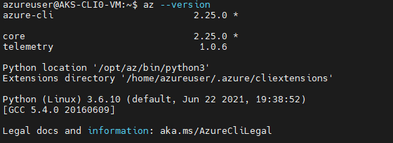
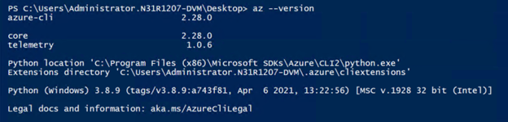
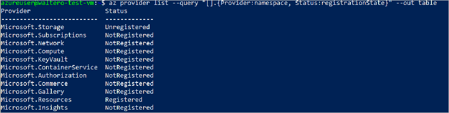
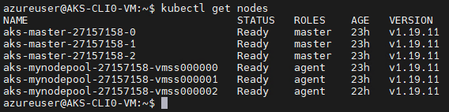

# Use Azure Kubernetes Service on Azure Stack Hub with the CLI

This is a guide to get you started using the Azure Kubernetes Service (AKS) service on Azure Stack Hub. This article describes the main set of scenarios to get you familiarized with AKS on Azure Stack Hub. The functionality available in Azure Stack Hub is a [subset](aks-overview.md) of what is available in global Azure.

In the following sections you will:

1.  Complete the prerequisites to use AKS on Azure Stack Hub.
2.  Complete the lifecycle operations of an AKS cluster using Azure CLI and the Azure Stack Hub user portal.

### Install Azure CLI

You will need to install the Azure CLI with AKS support for your machine. Prepare a clean machine Linux or Windows machine to install the preview version of the Azure CLI with AKS support. Ensure the machine does not have Azure CLI installed to avoid conflicting with preview of Azure CLI you will install next. Most of the instructions below assume you are using a Linux VM, but you can find the equivalent steps in Windows in the product documentation.

Don't upgrade Azure CLI after installing the Azure CLI with AKS support. If you do upgrade, it will be replaced by the production ready version that lacks AKS support.
### [Ubuntu](#tab/ubuntu)

For an Ubuntu machine, follow the instructions at [Install the Azure CLI on Linux](/cli/azure/install-azure-cli-linux?pivots=apt).

After you have installed Azure CLI with AKS support, verify that the installation is correct by running the following Azure CLI command:

```azurecli
    az --version
```
This is the output from a Linux machine:



Azure CLI should be 2.28.0 or above.

### [Other Linux](#tab/linux)

For other Linux machines, download and install from [Install the Azure CLI on Linux](/cli/azure/install-azure-cli-linux).

After you have installed Azure CLI with AKS support, verify that the installation is correct by running the following Azure CLI command:

```azurecli
    az --version
```

This is the output from a Linux machine:


Azure CLI should be 2.28.0 or above.
### [Windows](#tab/windows)

For a Windows machine, download and install an MSI with the Azure CLI with AKS support from [Install Azure CLI on Windows](/cli/azure/install-azure-cli-windows?tabs=azure-cli).

After you have installed Azure CLI with AKS support, verify that the installation is correct by running the following Azure CLI command:

```azurecli
    az --version
```

The following output should be produced in a Windows machine:



Azure CLI should be 2.28.0 or above.

---
### Connect to Azure Stack Hub

1. Connect to your Azure Stack Hub endpoint. You need to use Azure CLI to establish the specific Azure Stack Hub environment to which you are connecting. You can find the instructions at [Connect to Azure Stack Hub](/azure-stack/user/azure-stack-version-profiles-azurecli2?tabs=ad-win#connect-with-azure-cli)

2. Register your environment so that Azure CLI can connect to the Azure Stack Hub Resource Manager endpoint for your instance. Update the URLs in the following snippet and run the following command:

    ```azurecli  
    az cloud register \
        -n aks-preview-test \
        --endpoint-resource-manager "https://management.redmond.xbx.nxn.microsoft.com" \
        --suffix-storage-endpoint "redmond.xbx.nxn.microsoft.com" \
        --suffix-keyvault-dns ".vault.redmond.xbx.nxn.microsoft.com"
    ```

3. Set the active environment.

    ```azurecli  
    az cloud set -n aks-preview-test
    ```

4. Update your environment configuration.

    ```azurecli  
    az cloud update --profile 2020-09-01-hybrid
    ```

5. Connect to the environment.

    ```azurecli  
    az login -u 'user@contoso.onmicrosoft.com' -p 'xxxxxxx' --tenant 'contoso.onmicrosoft.com'
    ```

    > [!NOTE]  
    > If you trigger a **certificate verify failed** error, it may be that the certificate used for the Azure Resource Manager endpoint is not trusted by your client machine. If so, you need to export the certificate used in the Azure Stack Hub endpoints and trust it. You can find instructions at [Export the Azure Stack Hub CA Root Certificate](azure-stack-version-profiles-azurecli2.md).
    > 
    > In particular, for Linux machines see: [Microsoft Entra ID on Linux](azure-stack-version-profiles-azurecli2.md)

6. Set the subscription in your Azure CLI session as the default with:

    ```azurecli  
    az account set --subscription <subscription-id>
    ```

7. Register the Azure Kubernetes Service resource provider. List the available resource providers in your subscription.

    ```azurecli  
    az provider list --query "[].{Provider:namespace, Status:registrationState}" --out table
    ```

    The output should look like:

    

8. Make note of the **Microsoft.ContainerService** resource provider and then register the provider:

    ```azurecli  
    az provider register --namespace Microsoft.ContainerService
    ```

9. Rerun step seven to verify the resource provider registration status. The registration can take several minutes to complete. 

Once those prerequisite steps are completed, you can proceed to test the following scenarios.

## Create an AKS cluster

You can find the global Azure instructions at [Deploy an Azure Kubernetes Service cluster using the Azure CLI](/azure/aks/kubernetes-walkthrough). The instructions here reflect the limitations of using AKS on Azure Stack Hub. You can use the Azure CLI to create an AKS cluster for Linux or Windows containers.

### [Linux containers](#tab/linuxcon)

1.  Create a resource group:

    ```azurecli
    az group create --name myResourceGroup --location <Azure Stack Hub location>
    ```

2.  Make sure you have a service principal ID ready with contributor permission on your subscription to create clusters in it.

    1.  To create a service principal (SPN) using Microsoft Entra ID, follow these [instructions](../operator/give-app-access-to-resources.md#create-an-app-registration-that-uses-a-client-secret-credential).
    2.  To create an SPN using Active Directory Federated Services (AD FS), follow these [instructions](../operator/give-app-access-to-resources.md#create-an-app-registration-that-uses-a-certificate-credential).
    3.  To assign "Contributor" role to the SPN see [instructions](/azure/active-directory/develop/howto-create-service-principal-portal). Make sure to select the "Contributor" role.

3.  Create an AKS cluster of three agent nodes. Provide values to the parameters below, examples are provided. Run:

    ```azurecli
    az aks create \
    --resource-group myResourceGroup \
    --name myakscluster \
    --dns-name-prefix myakscluster \
    --nodepool-name mynodepool \
    --admin-username azureuser \
    --service-principal xxxxxxxx-xxxx-xxxx-xxxx-xxxxxxxxxxxx \
    --client-secret xxxxxxxx-xxxx-xxxx-xxxx-xxxxxxxxxxxx \
    --node-count 3 \
    --generate-ssh-keys \
    --load-balancer-sku basic \
    --vm-set-type VirtualMachineScaleSets \
    --location <Azure Stack Hub location> \
    --kubernetes-version 1.20.7
    ```

    The output from this operation will be in json format and contain a specification of the cluster including the ssh public key generated, fully qualified domain name (FQDN) used in the cluster among other properties. Notice that the command will output a text such as this one highlighting the location of the private key: `SSH key files '/home/azureuser/.ssh/id_rsa'` and `'/home/azureuser/.ssh/id_rsa.pub'` have been generated under `\~/.ssh` to allow SSH access to the VM. Store these keys in a safe location to be use in case there is a need to ssh into the VMs as is the case when troubleshooting issues.

4. Now you can proceed to repeat the tests for [Scale](#scale-cluster), [deploy an app](aks-how-to-push-an-app-cli.md), and [Delete](#delete-cluster).
### [Windows containers](#tab/wincon)

1.  Create a resource group

    ```azurecli
        az group create --name myResourceGroup-Win --location <your stamp location>
    ```

2.  Create a Windows Azure Kubernete az login
3.  Service cluster.

    ```azurecli
    PASSWORD_WIN="************"
    az aks create  \
    --resource-group myResourceGroup-Win  \
    --name akswin \
    --dns-name-prefix akswin \
    --nodepool-name mypool \
    --admin-username azureuser \
    --service-principal xxxxxxxx-xxxx-xxxx-xxxx-xxxxxxxxxxxx  \
    --client-secret xxxxxxxx-xxxx-xxxx-xxxx-xxxxxxxxxxxx \
    --node-count 3 \
    --generate-ssh-keys \
    --load-balancer-sku basic \
    --vm-set-type VirtualMachineScaleSets \
    --network-plugin azure \
    --windows-admin-username azureuser \
    --windows-admin-password $PASSWORD_WIN \
    --location redmond \
    --kubernetes-version 1.20.7
    ```

4. Now you can proceed to repeat the tests for [Scale](#scale-cluster), [deploy a Windows app](aks-how-to-push-an-app-cli.md), and [Delete](#delete-cluster).

---

## Connect to the cluster

1.  To manage a Kubernetes cluster, you use **kubectl**, the Kubernetes command-line client. To install **kubectl** locally, use the az aks install-cli command (you may need to use 'sudo' at te beginning to have permission to install it):

    ```azurecli  
    az aks install-cli
    ```

2.  To configure **kubectl** to connect to your Kubernetes cluster, use the `az aks get-credentials` command. This command downloads credentials and configures the Kubernetes CLI to use them.

    ```azurecli  
    az aks get-credentials --resource-group myResourceGroup --name myakscluster --admin
    ```

3.  To verify the connection to your cluster, use the **kubectl** get command to return a list of the cluster nodes.

    ```bash
    kubectl get nodes
    ```



## Scale cluster

Another cluster management task is scaling a cluster. You can scale a cluster anytime after it has been created by using the az aks scale command. To scale the cluster from the initial three nodes to 4, run:

```azurecli  
    az aks scale --resource-group myResourceGroup --name myakscluster --node-count 4
```

When the cluster has successfully scaled, the output will contain an "agentPoolProfiles" similar to the following example:

```json
    "agentPoolProfiles": [
        {
        "availabilityZones": null,
        "count": 4,
        "enableAutoScaling": null,
        "enableNodePublicIp": false,
        "maxCount": null,
        "maxPods": 110,
        "minCount": null,
        "mode": "System",
        "name": "mynodepool",
        "nodeLabels": {},
        "nodeTaints": null,
        "orchestratorVersion": "1.20.7",
        "osDiskSizeGb": 100,
        "osType": "Linux",
        "provisioningState": "Succeeded",
        "scaleSetEvictionPolicy": null,
        "scaleSetPriority": null,
        "spotMaxPrice": null,
        "tags": null,
        "type": "VirtualMachineScaleSets",
        "vmSize": " Standard_DS2_v2",
        "vnetSubnetId": null
        }
    ]
```
## Delete cluster

Once the previous operations have been performed, you can proceed to delete the cluster. Run:

```azurecli
az aks delete --name myakscluster --resource-group myResourceGroup
```

## Create AKS cluster with custom VNET

Creating a cluster to be deployed in a user-provided network is a common scenario. Planning the network configuration takes some preparation. Also, notice that with AKS the default network plugin is Azure CNI, not Kubenet as is the case with AKS engine. With Azure CNI every pod gets an IP address from the subnet and can be accessed directly (without the need for a Routing table as is the case with Kubenet). These IP addresses must be unique across your network space and must be planned. The following article walks you through the process of planning for your custom VNET deployment. You can find various network configurations that work for your needs and test them. For an initial test the following two steps will show you the basic process:

1.  Follow the instructions in [this article](/azure/aks/configure-azure-cni) to plan the deployment using Azure CNI. For example, you could use the portal to create a VNet named "myAKSVnet" with IP range 10.0.0.0/8 with subnet "myAKSSubnet" and IP range 10.240.0.0/16 in a Resource Group named "myTest-rg". Then use the next step for the creation of the cluster.

    ```azurecli
    az network vnet create \
        --resource-group myTest-rg \
        --name myAKSVnet \
        --address-prefixes 10.0.0.0/8 \
        --subnet-name myAKSSubnet \
        --subnet-prefix 10.240.0.0/16    
    ```

2.  Note the cluster command provided in the Azure article works fine when deploying on Azure, to deploy to Azure Stack Hub you need to specify extra parameters as in the following example. The vnet subnet ID should look like '/subscriptions/dfdfdff-5dfdf-dfdf-dfdf-dfdfdfdfdfd/resourceGroups/myTest-rg/providers/Microsoft.Network/virtualNetworks/myAKSVnet/subnets/myAKSSubnet':

    ```azurecli  
    az aks create  \ 
    --resource-group myTest-rg \
    --name aksvnet \
    --dns-name-prefix  aksvnet \
    --nodepool-name mynodepool \
    --admin-username azureuser \
    --service-principal xvxvxvxvx-ffff-ffff-xvxvxvx-8xbxbxbx8  \
    --client-secret dccbcbcbcbcbcbcbcbbcbcbcbcbcbcbc-LNX \
    --node-count 3 \
    --generate-ssh-keys \
    --load-balancer-sku basic \
    --vm-set-type VirtualMachineScaleSets \
    --network-plugin azure \
    --vnet-subnet-id '<subnet-resource-id>' \
    --skip-subnet-role-assignment \
    --docker-bridge-address 172.17.0.1/16 \
    --dns-service-ip 10.0.0.10 \
    --location redmond
    ```

2.  Follow the instructions on the section "Connect to the cluster" to connect to the Kubernetes cluster and deploy your applications.

## Consistency check

Consistency check between Azure and Azure Stack Hub

1.  Select a combination of commands from the ones tested above, from the "Command Reference" section below, or from your own day-to-day scripts.
2.  Apply them to Azure, and later to Azure Stack Hub. Note any discrepancies not expected and provide [feedback](https://aka.ms/aks-ash-feedback).


## Next steps

[Learn about AKS on Azure Stack Hub](aks-overview.md)
