# Use Azure Kubernetes Service on Azure Stack Hub in the portal

You can use the Azure Stack Hub user portal, in the Azure Kubernetes Service (AKS), to discover, create, scale, upgrade, and delete AKS clusters.

## Discover available AKS clusters

1.  In the Azure Stack tenant portal, find **All Services**, and select **Kubernetes services**.

    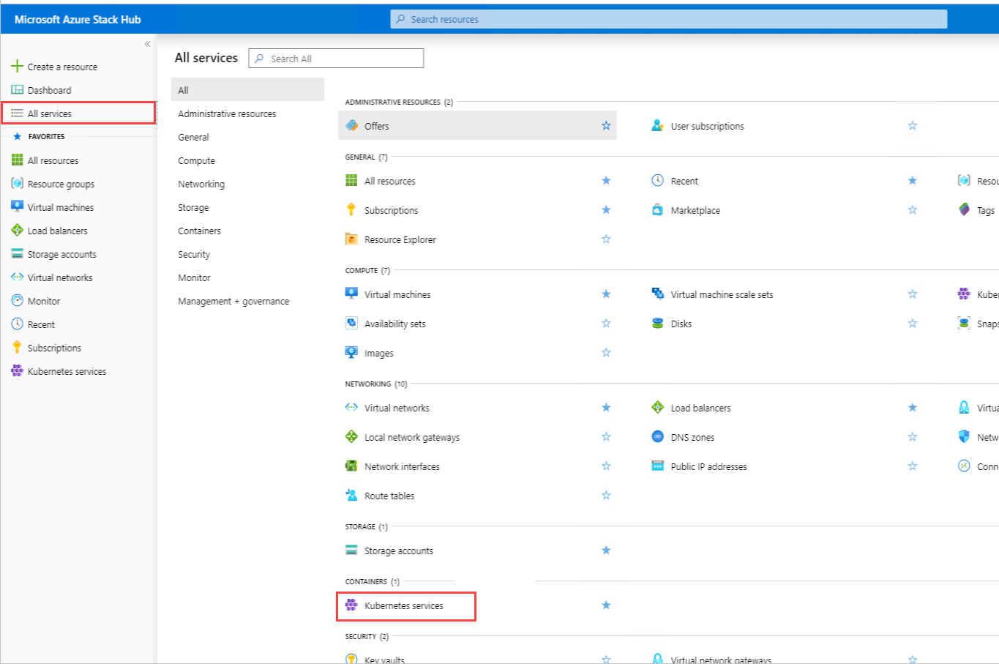

1.  Verify that all clusters that you have created appear in **Kubernetes service**:

    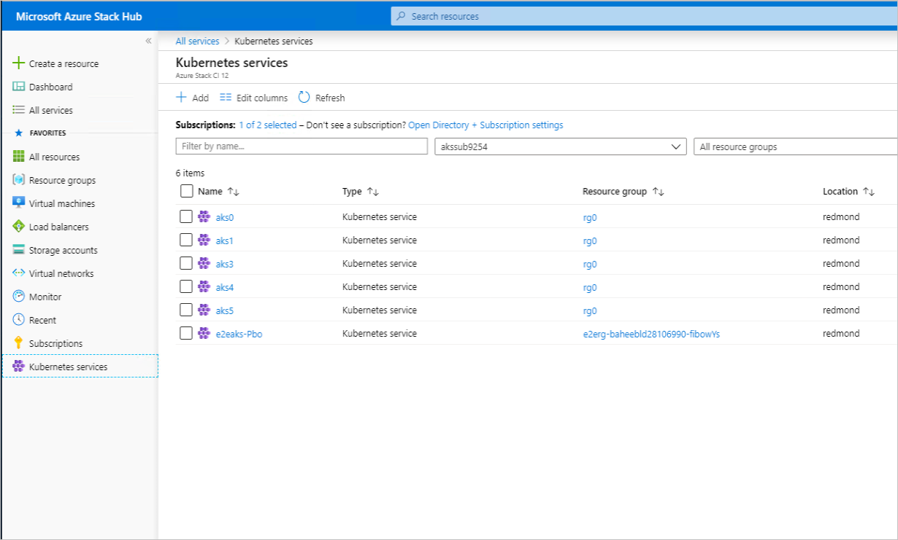

1.  Verify that you can view the details of any of the clusters:

    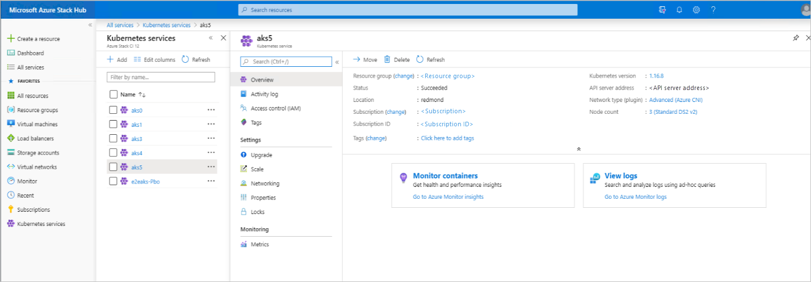

## Create cluster

1.  In Kubernetes services, select **Add**.

    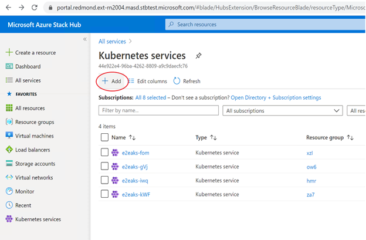

1.  Follow the steps to create an AKS cluster. The first step collects the basic cluster properties:

    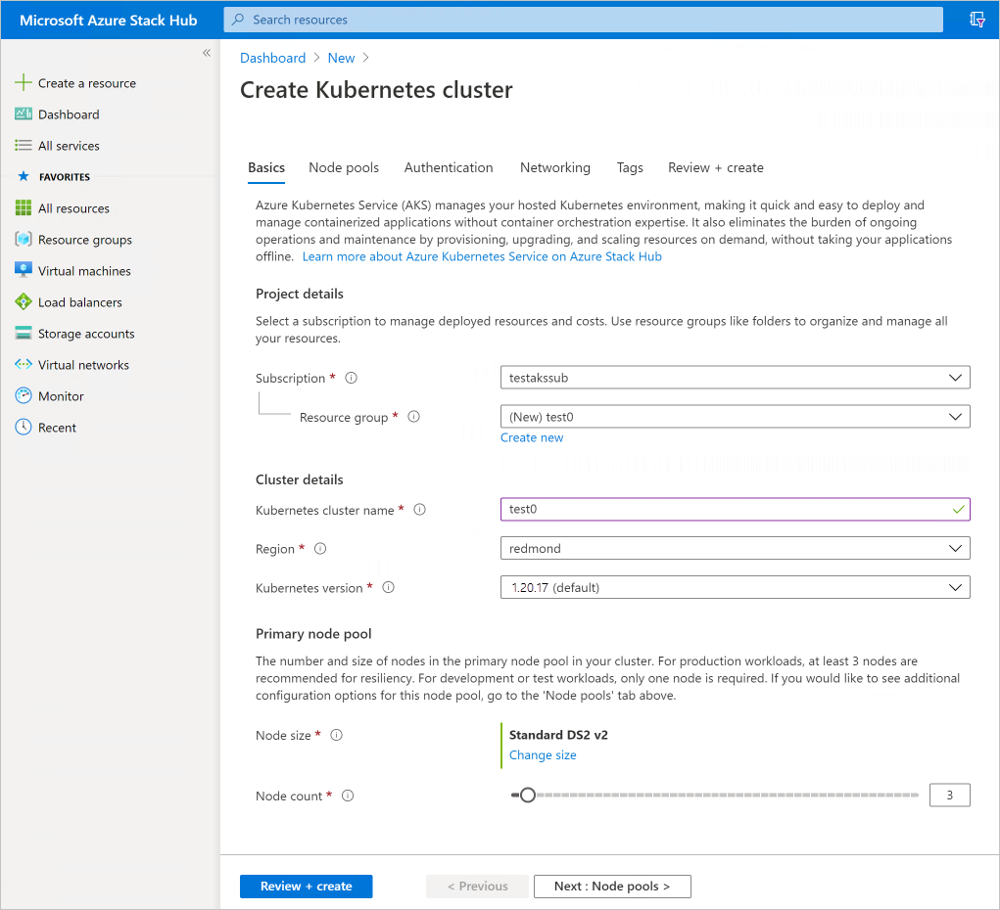

1.  In **Node pools** you can see that only a single node pool is allowed in Azure Stack Hub:

    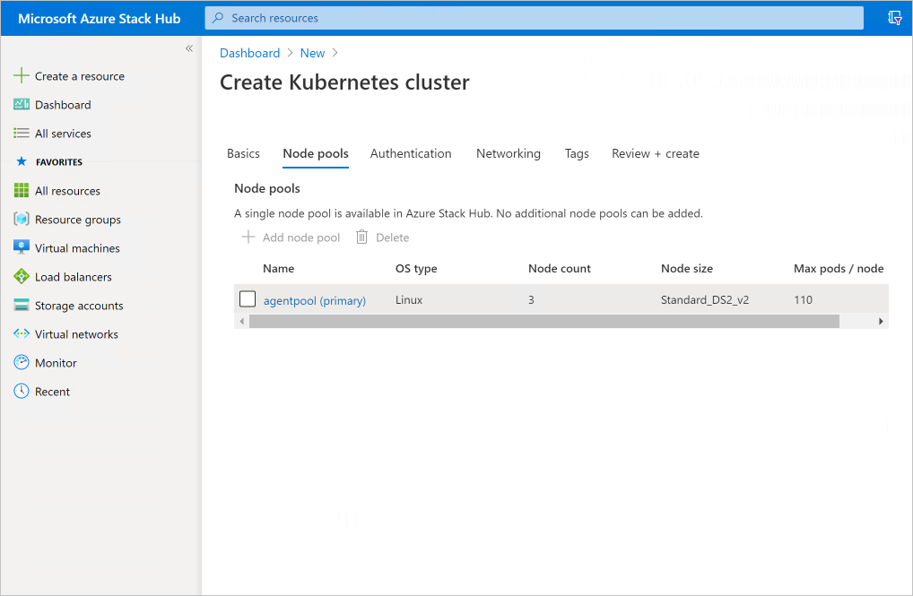

1.  In the **Authentication**, provide the service principal (SPN). The SPN won't be automatically generated as in Azure. Select the **Configure service principal** link and add the service principal. You can find [the instructions](../operator/give-app-access-to-resources.md) to create one.

    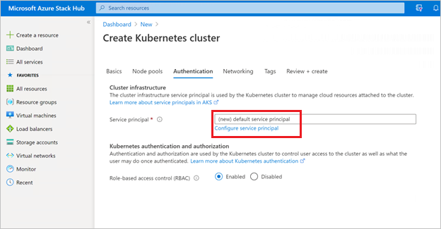

1.  Follow the steps of creating an AKS cluster.

## Upgrade cluster

1.  To upgrade the cluster's control plane, in the cluster details, select **Configuration**, then select the Kubernetes upgrade version to upgrade to and select save.

    !Upgrade and select save](media/aks-how-to-use/upgrade-to-and-select-save.png)

    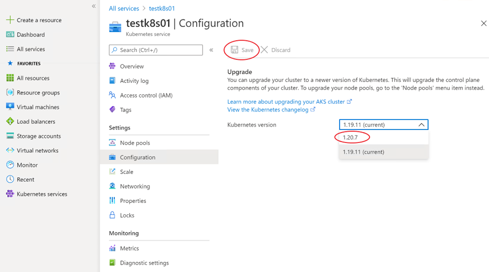

2. To upgrade the agent node pool, in the cluster details, select **Node pools**, then either select the node pool version link or **Upgrade**.

    

3.  Select the node pool Kubernetes version

    

## Scale cluster

1. In cluster details, select **Node pools**, then select the node pool and select **Scale**

    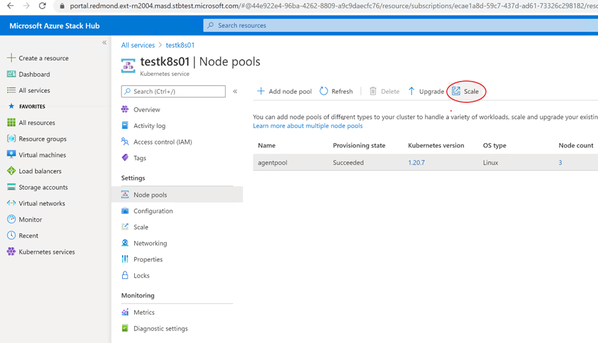

2. In the scale panel on the right, select the new node count

    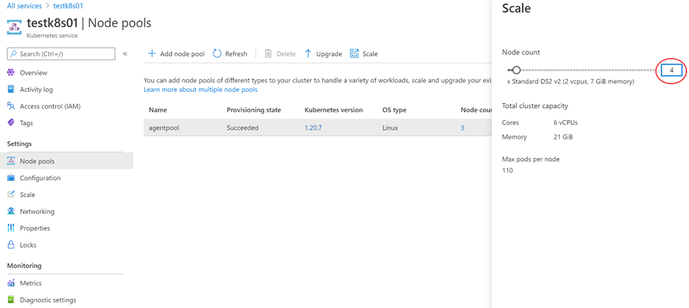

## Delete cluster

1.  In the overview for the AKS cluster, find and select **Delete** as in the image below.

    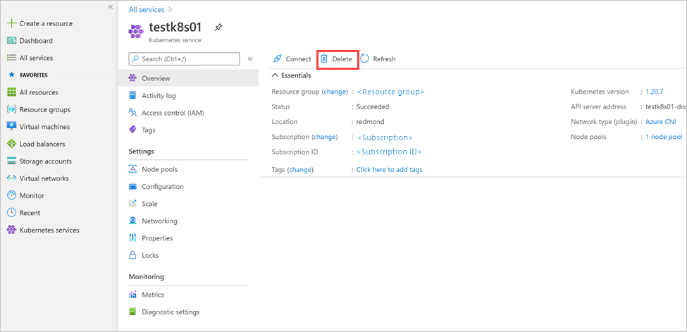

2.  Verify the cluster is deleted. Also, check that the associated resource group is deleted. In **Resource groups**, look for a resource group with the following pattern `<…>_clustername_location`. If a resource can't be found, it was properly deleted.

## Next steps

[Learn about AKS on Azure Stack Hub](aks-overview.md)