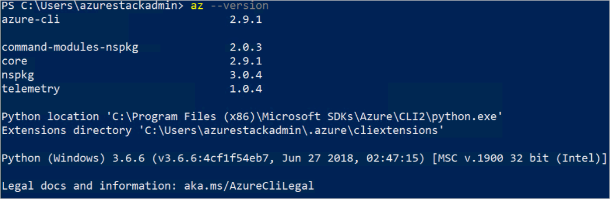
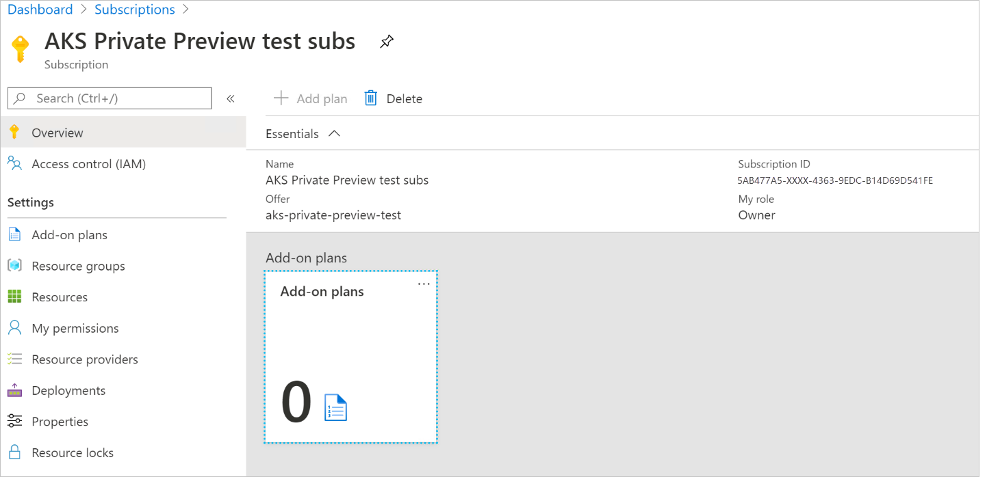
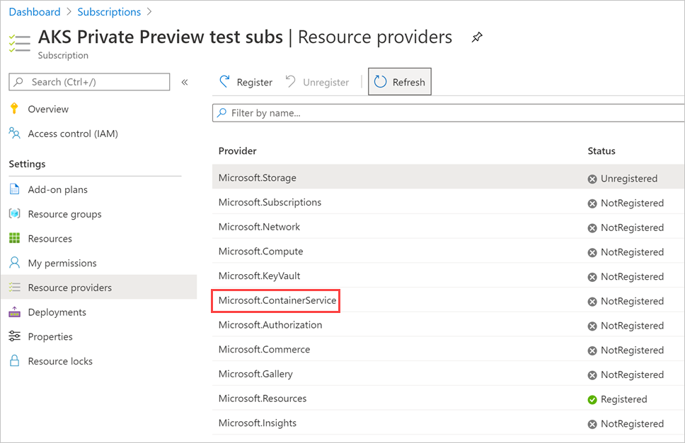
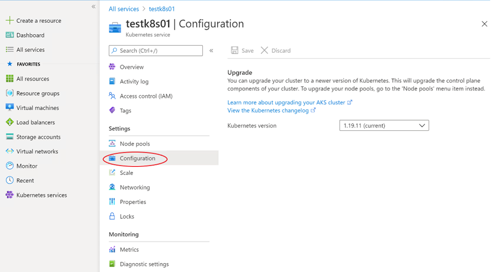
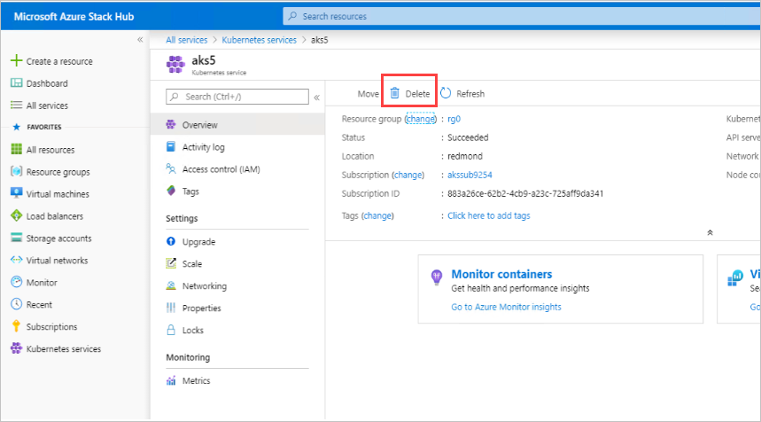

# Using Azure Kubernetes Service on Azure Stack Hub

This is a guide to get you started using the Azure Kubernetes Service (AKS) service on Azure Stack Hub. This article describes the main set of scenarios to get you familiarized with AKS on Azure Stack Hub. The functionality available in Azure Stack Hub is a [subset](aks-overview.md) of what is available in global Azure.

In the following sections you will:

1.  Complete the prerequisites to use AKS on Azure Stack Hub.
2.  Complete the lifecycle operations of an AKS cluster using Azure CLI and the Azure Stack Hub user portal.

## Prerequisites

Before you can start, you will need to:

1.  Ask your Azure Stack Hub cloud operator to install [Azure Stack Hub Update 2107](/azure-stack/operator/release-notes) or greater. AKS in Azure Stack Hub Preview is only available starting with that update
2.  Ask your Azure Stack Hub administrator to create a plan and offer that includes this resource provider, see the [installation instructions](../operator/aks-add-on.md).

### Install Azure CLI

You will need to install the Azure CLI with AKS support for your machine. Prepare a clean machine Linux or Windows machine to install the preview version of the Azure CLI with AKS support. Ensure the machine does not have Azure CLI installed to avoid conflicting with the special build of Azure CLI you will install next. Most of the instructions below assume you are using a Linux VM, but you can find the equivalent steps in Windows in the product documentation.

Don't upgrade Azure CLI after installing the Azure CLI with AKS support. If you do upgrade, it will be replaced by the production ready version that lacks AKS support.
### [Ubuntu](#tab/ubuntu)

For an Ubuntu machine, run the following commands to install the build of the Azure CLI with AKS support.

```bash  
curl -o azure-cli_xenial_all.deb https://azurecliprod.blob.core.windows.net/devops-edge/azurestack-aks/azure-cli_xenial_all.deb

sudo apt install ./azure-cli_xenial_all.deb
```

After you have installed Azure CLI with AKS support, verify that the installation is correct by running the following Azure CLI command:

```azurecli
    az --version
```
This is the output from a Linux machine:


### [Other Linux](#tab/linux)

For other Linux machines, down and install from https://azurecliprod.blob.core.windows.net/devops-edge/azurestack-aks/azure-cli_xenial_all.deb.

After you have installed Azure CLI with AKS support, verify that the installation is correct by running the following Azure CLI command:

```azurecli
    az --version
```

This is the output from a Linux machine:


### [Windows](#tab/windows)

For a Windows machine, download and install an MSI with the the Azure CLI with AKS support from https://azurecliprod.blob.core.windows.net/devops-edge/azurestack-aks/Microsoft%20Azure%20CLI.msi.

After you have installed Azure CLI with AKS support, verify that the installation is correct by running the following Azure CLI command:

```azurecli
    az --version
```

The following output should be produced in a windows machine:



---

Connect to your Azure Stack Hub endpoint. You need to use Azure CLI to establish the specific Azure Stack Hub environment tp which you are connecting. You can find the instructions at [Connect to Azure Stack Hub](/azure-stack/user/azure-stack-version-profiles-azurecli2?view=azs-2005#connect-to-azure-stack-hub)

Register your environment so that Azure CLI can connect to the Azure Stack Hub Resource Manager endpoint for your instance. Update the URLs in the following snippet and run the following command:

```azurecli  
az cloud register \
    -n aks-preview-test \
    --endpoint-resource-manager "https://management.redmond.xbx.nxn.microsoft.com" \
    --suffix-storage-endpoint "redmond.xbx.nxn.microsoft.com" \
    --suffix-keyvault-dns ".vault.redmond.xbx.nxn.microsoft.com"
```

Set the active environment.

```azurecli  
az cloud set -n aks-preview-testaz
```

Update your environment configuration.

```azurecli  
az cloud update --profile 2019-03-01-hybrid
```

Connect to the environment.

```azurecli  
az login -u "user@contoso.onmicrosoft.com" -p 'xxxxxxx' --tenant contoso.onmicrosoft.com
```

> [!NOTE]  
> If you trigger a **certificate verify failed** error, it may be that the certificate used for the Azure Resource Manager endpoint is not trusted by your client machine. If so, you need to export the certificate used in the Azure Stack Hub endpoints and trust it. You can find instructions at [Export the Azure Stack Hub CA Root Certificate](azure-stack-version-profiles-azurecli2.md).
> 
> In particular, for Linux machines see: [Azure AD on Linux](azure-stack-version-profiles-azurecli2.md)

Ensure you have selected the subscription with the offer/plan with the **Microsoft.ContainerService** resource provider. You can check the subscription in the portal by selecting your subscription and examining the subscription ID and resource providers it contains.





Set the subscription in your Azure CLI session as the default with:

```azurecli  
az account set --subscription <subscription-id>
```

Register the Azure Kubernetes Service resource provider. List the available resource providers in your subscription.

```azurecli  
az provider list --query "[].{Provider:namespace, Status:registrationState}" --out table
```

The output should look like:


Make note of the **Microsoft.ContainerService** resource provider and then register the provider:

```azurecli  
az provider register --namespace Microsoft.ContainerService
```

Once those prerequisite steps are completed, you can proceed to test the following scenarios.


## Create an Ubuntu AKS cluster

You can find the find the global Azure instructions at [Deploy an Azure Kubernetes Service cluster using the Azure CLI](/azure/aks/kubernetes-walkthrough). The instructions here reflect the limitations of using AKS on Azure Stack Hub.

1.  Create a resource group:

    ```azurecli
    az group create --name myResourceGroup --location <Azure Stack Hub location>
    ```

2.  Make sure you have a Service Principal identity ready with contributor permission on your subscription to create clusters in it.
    1.  To create an SPN using ADD follow these [instructions](/azure-stack/operator/azure-stack-create-service-principals?view=azs-2005#create-a-service-principal-that-uses-a-client-secret-credential).
    2.  To create an SPN using ADFS follow these [instructions](/azure-stack/operator/azure-stack-create-service-principals?view=azs-2005#create-a-service-principal-that-uses-client-secret-credentials).
    3.  To assaying "Contributor" role to the SPN see [instructions](/azure-stack/operator/azure-stack-create-service-principals?view=azs-2005#assign-a-role). Make sure to select the "Contributor" role.
3.  Create an AKS cluster of 3 agent nodes. Provide values to the parameters below, examples are provided. Run:

    ```azurecli
    az aks create  \
    --resource-group myTest-rg  \
    --name akscluster00 \
    --dns-name-prefix AKScluster00 \
    --nodepool-name mynodepool \
    --admin-username azureuser \
    --service-principal xxxxxxxx-xxxx-xxxx-xxxx-xxxxxxxxxxxx  \
    --client-secret xxxxxxxx-xxxx-xxxx-xxxx-xxxxxxxxxxxx \
    -- node-count 3 \
    --generate-ssh-keys \
    --load-balancer-sku basic \
    --vm-set-type AvailabilitySet \
    --location Redmond
    ```

    The output from this operation will be in json format and contain a specification of the cluster including the ssh public key generated, fully qualified domain name (FQDN) used in the cluster among other properties. Notice that the command will output a text such as this one highlighting the location of the private key: `SSH key files '/home/azureuser/.ssh/id_rsa'` and `'/home/azureuser/.ssh/id_rsa.pub'` have been generated under `\~/.ssh` to allow SSH access to the VM. Store these keys in a safe location to be use in case there is a need to ssh into the VMs as is the case when troubleshooting issues.

## Connect to the cluster

1.  To manage a Kubernetes cluster, you use **kubectl**, the Kubernetes command-line client. To install **kubectl** locally, use the az aks install-cli command, you need to specify the -install-location parameter with value "\~/.azure-kubectl/kubectl" (otherwise it will attempt to copy to a directory for which there are no permissions -known bug):

    ```azurecli  
    az aks install-cli --install-location \~/.azure-kubectl/kubectl
    ```

    > [!NOTE]  
    > For Windows user the path should include "kubectl.exe" instead.

2.  To configure **kubectl** to connect to your Kubernetes cluster, use the `az aks get-credentials` command. This command downloads credentials and configures the Kubernetes CLI to use them.

    ```azurecli  
    az aks get-credentials --resource-group myResourceGroup --name myAKSCluster --admin
    ```

3.  To verify the connection to your cluster, use the **kubectl** get command to return a list of the cluster nodes.

    ```bash
    .azure-kubectl/kubectl get nodes
    ```


## Deploy test applications

If your stamp is connected, you can follow these instructions to deploy Prometheus and Grafana to the cluster.

1.  Download and install Helm 3:

    ```bash  
    curl -fsSL -o get_helm.sh https://raw.githubusercontent.com/helm/helm/master/scripts/get-helm-3
    chmod 700 get_helm.sh
    ./get_helm.sh
    ```

    > [!NOTE]  
    > For Windows user use [Chocolatey](https://chocolatey.org/install) to install Helm:
    >```powershell  
    >choco install kubernetes-helm
    >```

1.  Ensure we have the latest stabled helm repository:

    ```bash  
    helm repo add stable https://charts.helm.sh/stable
    helm repo update
    ```

1.  Install Prometheus.

    ```bash  
    helm install my-prometheus stable/prometheus --set server.service.type=LoadBalancer --set rbac.create=false
    ```

1.  Give cluster administrative access to Prometheus account. Lower permissions are better for security reasons.

    ```bash  
    .azure-kubectl/kubectl create clusterrolebinding my-prometheus-server --clusterrole=cluster-admin --serviceaccount=default:my-prometheus-server
    ```

1.  Install Grafana.

    ```bash  
    helm install my-grafana stable/grafana --set service.type=LoadBalancer --set rbac.create=false
    ```

1.  Get secret for Grafana portal.

    ```bash  
    .azure-kubectl/kubectl get secret --namespace default my-grafana -o jsonpath="{.data.admin-password}" \| base64 --decode ; echo
    ```

> [!NOTE]  
> On Windows use the following PowerShell cmdlets to get the secret:
> ```powershell  
> \$env:Path = \$env:Path + ";\$env:USERPROFILE\\.azure-kubectl"
> [System.Text.Encoding]::ASCII.GetString([System.Convert]::FromBase64String(\$(kubectl get secret --namespace default my-grafana -o jsonpath="{.data.admin-password}")))
> ```

### Deploy your applications to the cluster using Azure Container Registry

At this point, your client machine is connected to the cluster and you can proceed to use **kubectl** to configure the cluster and deploy your applications. If you are also testing the Azure Container Registry (ACR) service, you can follow the instructions below. Otherwise, you can skip to the section title [Upgrade the cluster](#upgrade-cluster).

### Docker Registry Secret for accessing local ACR

If you are deploying application images from a local ACR, you will need to store a secret in order for the Kubernetes cluster to have access to pull the images from the registry. To do this you will need to provide a Service Principal ID (SPN) and Secret, add the SPN as a contributor to the source registry and create the Kubernetes secret. You will also need to update your YAML file to reference the secret.

### Command to add the service principle as a contributor to the ACR. 

> [!NOTE]  
> This script has been modified from the [Azure Container Registry site](/azure/container-registry/container-registry-auth-service-principal) (bash [sample](https://github.com/Azure-Samples/azure-cli-samples/blob/master/container-registry/service-principal-assign-role/service-principal-assign-role.sh)) as Azure Stack Hub does not yet have the ACRPULL role. This sample is a PowerShell script, equivalent can be written in bash. Be sure to add the values for your system.

```powershell  
# Modify for your environment. The ACR_NAME is the name of your Azure Container
# Registry, and the SERVICE_PRINCIPAL_ID is the service principal's 'appId' or
# one of its 'servicePrincipalNames' values.
ACR_NAME=mycontainerregistry
SERVICE_PRINCIPAL_ID=<service-principal-ID>

# Populate value required for subsequent command args
ACR_REGISTRY_ID=$(az acr show --name $ACR_NAME --query id --output tsv)

# Assign the desired role to the service principal. 
az role assignment create --assignee $SERVICE_PRINCIPAL_ID --scope $ACR_REGISTRY_ID --role contributor

```

### Command to create the secret in Kubernetes

Use the following command to add the secret to the Kubernetes cluster. Be sure to add the values for your system in the code snippets.

```bash
.azure-kubectl/kubectl create secret docker-registry <secret name> \
.azure-kubectl/kubectl create secret docker-registry <secret name> \
    --docker-server=<ACR container registry URL> \
    --docker-username=<Service Principal ID> \
    --docker-password=<Service Principal Secret> 

```

### Example of referencing the secret in your app YAML

```yaml
apiVersion: apps/v1
kind: Deployment
metadata:
  name: nginx-deployment 
spec:
selector:
  matchLabels:
   app: nginx
replicas: 2
template:
  metadata:
   labels:
    app: nginx
  spec:
   containers:
   - name: nginx
     image: democr2.azsacr.redmond.ext-n31r1208.masd.stbtest.microsoft.com/library/nginx:1.17.3
     imagePullPolicy: Always
     ports: 
      - containerPort: 80
   imagePullSecrets:
     - name: democr2
 
 
---
apiVersion: v1
kind: Service
metadata:
  name: nginx
spec:
  selector:
    app: nginx
  ports:
  - protocol: "TCP"
    port: 80
    targetPort: 80
  type: LoadBalancer
```

## Upgrade cluster

After the deploying a cluster and connect to it to verify it was deployed as expected, you can proceed to upgrade it.

1.  Get the available cluster versions by running:

    ```azurecli
    az aks get-upgrades --resource-group myResourceGroup --name myAKSCluster
    ```
    The output should contain the current version of each of the masters and agents and to which versions of Kubernetes they can be updated.

    ```json  
    "agentPoolProfiles": [
        {
        "kubernetesVersion": "1.15.11",
        "name": null,
        "osType": "Linux",
        "upgrades": [
            {
            "isPreview": null,
            "kubernetesVersion": "1.16.9"
            },
            {
            "isPreview": null,
            "kubernetesVersion": "1.16.8"
            }
        ]
        }
    ],
    "controlPlaneProfile": {
        "kubernetesVersion": "1.15.11",
        "name": null,
        "osType": "Linux",
        "upgrades": [
        {
            "isPreview": null,
            "kubernetesVersion": "1.16.9"
        },
        {
            "isPreview": null,
            "kubernetesVersion": "1.16.8"
        }
        ]
    },
    ...
    }

    ```

2.  Upgrade the cluster by selecting the Kubernetes version desired. For example `1.16.8`, and running.

    ```azurecli  
    az aks upgrade \
        --resource-group myResourceGroup \
        --name myAKSCluster \
        --kubernetes-version 1.16.8
    ```

    You can only upgrade one minor version at a time. For example, you can upgrade from 1.14.x to 1.15.x, but cannot upgrade from 1.14.x to 1.16.x directly. To upgrade from 1.14.x to 1.16.x, first upgrade from 1.14.x to 1.15.x, then perform another upgrade from 1.15.x to 1.16.x.

3.  Validate the upgrade by querying the current version of the cluster with:

    ```azurecli
        az aks show --resource-group myResourceGroup --name myAKSCluster --output table
    ```

    The output should look like:

    ```azurecli
    Name          Location    ResourceGroup    KubernetesVersion    ProvisioningState    Fqdn
    ------------  ----------  ---------------  -------------------  -------------------  ----------------------------------------------------------------
    myAKSCluster  eastus      myResourceGroup  1.16.8               Succeeded            myaksclust-myresourcegroup-…
    ```

## Scale cluster

Another cluster management task is scaling a cluster. You can scale a cluster anytime after it has been created by using the az aks scale command. To scale the cluster from the initial 3 nodes to 4, run:

```azurecli  
    az aks scale --resource-group myResourceGroup --name myAKSCluster --node-count 4
```

When the cluster has successfully scaled, the output will contain an "agentPoolProfiles" similar to the following example:

```json
    "agentPoolProfiles": [
        {
        "availabilityZones": null,
        "count": 4,
        "enableAutoScaling": null,
        "enableNodePublicIp": false,
        "maxCount": null,
        "maxPods": 110,
        "minCount": null,
        "mode": "System",
        "name": "mynodepool",
        "nodeLabels": {},
        "nodeTaints": null,
        "orchestratorVersion": "1.15.11",
        "osDiskSizeGb": 100,
        "osType": "Linux",
        "provisioningState": "Succeeded",
        "scaleSetEvictionPolicy": null,
        "scaleSetPriority": null,
        "spotMaxPrice": null,
        "tags": null,
        "type": "AvailabilitySet",
        "vmSize": " Standard_DS2_v2",
        "vnetSubnetId": null
        }
    ]
```
## Delete cluster

Once the previous operations have been performed, you can proceed to delete the cluster. Run:

```azurecli
az aks delete --name MyManagedCluster --resource-group MyResourceGroup
```

## Create AKS cluster with custom VNET

Creating a cluster to be deployed in a user-provided network is a common scenario. Planning the network configuration takes some preparation. Also, notice that with AKS resource provider the default network plugin is Azure CNI, not Kubenet as is the case with AKS engine. With Azure CNI every pod gets an IP address from the subnet and can be accessed directly (without the need for a Routing table as is the case with Kubenet). These IP addresses must be unique across your network space and must be planned. The following article walks you through the process of planning for your custom VNET deployment. We encourage you to find various network configurations that work for your needs and test them. For a test do follow the recommendations in the article in step one and the create command provided in step two:

1.  Follow the instructions in [this article](/azure/aks/configure-azure-cni) to plan the deployment using Azure CNI. For example, you could use the portal to create a VNet named "myAKSVnet" with IP range 192.168.0.0/16 with subnet "myAKSSubnet" and IP range 192.168.1.0/24 in a Resource Group named "myTest-rg". Then use the next step for the creation of the cluster.

    ```azurecli
    az network vnet create \
        --resource-group myTest-rg \
        --name myAKSVnet \
        --address-prefixes 192.168.0.0/16 \
        --subnet-name myAKSSubnet \
        --subnet-prefix 192.168.1.0/24
    ```

1.  Notice that the cluster command provided in the article works fine when deploying on Azure, to deploy to Azure Stack Hub you need to specify extra parameters as in the following example:

    ```azurecli  
    az aks create  \
    --resource-group myTest-rg \
    --name aksvnet00 \
    --dns-name-prefix  aksvnet00 \
    --nodepool-name mynodepool \
    --admin-username azureuser \
    --service-principal xvxvxvxvx-ffff-ffff-xvxvxvx-8xbxbxbx8  \
    --client-secret dccbcbcbcbcbcbcbcbbcbcbcbcbcbcbc-LNX \
    --node-count 3 \
    --generate-ssh-keys \
    --load-balancer-sku basic \
    --vm-set-type AvailabilitySet \
    --network-plugin azure \
    --vnet-subnet-id <subnet-resource-id> \
    --skip-subnet-role-assignment \
    --docker-bridge-address 172.17.0.1/16 \
    --dns-service-ip 10.2.0.10 \
    --location Redmond
    ```

2.  Follow the instructions on the section "Connect to the cluster" to connect to the Kubernetes cluster and deploy your applications.

## Create Windows AKS cluster

1.  Create a resource group

    ```azurecli
        az group create --name myResourceGroup-Win --location <your stamp location>
    ```

2.  Create a Windows Azure Kubernete az login
3.  Service cluster.

    ```azurecli
    PASSWORD_WIN="************"
    az aks create  \
    --resource-group myResourceGroup  \
    --name myResourceGroup-Win \
    --dns-name-prefix wincluster00 \
    --nodepool-name mynodepool \
    --admin-username azureuser \
    --service-principal xxxxxxxx-xxxx-xxxx-xxxx-xxxxxxxxxxxx  \
    --client-secret xxxxxxxx-xxxx-xxxx-xxxx-xxxxxxxxxxxx \
    --node-count 3 \
    --generate-ssh-keys \
    --load-balancer-sku basic \
    --vm-set-type AvailabilitySet \
    --network-plugin azure \
    --windows-admin-username azureuser \
    --windows-admin-password $PASSWORD_WIN \
    --location redmond
    ```

4. Now you can proceed to repeat the tests above for Upgrade, Scale, deploy a Windows app, and Delete.

## Consistency check

Consistency check between Azure and Azure Stack Hub

1.  Select a combination of commands from the ones tested above, from the "Command Reference" section below, or from your own day-to-day scripts.
2.  Apply them to Azure, and later to Azure Stack Hub. Please note any discrepancies not expected and report them in the links provided in the [Overview document](https://microsoft.sharepoint.com/:w:/t/AKSandACRonASHPrivatePreview/EbAI3-vVpV5Ln5rsRzKqNU8BoFTKWTYRBFPjs7VnlwseoQ?e=lzwGko).

## Connect a Kubernetes to Azure Arc

If you are testing on a Connected stamp, you can connect your AKS cluster to Azure Arc:

1.  Either follow the create cluster instructions above or use an existing cluster. Make sure it is and Ubuntu base cluster.
2.  Follow the instructions [here](/azure/azure-arc/kubernetes/connect-cluster) to connect your cluster to Arc.

## Use the AKS Portal

In the AKS private preview the operations of cluster creation and scale are not yet available, these will come on a subsequent update to the preview.

### Portal: Discover available AKS clusters

1.  In the Azure Stack tenant portal find the "All Services" blade and select "Kubernetes services"

    

1.  Verify that all clusters that you have created appear in the "Kubernetes service" blade:

    

1.  Verify that you can view the details of any of the clusters:

    

### Portal: Upgrade cluster

1.  In the cluster's details blade select **Upgrade** and select the Kubernetes upgrade version to upgrade to and select save.

    

1.  Verify the cluster was upgraded by checking the cluster details blade

    

### Portal: Delete cluster

1.  In the overview blade for the AKS cluster, find and select **Delete** as in the image below.

    

1.  Verify the cluster is deleted. Also, check that the associated resource group is deleted, in the Resource groups blade, look for a resource group with this pattern "<…>_clustername_location", if it is not found it was properly deleted.

## Troubleshooting

If any of the cluster nodes goes down, apply an update operation to allow AKS to recreate a node for you.

If you run into a Kubernetes error, you may need to collect the Kubernetes logs. Follow these steps to obtain the logs:

1.  Open port 22 for SHH access to the master and agent nodepools:
    1.  Go to the resource group that contains the infrastructure components of your cluster, you can find it in the portal as part of the properties of the AKS cluster you plan to troubleshoot
    2.  Inside the infrastructure resource group, locate the Network Security rules (NSG) for the agent and master nodepools, they are named as such.
    3.  To each NSG set add a new inbound rule to open port 22.
2.  From a Linux machine, run the getkuberneteslogs.sh script available [here](/azure-stack/user/azure-stack-kubernetes-aks-engine-troubleshoot?view=azs-2005#collect-kubernetes-logs)
    1.  This script requires the private ssh key and user name used to create the cluster, if you selected the option of "generate keys", the private key is stored in "\~/.ssh/id_rsa" within the machine where you run the "az aks create" command.

## Next steps

[Learn about AKS on Azure Stack Hub](aks-overview.md)