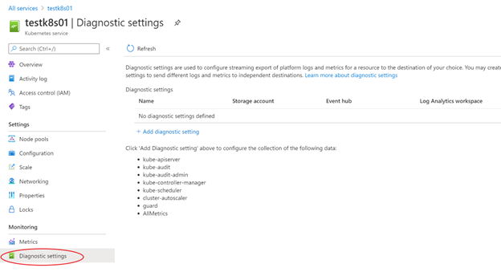

# Troubleshoot the Azure Kubernetes Service on Azure Stack Hub

## Overview of troubleshooting

Troubleshooting Azure Kubernetes Service (AKS) clusters in most respects are no different than troubleshooting most Kubernetes clusters. You can find information on the Kubernetes site, [Troubleshooting](https://kubernetes.io/docs/tasks/debug/debug-cluster/). Another resource you may find useful in Azure Stack Hub is **Diagnostic settings** available in the Azure Stack Hub user [portal **AKS cluster** blade](aks-how-to-use-portal.md).



From this blade, you can collect information on:

* kube-apiserver
* kube-audit
* kube-audit-admin
* kube-controller-manager
* kube-scheduler
* AllMetrics

## Collect logs from cluster nodes

In order to troubleshoot some AKS cluster issues, you may need to collect logs directly from the cluster nodes. You can use the script in the GitHub repository **[msazurestackworkloads/azurestack-gallery](https://github.com/msazurestackworkloads/azurestack-gallery)** to collect logs from cluster nodes. Without these scripts, you would need to connect to each node in the cluster, locate, and download the logs manually.

The scripts aim to simplify the collection of relevant logs from your Kubernetes cluster. The script will automatically create a snapshot of the cluster, and connect to each node to collect logs. In addition, the script can, optionally, upload the collected logs to a storage account.

This tool is designed for the Microsoft support team to collect comprehensive cluster logs.

### Script requirements

- Make sure the Network Security Group (NSG) for control plane nodes has exposed SSH port 22.
- A machine that has access to your Kubernetes cluster, or the same machine you used to deploy your cluster. For Windows machine, install [Git Bash](https://gitforwindows.org/) in order to run bash scripts.
- Azure CLI installed on the machine where the script will be run. Make sure that you can log in to your Azure Stack environment using `Azure CLI` from the machine. You can find instructions at [Install Azure CLI on Azure Stack Hub](/azure-stack/user/azure-stack-version-profiles-azurecli2) on how to learn to install and configure Azure CLI to manage your Azure Stack cloud.
- Switch to the subscription where the Kubernetes cluster is deployed, by using `az account set --subscription <Subscription ID>`.
- Download the latest [release](https://github.com/msazurestackworkloads/azurestack-gallery/releases) of the script into your machine and extract the scripts.

### Logs

The script automates the process of gathering the following logs:

- Log files in directory `/var/log/azure/`
- Log files in directory `/var/log/kubeaudit` (kube audit logs)
- Log file `/var/log/waagent.log` (waagent)
- Log file `/var/log/azure/deploy-script-dvm.log` (if deployed using Azure Stack's Kubernetes Cluster marketplace item)
- Static manifests in directory `/etc/kubernetes/manifests`
- Static addons in directory `/etc/kubernetes/addons`
- Waagent logs
- kube-system containers metadata and logs
- kubelet status and journal
- etcd status and journal
- docker status and journal
- containerd status and journal
- kube-system snapshot
- Azure CNI config files
- kubelet config files

Some more logs are retrieved for Windows nodes:

 - Log file `c:\Azure\CustomDataSetupScript.log`
 - kube-proxy status and journal
 - containerd status and journal
 - azure-vnet log and azure-vnet-telemetry log
 - ETW events for docker
 - ETW events for Hyper-V
 - Azure CNI config files

### Parameters

| Parameter                   | Description                                                                                                                                                            | Required | Example                                          |
|-----------------------------|------------------------------------------------------------------------------------------------------------------------------------------------------------------------|----------|--------------------------------------------------|
| -h, --help                  | Print command usage.                                                                                                                                                   | no       |                                                  |
| -u,--user                   | The administrator username for the cluster VMs.                                                                                                                        | yes      | azureuser (default value)                        |
| -i, --identity-file         | SA private key tied to the public key used to create the Kubernetes cluster (sometimes named 'id_rsa').                                                                | yes      | /rsa.pem (Putty)<br>~/.ssh/id_rsa (SSH)          |
| -g, --resource-group        | Kubernetes cluster resource group. For the clusters created by AKS Service, the managed resource group name follows pattern 'MC_RESOURCEGROUP_CLUSTERNAME_LOCTION'.    | yes      | k8sresourcegroup<br>MC_AKSRP_k8scluster1_redmond |
| -n, --user-namespace        | Collect logs from containers in the specified namespaces. If not specified, logs from ALL namespaces are collected.                                                    | no       | monitoring                                       |
| --upload-logs               | Persists retrieved logs in an Azure Stack Hub storage account. Logs can be found in KubernetesLogs resource group.                                                     | no       |                                                  |
| --api-model                 | Persists apimodel.json file in an Azure Stack Hub Storage account. Upload apimodel.json file to storage account happens when --upload-logs parameter is also provided. | no       | ./apimodel.json                                  |
| --disable-host-key-checking | Sets SSH's StrictHostKeyChecking option to "no" while the script executes. Only use in a safe environment.                                                             | no       |                                                  |

### Examples

```azurecli
# switch to the subscription where the Kubernetes cluster is deployed.
az account set --subscription <Subscription ID>

# download the scripts.
mkdir -p $HOME/kuberneteslogs
cd $HOME/kuberneteslogs
curl -L https://github.com/msazurestackworkloads/azurestack-gallery/releases/download/diagnosis-v1.1.0/diagnosis-v1.1.0.tar.gz -o diagnosis.tar.gz
tar xvf diagnosis.tar.gz

# use the script to collect logs
./getkuberneteslogs.sh -u azureuser -i private.key.1.pem -g k8s-rg
./getkuberneteslogs.sh -u azureuser -i ~/.ssh/id_rsa -g k8s-rg --disable-host-key-checking
./getkuberneteslogs.sh -u azureuser -i ~/.ssh/id_rsa -g k8s-rg -n default -n monitoring
./getkuberneteslogs.sh -u azureuser -i ~/.ssh/id_rsa -g k8s-rg --upload-logs --api-model clusterDefinition.json
./getkuberneteslogs.sh -u azureuser -i ~/.ssh/id_rsa -g k8s-rg --upload-logs
```

## Next steps

[Learn how to use AKS on Azure Stack Hub](aks-how-to-use-cli.md)
