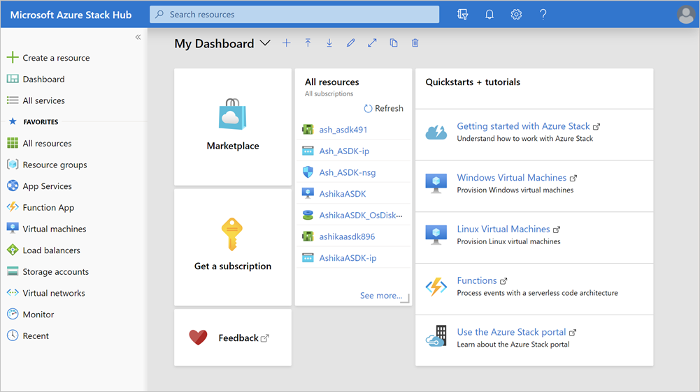

# How to get authentication information for Azure Stack Hub

To authenticate to Azure Stack Hub requires that you provide subscription ID, tenant ID, and Location, and Azure Stack Hub Resource Manager endpoint. You can get these values from the [Azure Stack Hub Resource Manager endpoint](https://docs.microsoft.com/azure-stack/user/azure-stack-version-profiles-ruby?view=azs-1910#the-azure-stack-resource-manager-endpoint) for Azure Stack Hub. Or you can get them using the steps in this article.

## Values needed to authenticate

You need the following information:

-   **Subscription ID**  

    You use the subscription ID to access offers in Azure Stack.

-   **Tenant ID**

    A directory is a container that holds information about users, applications, groups, and service principals. A directory tenant is an organization, such as Microsoft or your own company.

-   **Location**

    The location, or region, is a set of datacenters deployed within a latency-defined perimeter and connected through a dedicated regional low-latency network. With Azure Stack Hub, your location may include a local datacenter rather than an Azure region.

-   **Azure Stack Hub Resource Manager endpoint**

    The Microsoft Azure Resource Manager is a management framework that allows admins to deploy, manage, and monitor Azure resources. Azure Resource Manager can handle these tasks as a group, rather than individually, in a single operation.

## Get the subscription ID

To get the subscription ID:

1.  Sign in to the Azure Stack Hub user portal.

2.  Select **All Services**.

    > 

3.  Select **Subscriptions**.

4.  Select the subscription you would like to use.

5.  Copy the **subscription ID** from **Overview**.

## Get the tenant ID

To get the tenant ID:

1.  Sign in to the Azure Stack Hub user portal.

2.  Hover over your username in the top right of the blade.

3.  The **Directory ID** is the tenant ID.

## Get the Azure Resource Manager endpoint

The Azure Resource Manager endpoint is the metadata endpoint for the deployment and management service for Azure Stack Hub. It provides a management layer that enables you to create, update, and delete resources in your Azure subscription.

For an integrated system, the URL for the Azure Resource Manager Endpoint is: `https://management.<location>.<fqdn>.com`

To get the metadata endpoint that points to properties such as gallery endpoint, graph endpoint, portal endpoint, sign in endpoint, and audiences, the URL is: `<ResourceManager>/metadata/endpoints?api-version=1.0`

## Next steps

Learn more about using the [Azure Stack Resource Manager](https://docs.microsoft.com/azure-stack/user/azure-stack-version-profiles?view=azs-1910) with Azure Stack Hub.
